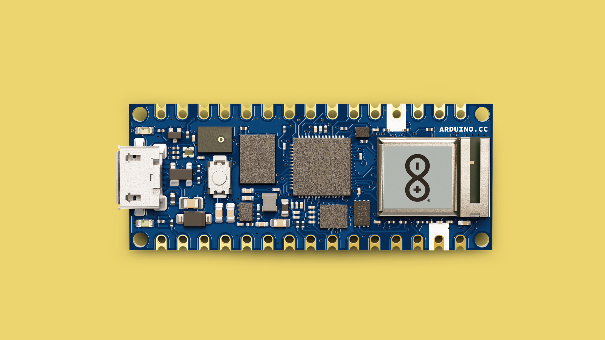
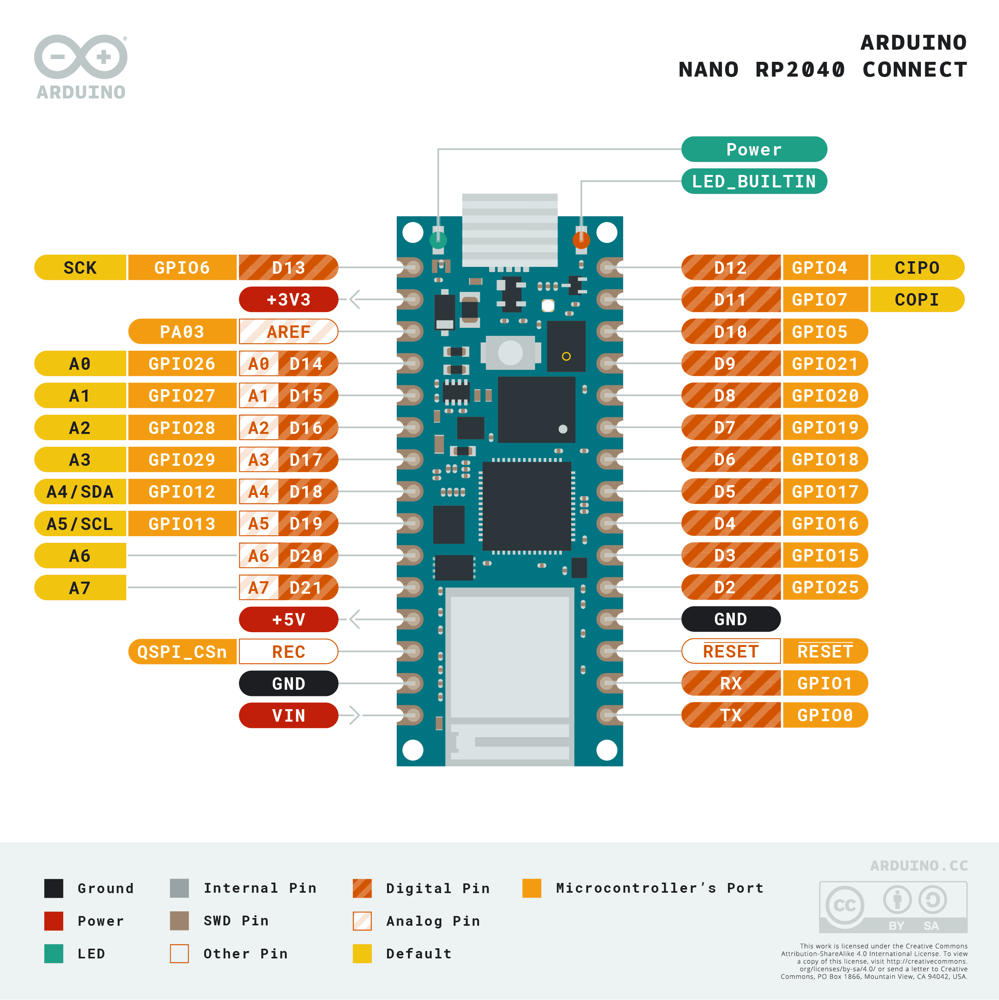

In this guide, you will find information specific to the [Nano RP2040 Connect board](https://store.arduino.cc/products/arduino-nano-rp2040-connect), such as supported serial protocols and built-in sensors that can be accessed.

For installation instructions, please visit the link below.
- [Installing MicroPython](/micropython/first-steps/install-guide)

## Pinout

The pinout for the Nano RP2040 Connect can be found in the image below.



***For more details on this product, visit the [hardware product page](/hardware/nano-rp2040-connect/).***

## Board Specific Features

The Nano RP2040 Connect has a number of board-specific features that can be accessed through MicroPython:

- **RGB LED** - a simple RGB pixel that can be controlled by setting `r`, `g` and `b` values.
- **Microphone (MP34DT05)** - a microphone for recording audio samples.
- **IMU (LSM6DSOX)** - for sampling gyroscope and accelerometer data.

### RGB LED

To use the RGB pixel, we can control it by using the `1`, `2` and `3` pins. Below is an example that will blink the main colors in sequence:

```python
from board import LED
import time 

led_red = LED(1)
led_green = LED(2)
led_blue = LED(3)

while (True):
   
    # Turn on LEDs
    led_red.on()
    led_green.on()
    led_blue.on()

    # Wait 0.25 seconds
    time.sleep_ms(250)
    
    # Turn off LEDs
    led_red.off()
    led_green.off()
    led_blue.off()

    # Wait 0.25 seconds
    time.sleep_ms(250)
```

### Microphone (MP34DT05)

The Nano RP2040 Connect has a built-in microphone, that can be used through the OpenMV editor. To use it, you will need to install [OpenMV](https://openmv.io/pages/download) and run the following script.

```python
import image, audio, time
from ulab import numpy as np
from ulab import scipy as sp

CHANNELS = 1
FREQUENCY = 32000
N_SAMPLES = 32 if FREQUENCY == 16000 else 64
SCALE = 2
SIZE = (N_SAMPLES * SCALE) // CHANNELS

raw_buf = None
fb = image.Image(SIZE+(50*SCALE), SIZE, image.RGB565, copy_to_fb=True)
audio.init(channels=CHANNELS, frequency=FREQUENCY, gain_db=16)

def audio_callback(buf):
    # NOTE: do Not call any function that allocates memory.
    global raw_buf
    if (raw_buf == None):
        raw_buf = buf

# Start audio streaming
audio.start_streaming(audio_callback)

def draw_fft(img, fft_buf):
    fft_buf = (fft_buf / max(fft_buf)) * SIZE
    fft_buf = np.log10(fft_buf + 1) * 20
    color = (0xFF, 0x0F, 0x00)
    for i in range(0, len(fft_buf)):
        img.draw_line(i*SCALE, SIZE, i*SCALE, SIZE-int(fft_buf[i]) * SCALE, color, SCALE)

def draw_audio_bar(img, level, offset):
    blk_size = (SIZE//10)
    color = (0xFF, 0x00, 0xF0)
    blk_space = (blk_size//4)
    for i in range(0, int(round(level/10))):
        fb.draw_rectangle(SIZE+offset, SIZE - ((i+1)*blk_size) + blk_space, 20 * SCALE, blk_size - blk_space, color, 1, True)

while (True):
    if (raw_buf != None):
        pcm_buf = np.frombuffer(raw_buf, dtype=np.int16)
        raw_buf = None

        if CHANNELS == 1:
            fft_buf = sp.signal.spectrogram(pcm_buf)
            l_lvl = int((np.mean(abs(pcm_buf[1::2])) / 32768)*100)
        else:
            fft_buf = sp.signal.spectrogram(pcm_buf[0::2])
            l_lvl = int((np.mean(abs(pcm_buf[1::2])) / 32768)*100)
            r_lvl = int((np.mean(abs(pcm_buf[0::2])) / 32768)*100)

        fb.clear()
        draw_fft(fb, fft_buf)
        draw_audio_bar(fb, l_lvl, 0)
        draw_audio_bar(fb, l_lvl, 25*SCALE)
        if CHANNELS == 2:
            draw_audio_bar(fb, r_lvl, 25 * SCALE)
        fb.flush()

# Stop streaming
audio.stop_streaming()
```

## IMU (LSM6DSOX)

The Nano RP2040 Connect has a built-in inertial measure unit (IMU). With the following script, you can retrieve the accelerometer and gyroscope data and print it in the REPL.

```python
import time
from lsm6dsox import LSM6DSOX
from machine import Pin, I2C

# Initialize the LSM6DSOX sensor with I2C interface
lsm = LSM6DSOX(I2C(0, scl=Pin(13), sda=Pin(12)))

while True:
    # Read accelerometer values
    accel_values = lsm.accel()
    print('Accelerometer: x:{:>8.3f} y:{:>8.3f} z:{:>8.3f}'.format(*accel_values))
    
    # Read gyroscope values
    gyro_values = lsm.gyro()
    print('Gyroscope:     x:{:>8.3f} y:{:>8.3f} z:{:>8.3f}'.format(*gyro_values))
    
    print("")
    time.sleep_ms(100)
```

## Communication

The Nano RP2040 Connect supports **I2C**, **UART** and **SPI**. Below you will find examples on how to use them.

### I2C

The I2C bus on the Nano RP2040 Connect is available through the **A4/A5** pins. Below is an example for how to use it:

```python
from machine import Pin, I2C

# Initialize I2C with SCL on A5 and SDA on A4
i2c = I2C(0, scl=Pin(5), sda=Pin(4))
devices = i2c.scan()

print("I2C devices found:", devices)
```

***Read more about I2C in [this article](/micropython/communication/i2c).***

### UART

The Nano RP2040 Connect supports **UART** through the **D0/D1** pins. Below is an example for how to use it:

```python
from machine import UART

# Initialize UART on pins 16 (TX) and 17 (RX)
uart = UART(1, baudrate=9600, tx=16, rx=17)

# Send and receive data
uart.write("Hello from Nano ESP32!")
data = uart.read()
print("Received:", data)
```

### SPI

The Nano RP2040 Connect supports **SPI** through the following pins:
- **(CIPO)** - D12
- **(COPI)** - D11
- **(SCK)** - D13
- **(CS)** - Any GPIO (except for A6/A7)

Below is an example for how to use it:

```python
from machine import Pin, SPI

# Initialize SPI with SCK on pin 18, MOSI on pin 23, and MISO on pin 19
spi = SPI(1, baudrate=1000000, polarity=0, phase=0, sck=Pin(18), mosi=Pin(23), miso=Pin(19))

print("SPI initialized")
```