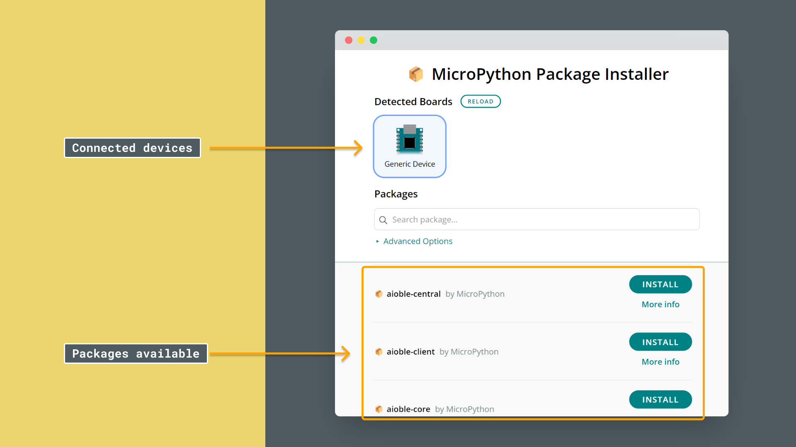
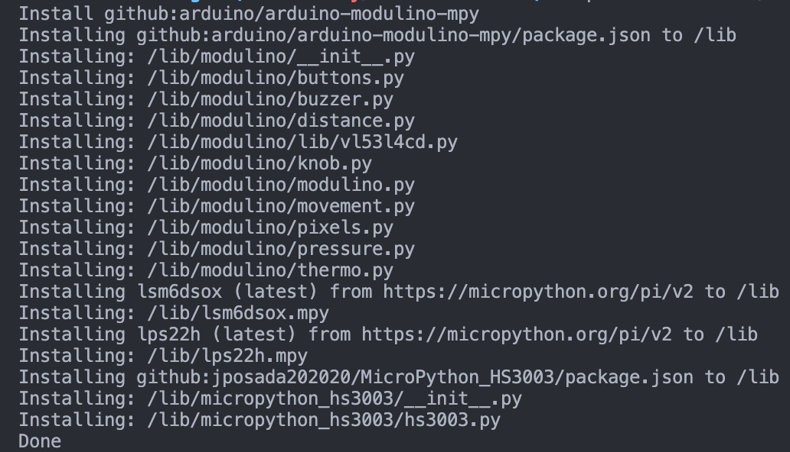
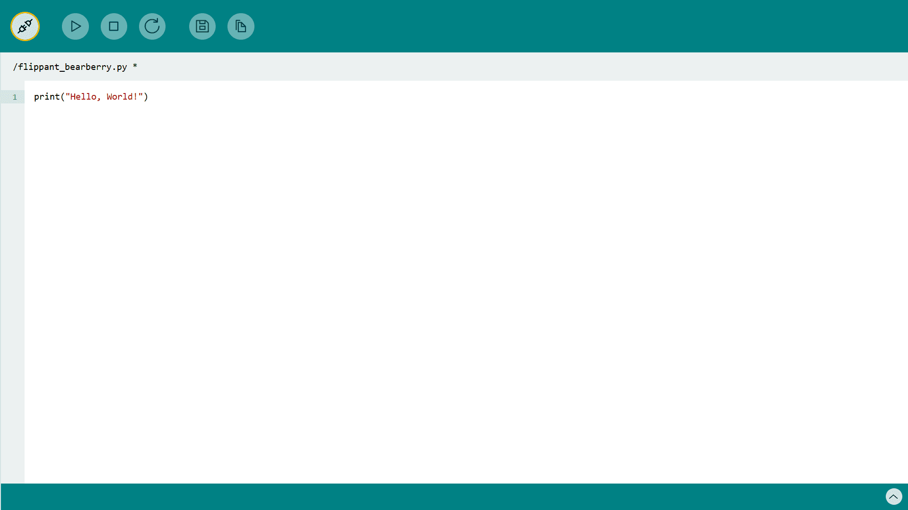
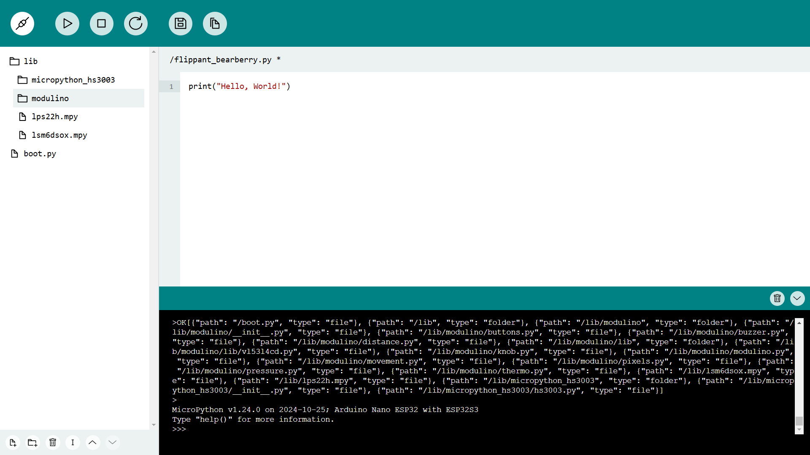

In this tutorial, we will go through the installation process required for programming the Arduino Modulino nodes with MicroPython. 

## Goals

The goals of this tutorial are:

- Learn how to install a MicroPython package on an Arduino board (the Modulino package).

## Hardware & Software Needed

We will need a MicroPython compatible board that works with the Modulino nodes:
- [Arduino Nano ESP32](https://store.arduino.cc/products/nano-esp32?queryID=undefined)
- [Arduino Nano RP2040 Connect](https://store.arduino.cc/en-se/products/arduino-nano-rp2040-connect)

We will also need the following software:
- [MicroPython Labs](https://lab-micropython.arduino.cc/)
- [MicroPython Installer](https://labs.arduino.cc/en/labs/micropython-installer)
- [Modulino MicroPython package](https://github.com/arduino/arduino-modulino-mpy)
- [MicroPython package installer](https://github.com/arduino/lab-micropython-package-installer/releases)

## Install MicroPython


### Option 1: Using the MicroPython Package Installer **(Recommended)**  

The **MicroPython Package Installer** is a graphical tool that simplifies the installation of external modules without requiring command-line interaction.

1. **Download and install** the [MicroPython Package Installer](https://github.com/arduino/lab-micropython-package-installer/releases).  
2. **Open the tool** and plug in your board.  


If the board does not appear in the `Detected Boards` section, click `Reload`.  
If the board is still not detected, ensure no other programs (e.g., a code editor) are using the board's COM port.  
1. **Search for the Modulino package** using the search feature.  
2. Click **Install** and wait for the installation confirmation.  
3. **Disconnect the board** before returning to your code editor to avoid conflicts due to the COM port being busy.  

  

### Option 2: Terminal Installation

To install a module, we can use `mpremote`. Currently, we will need a version of Python installed on our computer.

1. Open a terminal, and write the following line:
   ```bash
   pip install mpremote 
   ```
   This will install `mpremote`, which makes it possible to install packages on our board via our computer.
2. With `mpremote` installed, we need to run the following command to identify our board's serial port:
   ```bash
   mpremote connect list
   ```
   
   Which will give us something like this:
   
   ```bash
   /dev/cu.usbmodem101 ecda3b60a4dccb3f 2341:056b Arduino Nano ESP32
   ```
   The port here is `/dev/cu.usbmodem101`. Copy this.

3. Now, run the following the command. Make sure to replace `<PORT>` with the port of our device obtained in the previous step.
    ```bash
    mpremote connect <PORT> mip install github:arduino/arduino-modulino-mpy
    ```

    Upon completion, we should see something like this in the terminal, to verify the success of the installation:
    

4. Great job. We have now installed the Modulino package on our board!

**Troubleshooting:**
- Make sure your board is connected to your computer.
- Make sure it is **not** connected in the Arduino Lab for MicroPython, as this might disturb the connection.
- If you are unable to run `mpremote` in the terminal, this means it is not installed.
- If you are unable to run `python` in the terminal, make sure you have installed Python (you can download and install it [here](https://www.python.org/downloads/))
- If you have installed Python and it is still not working, try running `python3` and `pip3` instead.
- If you installed Python while having the terminal open, try closing the terminal and re-opening it.
- If you run `mpremote` and there's no board appearing in the list, try re-installing the firmware on your board as it might have failed during installation. 

## MicroPython Labs

We can now verify that everything was installed correctly. Go to [MicroPython Labs](https://lab-micropython.arduino.cc/) and click on the connect icon in the top left corner.



Select the board and press select "connect". We should now be connected to our Arduino board.

***If we experience any issues, try disconnecting and connecting the board again and reinstall MicroPython using the [MicroPython Installer](https://labs.arduino.cc/en/labs/micropython-installer).***

To verify that the Modulino package has been installed correctly, click on the file icon in the top bar of the Labs editor.

We should see a folder called `lib` and a file called `boot.py`. Go ahead and press on the `lib` folder and we should see several files and a folder called `modulino`.



If we see this, it means the package has been installed successfully.

## Next Steps

Now that we have successfully installed everything it's time to program our first Modulino. Below are links to the documentation for all Modulino nodes. They are also accessible in the side menu at [Arduino Docs - MicroPython](https://docs.arduino.cc/micropython/), under "Modulino Nodes".

- [Modulino Distance](/micropython/modulinos/modulino-distance)
- [Modulino Pixels](/micropython/modulinos/modulino-pixels)
- [Modulino Buzzer](/micropython/modulinos/modulino-buzzer)
- [Modulino Buttons](/micropython/modulinos/modulino-buttons)
- [Modulino Knob](/micropython/modulinos/modulino-knob)
- [Modulino Movement](/micropython/modulinos/modulino-movement)
- [Modulino Thermo](/micropython/modulinos/modulino-thermo)