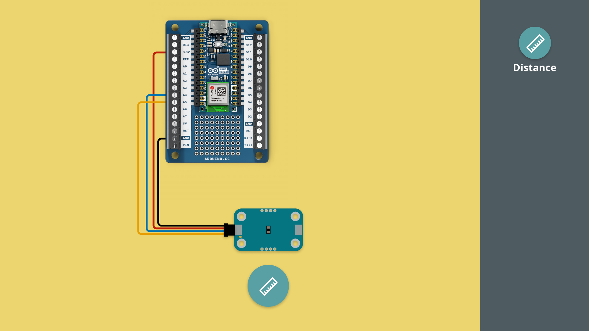
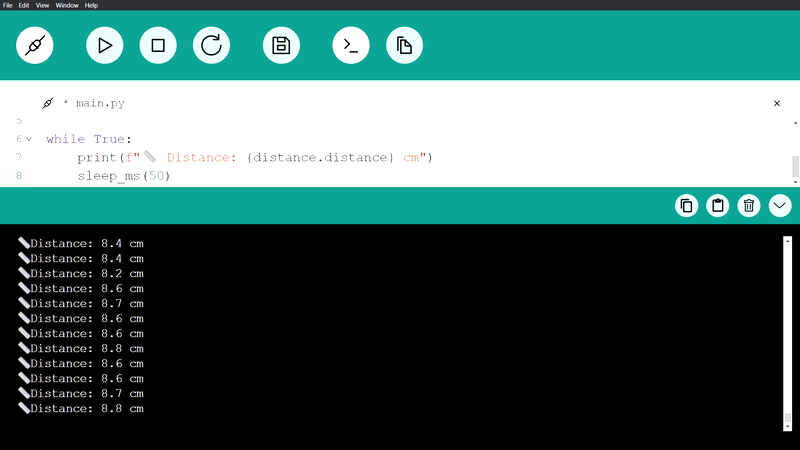

In this tutorial, we will get started with the Modulino Distance, which can measure the distance to an object.

***Note that the installation of the Modulino package is not covered in this tutorial. For details on how to install this, visit the [MicroPython - Modulino Package Installation tutorial](/micropython/modulinos/installation).***

## Goals

The goals of this tutorial are:

- learn how to connect a Modulino to an Arduino using MicroPython
- learn how to program the Modulino Distance.

## Hardware & Software Needed

For this tutorial, we will need the following hardware:
- [Modulino Distance](https://store.arduino.cc/products/plug-and-make-kit)
- [Arduino Nano ESP32](https://store.arduino.cc/products/nano-esp32?queryID=undefined) or [Arduino Nano RP2040 Connect](https://store.arduino.cc/en-se/products/arduino-nano-rp2040-connect)

We will also need the following software:
- [MicroPython Labs](https://lab-micropython.arduino.cc/)
- [Modulino MicroPython Package](https://github.com/arduino/arduino-modulino-mpy)

## Connect the Modulino

Before we start programming, we will need to connect our Modulino Distance to our Arduino board. For this we can follow the circuit diagram below:



## Modulino Distance Code Example

Copy the code below and run it in Arduino MicroPython labs, while connected to our board.

```python
from modulino import ModulinoDistance
from time import sleep_ms

distance = ModulinoDistance()

while True:
    print(f"📏 Distance: {distance.distance} cm")
    sleep_ms(50)
```

## How it works

The Modulino Distance is a sensor that measures the time it takes for light to travel from the module to the object and back, using a tiny laser and a light sensor. The distance sensor is also known as a Time of Flight (ToF) sensor.

The sensor can be used for a variety of projects, including gesture triggers, obstacle detection robots and motion detection.

***Note: For extra shipping protection, some sensors come with a small yellow plastic cover on the Modulino Distance sensor. If you notice this plastic piece still in place, please remove it to ensure more accurate readings.***

