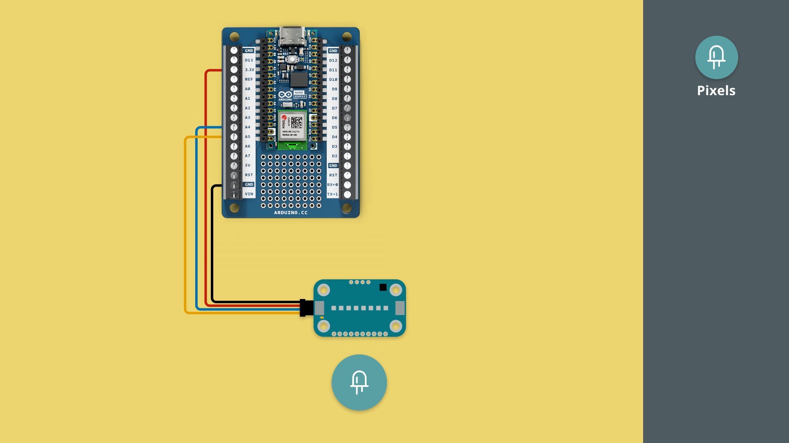
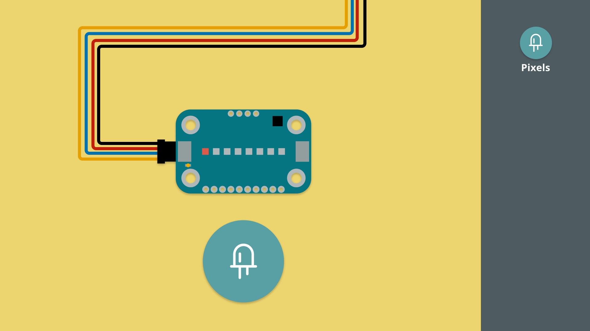

In this tutorial, we will get started with the Modulino Pixels and control its RGB LEDs.

***Note that the installation of the Modulino package is not covered in this tutorial. For details on how to install this, visit the [MicroPython - Modulino Package Installation tutorial](/micropython/modulinos/installation).***

## Goals

The goals of this tutorial are:

- learn how to connect a Modulino to an Arduino board.
- learn how to program the Modulino Pixels.

## Hardware & Software Needed

For this tutorial, we will need the following hardware:
- [Modulino Pixels](https://store.arduino.cc/products/plug-and-make-kit)
- [Arduino Nano ESP32](https://store.arduino.cc/products/nano-esp32?queryID=undefined) or [Arduino Nano RP2040 Connect](https://store.arduino.cc/en-se/products/arduino-nano-rp2040-connect)

We will also need the following software:
- [MicroPython Labs](https://lab-micropython.arduino.cc/)
- [Modulino MicroPython Package](https://github.com/arduino/arduino-modulino-mpy)

## Connect the Modulino

Before we start programming, we will need to connect our Modulino Pixels to our Arduino board. For this we can follow the circuit diagram below:



## Modulino Pixels Code Example

Copy the code below and run it in Arduino MicroPython labs, while connected to our board.

```python
from modulino import ModulinoPixels, ModulinoColor
from time import sleep

pixels = ModulinoPixels()

for index in range(0, 8):
    color_wheel_colors = [
        (255, 0, 0),
        (255, 85, 0),
        (255, 255, 0),
        (0, 255, 0),
        (0, 255, 255),
        (0, 0, 255),
        (255, 0, 255),
        (255, 0, 0)
    ]
    pixels.set_rgb(index, *color_wheel_colors[index], 100)
pixels.show()
sleep(1)

pixels.set_all_rgb(255, 0, 0, 100)
pixels.show()
sleep(1)

pixels.set_all_color(ModulinoColor.GREEN, 100)
pixels.show()
sleep(1)

pixels.set_all_color(ModulinoColor.BLUE, 100)
pixels.show()
sleep(1)


# Night Rider animation

for j in range(0, 3):
    for i in range(0, 8):
        pixels.clear_all()
        pixels.set_rgb(i, 255, 0, 0, 100)
        pixels.show()
        sleep(0.05)

    for i in range(7, -1, -1):
        pixels.clear_all()
        pixels.set_rgb(i, 255, 0, 0, 100)
        pixels.show()
        sleep(0.05)

# Turn off all LEDs
pixels.clear_all()    
pixels.show()
```

## How it works

The Modulino Pixels is a series of addressable RGB LEDs. These can be controlled by setting the brightness or the color of each LED.

