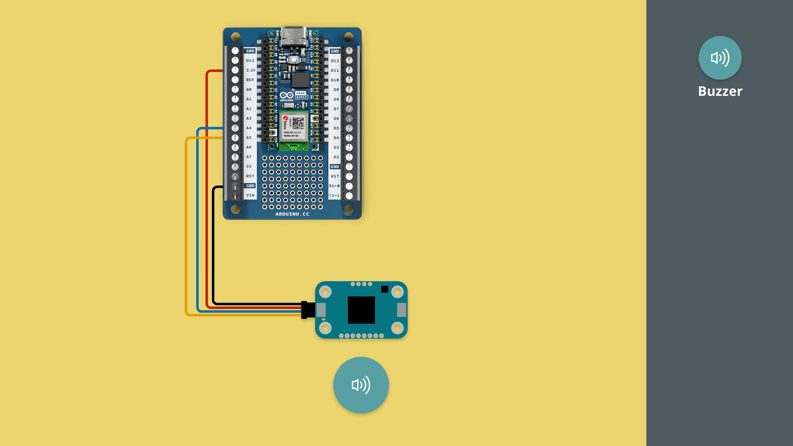
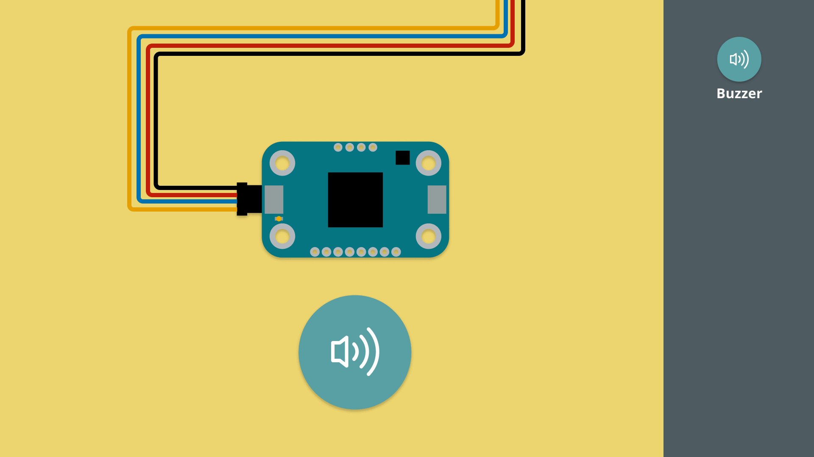

In this tutorial, we will get started with the Modulino Buzzer, a piezo speaker that can output sound.

***Note that the installation of the Modulino package is not covered in this tutorial. For details on how to install this, visit the [MicroPython - Modulino Package Installation tutorial](/micropython/modulinos/installation).***

## Goals

The goals of this tutorial are:

- learn how to connect a Modulino to an Arduino board.
- learn how to program the Modulino Buzzer.

## Hardware & Software Needed

For this tutorial, we will need the following hardware:
- [Modulino Buzzer](https://store.arduino.cc/products/plug-and-make-kit)
- [Arduino Nano ESP32](https://store.arduino.cc/products/nano-esp32?queryID=undefined) or [Arduino Nano RP2040 Connect](https://store.arduino.cc/en-se/products/arduino-nano-rp2040-connect)

We will also need the following software:
- [MicroPython Labs](https://lab-micropython.arduino.cc/)
- [Modulino MicroPython Package](https://github.com/arduino/arduino-modulino-mpy)

## Connect the Modulino

Before we start programming, we will need to connect our Modulino Buzzer to our Arduino board. For this we can follow the circuit diagram below:



## Modulino Buzzer Code Example

Copy the code below and run it in Arduino MicroPython labs, while connected to our board.

```python
from modulino import ModulinoBuzzer
from time import sleep

buzzer = ModulinoBuzzer()

# Super Mario Bros theme intro
melody = [
    (ModulinoBuzzer.NOTES["E5"], 125),
    (ModulinoBuzzer.NOTES["REST"], 25),
    (ModulinoBuzzer.NOTES["E5"], 125),
    (ModulinoBuzzer.NOTES["REST"], 125),
    (ModulinoBuzzer.NOTES["E5"], 125),
    (ModulinoBuzzer.NOTES["REST"], 125),
    (ModulinoBuzzer.NOTES["C5"], 125),
    (ModulinoBuzzer.NOTES["E5"], 125),
    (ModulinoBuzzer.NOTES["REST"], 125),
    (ModulinoBuzzer.NOTES["G5"], 125),
    (ModulinoBuzzer.NOTES["REST"], 375),
    (ModulinoBuzzer.NOTES["G4"], 250)
]

for note, duration in melody:
    buzzer.tone(note, duration, blocking=True)

# Wait 2 seconds before playing the next melody
sleep(2)

# Police siren sound effect
def generate_siren(frequency_start, frequency_end, total_duration, steps, iterations):
    siren = []
    mid_point = steps // 2
    duration_rise = total_duration // 2
    duration_fall = total_duration // 2

    for _ in range(iterations):
        for i in range(steps):
            if i < mid_point:
                # Easing in rising part
                step_duration = duration_rise // mid_point + (duration_rise // mid_point * (mid_point - i) // mid_point)
                frequency = int(frequency_start + (frequency_end - frequency_start) * (i / mid_point))
            else:
                # Easing in falling part
                step_duration = duration_fall // mid_point + (duration_fall // mid_point * (i - mid_point) // mid_point)
                frequency = int(frequency_end - (frequency_end - frequency_start) * ((i - mid_point) / mid_point))

            siren.append((frequency, step_duration))

    return siren

# 4 seconds up and down siren, with 200 steps and 2 iterations
siren_melody = generate_siren(440, 880, 4000, 200, 2)

for note, duration in siren_melody:
    buzzer.tone(note, duration, blocking=True)
```

## How it works

The Modulino Buzzer is a tiny speaker that can output sound waves.

The speaker is called a "piezo", which comes from piezoelectricity. When you apply voltage to the speaker with a specific frequency, you generate a specific sound. Changing the frequency will change the tone of the speaker.

