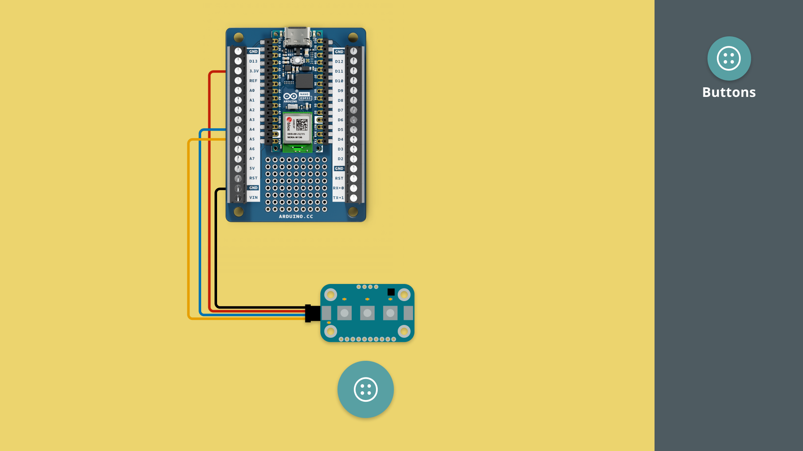
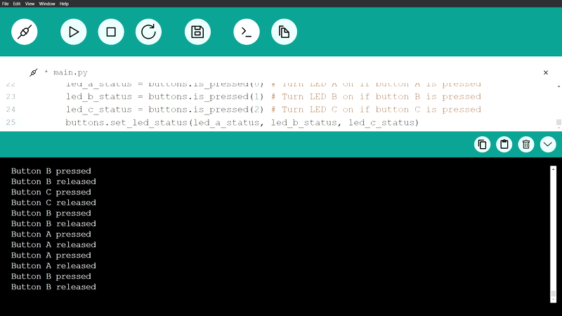

In this tutorial, we will get started with the Modulino Buttons, a three-button Modulino.

***Note that the installation of the Modulino package is not covered in this tutorial. For details on how to install this, visit the [MicroPython - Modulino Package Installation tutorial](/micropython/modulinos/installation).***

## Goals

The goals of this tutorial are:

- learn how to connect a Modulino to an Arduino board.
- learn how to program the Modulino Buttons.

## Hardware & Software Needed

For this tutorial, we will need the following hardware:
- [Modulino Buttons](https://store.arduino.cc/products/plug-and-make-kit)
- [Arduino Nano ESP32](https://store.arduino.cc/products/nano-esp32?queryID=undefined) or [Arduino Nano RP2040 Connect](https://store.arduino.cc/en-se/products/arduino-nano-rp2040-connect)

We will also need the following software:
- [MicroPython Labs](https://lab-micropython.arduino.cc/)
- [Modulino MicroPython Package](https://github.com/arduino/arduino-modulino-mpy)


## Connect the Modulino

Before we start programming, we will need to connect our Modulino Buttons to our Arduino board. For this we can follow the circuit diagram below:



## Modulino Buttons Code Example

Copy the code below and run it in Arduino MicroPython labs, while connected to our board.

```python
from modulino import ModulinoButtons

buttons = ModulinoButtons()

buttons.on_button_a_press = lambda : print("Button A pressed")
buttons.on_button_a_long_press = lambda : print("Button A long press")
buttons.on_button_a_release = lambda : print("Button A released")

buttons.on_button_b_press = lambda : print("Button B pressed")
buttons.on_button_b_long_press = lambda : print("Button B long press")
buttons.on_button_b_release = lambda : print("Button B released")

buttons.on_button_c_press = lambda : print("Button C pressed")
buttons.on_button_c_long_press = lambda : print("Button C long press")
buttons.on_button_c_release = lambda : print("Button C released")


while True:
    buttons_state_changed = buttons.update()
    
    if(buttons_state_changed):    
      led_a_status = buttons.is_pressed(0) # Turn LED A on if button A is pressed
      led_b_status = buttons.is_pressed(1) # Turn LED B on if button B is pressed
      led_c_status = buttons.is_pressed(2) # Turn LED C on if button C is pressed
      buttons.set_led_status(led_a_status, led_b_status, led_c_status)
````
## How it works

The Modulino Buttons is a three-button module, each button capable of having a HIGH or LOW state. Additionally, this Modulino has 3 yellow LEDs which can also be controlled independently.

The button is used in pretty much every electronic circuit, as it is the easiest way to switch between states! The most common example is a light switch, where a button press activates a light.

