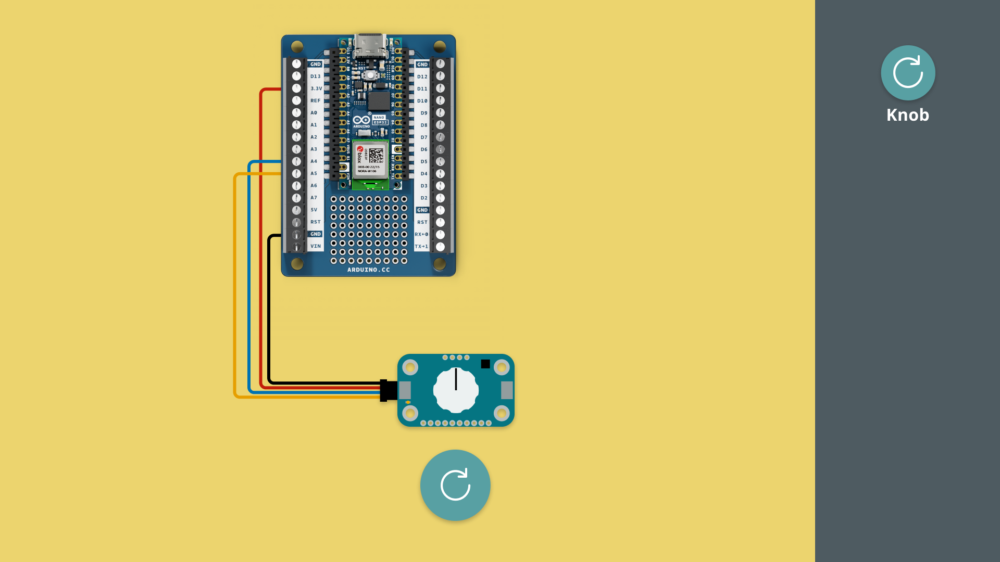
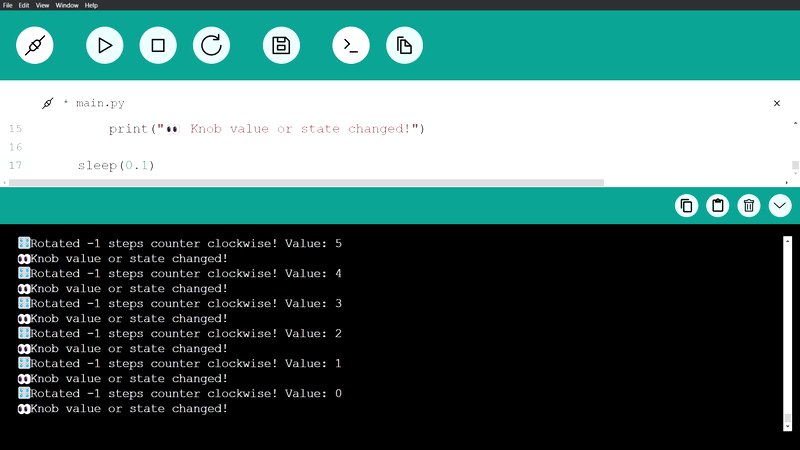

In this tutorial, we will get started with the Modulino Knob, a rotating knob with a button.

***Note that the installation of the Modulino package is not covered in this tutorial. For details on how to install this, visit the [MicroPython - Modulino Package Installation tutorial](/micropython/modulinos/installation).***

## Goals

The goals of this tutorial are:

- learn how to connect a Modulino to an Arduino board.
- learn how to program the Modulino Knob.

## Hardware & Software Needed

For this tutorial, we will need the following hardware:
- [Modulino Knob](https://store.arduino.cc/products/plug-and-make-kit)
- [Arduino Nano ESP32](https://store.arduino.cc/products/nano-esp32?queryID=undefined) or [Arduino Nano RP2040 Connect](https://store.arduino.cc/en-se/products/arduino-nano-rp2040-connect)

We will also need the following software:
- [MicroPython Labs](https://lab-micropython.arduino.cc/)
- [Modulino MicroPython Package](https://github.com/arduino/arduino-modulino-mpy)

## Connect the Modulino

Before we start programming, we will need to connect our Modulino Knob to our Arduino board. For this we can follow the circuit diagram below:



## Modulino Knob Code Example

Copy the code below and run it in Arduino MicroPython labs, while connected to our board.

```python
from modulino import ModulinoKnob
from time import sleep

knob = ModulinoKnob()
knob.value = 5 # (Optional) Set an initial value
knob.range = (-10, 10) # (Optional) Set a value range

knob.on_press = lambda: print("🔘 Pressed!")
knob.on_release = lambda: (knob.reset(), print("🔘 Released!")) 
knob.on_rotate_clockwise = lambda steps, value: print(f"🎛️ Rotated {steps} steps clockwise! Value: {value}")
knob.on_rotate_counter_clockwise = lambda steps, value: print(f"🎛️ Rotated {steps} steps counter clockwise! Value: {value}")

while True:
    if(knob.update()):
        print("👀 Knob value or state changed!")

    sleep(0.1)
````

## How it works

The Modulino Knob is a rotary encoder that increases, or decreases, a number based on which direction it is rotating.

When the knob moves into a new position, it sends a signal to the Arduino board with the new position.

Turning it right increases the number (for example from 1 to 2).
Turning it left decreases the number (for example from 2 to 1)
Clicking it will also register a button click (HIGH on click).


