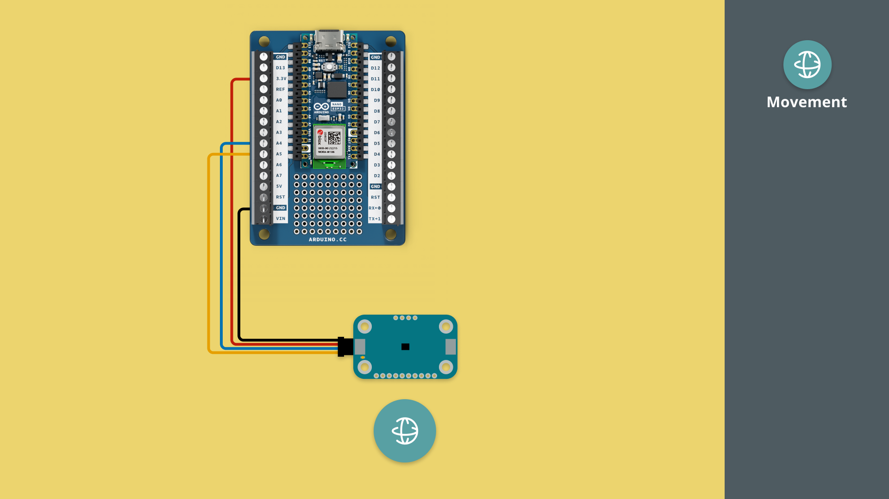

In this tutorial, we will get started with the Modulino Movement, measuring acceleration and positioning.

***Note that the installation of the Modulino package is not covered in this tutorial. For details on how to install this, visit the [MicroPython - Modulino Package Installation tutorial](/micropython/modulinos/installation).***

## Goals

The goals of this tutorial are:

- learn how to connect a Modulino to an Arduino board.
- learn how to program the Modulino Movement.

## Hardware & Software Needed

For this tutorial, we will need the following hardware:
- [Modulino Movement](https://store.arduino.cc/products/plug-and-make-kit)
- [Arduino Nano ESP32](https://store.arduino.cc/products/nano-esp32?queryID=undefined) or [Arduino Nano RP2040 Connect](https://store.arduino.cc/en-se/products/arduino-nano-rp2040-connect)

We will also need the following software:
- [MicroPython Labs](https://lab-micropython.arduino.cc/)
- [Modulino MicroPython Package](https://github.com/arduino/arduino-modulino-mpy)

## Connect the Modulino

Before we start programming, we will need to connect our Modulino Movement to our Arduino board. For this we can follow the circuit diagram below:



## Modulino Movement Code Example

Copy the code below and run it in Arduino MicroPython labs, while connected to our board.

```python
from modulino import ModulinoMovement
from time import sleep_ms

movement = ModulinoMovement()

while True:
    print("🏃 Accelerometer: x:{:>8.3f} y:{:>8.3f} z:{:>8.3f}".format(*movement.accelerometer))
    print("🌐 Gyroscope:     x:{:>8.3f} y:{:>8.3f} z:{:>8.3f}".format(*movement.gyro))
    print("")
    sleep_ms(100)
````

## How it works

The Modulino Movement can measure acceleration, which means it measures the rate of change of velocity of an object in terms of its linear acceleration along multiple axes.

The Modulino Movement can, in other words, detect when something moves, and how fast it moves. It is a sensitive sensor that can also measure vibration.

