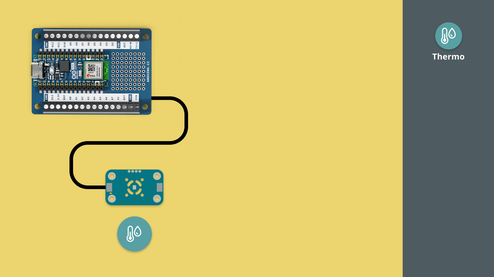
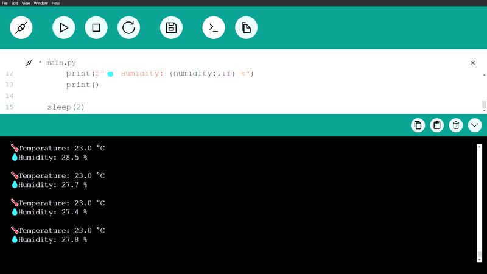

In this tutorial, we will get started with the Modulino Thermo, reading surrounding temperature and humidity.

***Note that the installation of the Modulino package is not covered in this tutorial. For details on how to install this, visit the [MicroPython - Modulino Package Installation tutorial](/micropython/modulinos/installation).***

## Goals

The goals of this tutorial are:

- learn how to connect a Modulino to an Arduino board.
- learn how to program the Modulino Thermo.

## Hardware & Software Needed

For this tutorial, we will need the following hardware:
- [Modulino Thermo](https://store.arduino.cc/products/plug-and-make-kit)
- [Arduino Nano ESP32](https://store.arduino.cc/products/nano-esp32?queryID=undefined) or [Arduino Nano RP2040 Connect](https://store.arduino.cc/en-se/products/arduino-nano-rp2040-connect)

We will also need the following software:
- [MicroPython Labs](https://lab-micropython.arduino.cc/)
- [Modulino MicroPython Package](https://github.com/arduino/arduino-modulino-mpy)

## Connect the Modulino

Before we start programming, we will need to connect our Modulino Thermo to our Arduino board. For this we can follow the circuit diagram below:



## Modulino Thermo Code Example

Copy the code below and run it in Arduino MicroPython labs, while connected to our board.

```python
from modulino import ModulinoThermo
from time import sleep

thermo_module = ModulinoThermo()

while True:    
    temperature = thermo_module.temperature
    humidity = thermo_module.relative_humidity
    
    if temperature != None and humidity != None:
        print(f"🌡️ Temperature: {temperature:.1f} °C")
        print(f"💧 Humidity: {humidity:.1f} %")    
        print()
        
    sleep(2)
````

## How it works

The Modulino Thermo can read both the temperature and humidity around you. This is a great component when you want to track the changes in indoor environments.

