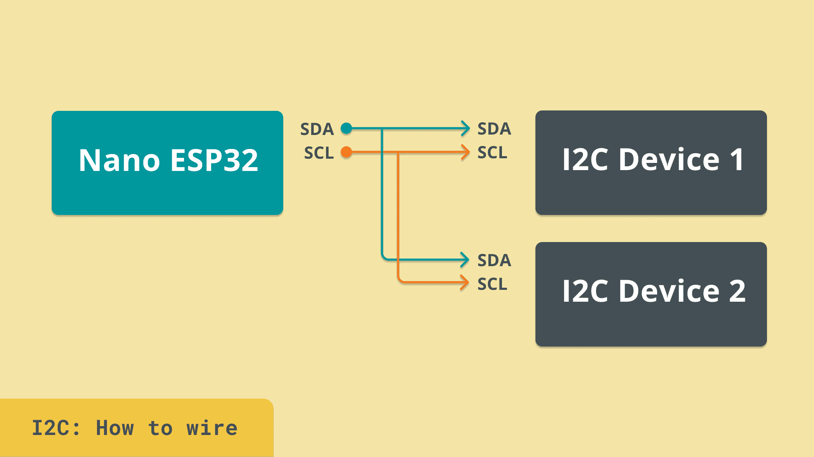
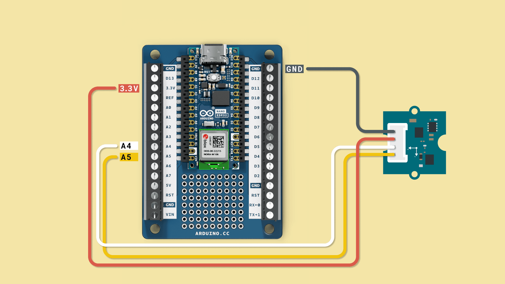
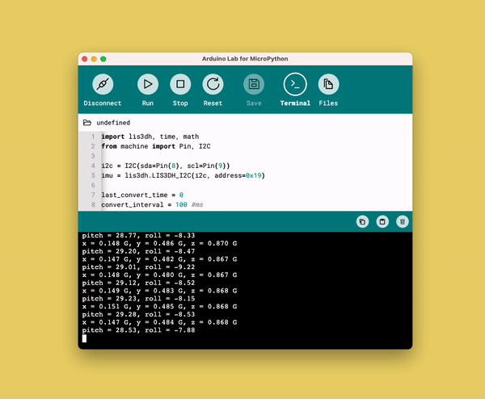

Inter-Integrated Circuit, or **I2C**, is one of the most widely used serial communication protocols, especially in the Arduino ecosystem. It enables multiple devices to communicate over just two wires, making it both efficient and versatile as you can easily add new modules more easily as the connections all happen across the same bus and standetizes them across manufacturers (and product lines).


## How I2C Works
I2C communication relies on two wires:
- **SDA (Serial Data):** Transfers data between devices.
- **SCL (Serial Clock):** Synchronizes data transmission.

Each device on an I2C bus has a unique address, allowing the controller to communicate directly with a specific device. This capability makes it possible to connect up to 128 devices on the same two wires (128 is the maximum number of different addresses you can have as the address is a 7 bit value and you can only express 128 unique values using 7 bits).



### Key Features of I2C

1. **Two-Wire Simplicity:** Reduces hardware complexity.
2. **Address-Based Communication:** Each device has a unique address.
3. **Bidirectional Communication:** Enables data transfer in both directions.


## Example: Reading Sensor Data Using I2C

In this example, we will connect an **LIS3DHTR accelerometer** to an Arduino and read its data via I2C.

**Circuit Diagram:**


**Setup Instructions:**
1. Connect the LIS3DHTR to your board as shown in the circuit diagram.
2. Install the required `lis3dh` module by running the following command:

   ```python
   mip.install("https://raw.githubusercontent.com/tinypico/tinypico-micropython/master/lis3dh%20library/lis3dh.py")
   ```

3. Copy the following code to your `main.py` file and run it.

**Code Example:**
```python
import lis3dh, time, math
from machine import Pin, I2C

i2c = I2C(sda=Pin(8), scl=Pin(9))
imu = lis3dh.LIS3DH_I2C(i2c, address=0x19)

last_convert_time = 0
convert_interval = 100 #ms
pitch = 0
roll = 0

# Convert acceleration to Pitch and Roll
def convert_accell_rotation( vec ):
    x_Buff = vec[0] # x
    y_Buff = vec[1] # y
    z_Buff = vec[2] # z

    global last_convert_time, convert_interval, roll, pitch

    # We only want to re-process the values every 100 ms
    if last_convert_time < time.ticks_ms():
        last_convert_time = time.ticks_ms() + convert_interval

        roll = math.atan2(y_Buff , z_Buff) * 57.3
        pitch = math.atan2((- x_Buff) , math.sqrt(y_Buff * y_Buff + z_Buff * z_Buff)) * 57.3

    # Return the current values in roll and pitch
    return ( roll, pitch )

# If we have found the LIS3DH
if imu.device_check():
    # Set range of accelerometer (can be RANGE_2_G, RANGE_4_G, RANGE_8_G or RANGE_16_G).
    imu.range = lis3dh.RANGE_2_G

    # Loop forever printing values
    while True:
        # Read accelerometer values (in m / s ^ 2).  Returns a 3-tuple of x, y,
        # z axis values.  Divide them by 9.806 to convert to Gs.
        x, y, z = [value / lis3dh.STANDARD_GRAVITY for value in imu.acceleration]
        print("x = %0.3f G, y = %0.3f G, z = %0.3f G" % (x, y, z))

        # Convert acceleration to Pitch and Roll and print values
        p, r = convert_accell_rotation( imu.acceleration )
        print("pitch = %0.2f, roll = %0.2f" % (p,r))

        # Small delay to keep things responsive but give time for interrupt processing.
        time.sleep(0.1)
```

**Expected Output:**
In the REPL terminal, you will see accelerometer data displayed every second. 



```
x = 0.001 G, y = -0.002 G, z = 1.000 G
pitch = -0.12, roll = 0.04
```

## Summary

I2C is a highly efficient protocol that enables multiple devices to communicate on just two wires. In this example, we demonstrated how to read data from an I2C-connected sensor, opening the door to integrating even more devices into your Arduino projects.

