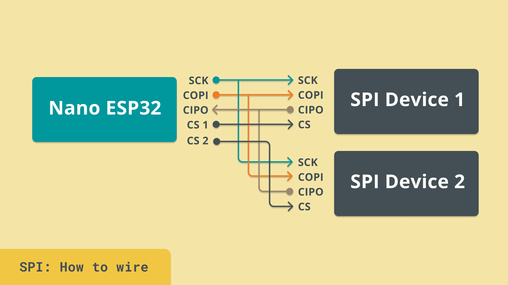

Serial Peripheral Interface, or **SPI**, is a widely used communication protocol for connecting devices. It enables high-speed, full-duplex communication over four primary wires, making it an excellent choice for applications requiring fast data exchange between microcontrollers and peripherals.

## How SPI Works

SPI communication relies on:

- **MOSI** (Controller Out, Peripheral In): Sends data from the controller to the peripheral.

- **MISO** (Peripheral Out, Controller In): Receives data from the peripheral to the controller.

- **SCLK** (Serial Clock): Synchronizes data transmission.

- **CS** (Chip Select): Selects which peripheral device to communicate with.



Unlike UART, SPI is synchronous, meaning it uses a clock signal for precise data timing. This enables faster and more reliable data exchange. SPI operates in a master-peripheral architecture, where a single controller device can communicate with one or multiple peripheral devices. Each peripheral is selected using the Chip Select (CS) line, ensuring that only the intended device responds to communication.

## Key Features of SPI

- **High-Speed Communication:** Supports much higher data rates than UART, making it suitable for applications requiring rapid data transfer.

- **Multi-Peripheral Support:** Multiple devices can share the SPI bus, each being activated by a separate Chip Select line.

- **Full-Duplex Data Transfer:** Unlike I2C, SPI allows data to be transmitted and received simultaneously, improving efficiency.

- **Flexible Configuration:** SPI supports various clock phase and polarity settings, allowing it to be tailored to different peripheral requirements.

## Common Use Cases

SPI is commonly used in a variety of applications, including:

- **Interfacing with Sensors:** Many modern sensors, such as temperature and accelerometers, communicate using SPI.

- **Display Modules:** OLED, LCD, and LED matrix displays often rely on SPI for data transfer.

- **Memory Storage:** Flash memory and SD card modules utilize SPI for high-speed data access.

Embedded Communication: SPI is often used in microcontroller-based projects to enable communication between different modules.

## Testing SPI Communication

You can easily test SPI communication without an external device by performing a loopback test. This involves connecting the MOSI and MISO pins together so that data sent out is received back, verifying that the SPI interface is working correctly.

### SPI Loopback Test Example

```python
from machine import SPI, Pin
import time

# Configure the SPI bus.
# Adjust these parameters as needed for your setup.
spi = SPI(1,
          baudrate=500000,
          polarity=0,
          phase=0,
          sck=Pin(7),
          mosi=Pin(8),
          miso=Pin(9))

# Set up the chip-select pin (active low)
cs = Pin(10, Pin.OUT)
cs.value(1)  # start with CS inactive

def loopback_test(command):
    """
    Sends a command (as bytes) over SPI.
    IF MOSI and MISO are connected together (loopback), the response
    will be identical to the command.
    """
    # Prepare a response buffer of the same length as the command.
    response = bytearray(len(command))
    
    cs.value(0)              # Activate communication (CS low).
    spi.write_readinto(command, response)
    cs.value(1)              # End communication (CS high).
    
    return response

while True:
    command = b'ping'
    response = loopback_test(command)
    print("Sent:", command, "Received:", response)
    time.sleep(1)
```

This method allows you to verify that SPI data transmission and reception are functioning correctly. Unfortunately, MicroPython does not currently support configuring SPI as a peripheral device, meaning only controller mode is available for communication.

## Conclusion

SPI is a powerful and efficient protocol for high-speed data communication between microcontrollers and peripherals. Its flexibility, full-duplex operation, and support for multiple devices make it a preferred choice for many embedded applications. Performing a loopback test is an effective way to validate SPI communication, especially when external peripherals are unavailable.
