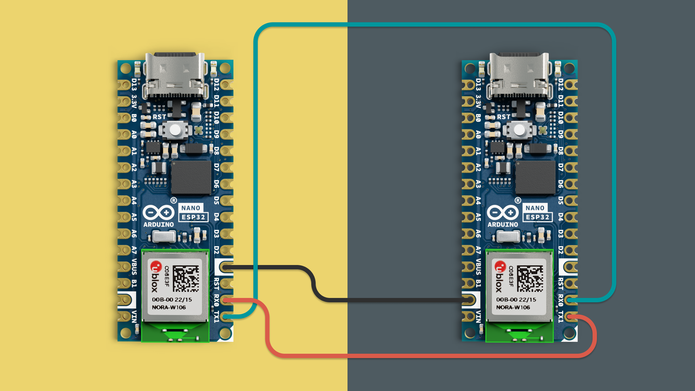
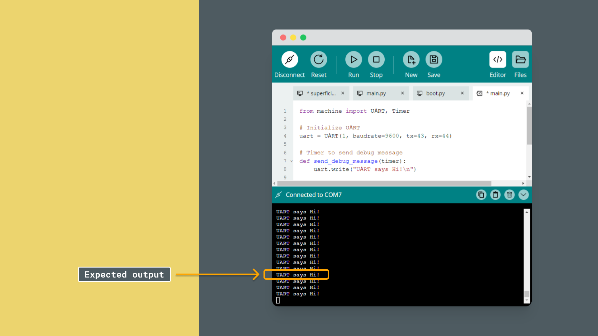

Universal Asynchronous Receiver-Transmitter, or **UART**, is one of the simplest and most widely used communication protocols for connecting devices. It enables point-to-point communication over just two wires, making it a perfect fit for debugging, logging, and connecting to peripheral devices.

## How UART Works

UART communication relies on:
- **TX (Transmit):** Sends data from one device to another.
- **RX (Receive):** Receives data from the transmitting device.

Unlike other protocols like I2C or SPI, UART is asynchronous, meaning it doesn’t use a clock line. Instead, the sender and receiver agree on a common data rate (baud rate), such as 9600 bits per second.

Each device directly connects TX to RX and RX to TX.
### Key Features of UART

1. **Simple Point-to-Point Communication:** Ideal for connecting two devices.  
2. **Flexible Speeds:** Baud rates can be adjusted to meet application needs.  
3. **Independent Lines:** TX and RX operate independently, enabling bidirectional communication.

## How to Read the Output

To observe the output of your UART communication, you’ll need a secondary board (or a USB-to-UART adapter) to act as a receiver. Here’s how you can set it up:

1. **Primary Board (Transmitter):** Runs the main UART code examples provided below.  
2. **Secondary Board (Receiver):** Reads from the UART interface and displays the output on a serial monitor like Arduino IDE or PuTTY.

### Circuit Setup
- Connect the **TX1 (GPIO43)** of the primary board to the **RX** of the secondary board.  
- Connect the **RX1 (GPIO44)** of the primary board to the **TX** of the secondary board.  
- Connect the ground (GND) of both devices together.



### Code for Secondary Board
The board simply forwards received UART data to its serial monitor. Use the following code:

```python
from machine import UART

# Initialize UART
uart = UART(1, baudrate=9600, tx=43, rx=44)  # Adjust TX/RX pins as needed

while True:
    if uart.any():  # Check if data is available
        ch = uart.read(1).decode()  # Read one character
        print(ch, end="")  # Print to the console
```

1. Flash the above code to the secondary board.  
2. Open a serial monitor for the secondary board (e.g., Arduino Lab for Micropython, Arduino IDE Serial Monitor, Putty).  
   

## Example 1: Testing UART

In this first example, we’ll create a program that prints `UART says Hi!` every second, allowing you to verify that the UART connection is working.

### Circuit Diagram
For this example:
- **Connect TX1 (GPIO43)** to the RX of your receiving device (e.g., USB-to-serial adapter).  
- **Connect RX1 (GPIO44)** to the TX of your receiving device.  
- **Connect GND** to the ground of the receiving device.


### Code Example

Copy the following code into your `main.py` file and run it on the board you designated as "primary":

```python
from machine import UART, Timer

# Initialize UART
uart = UART(1, baudrate=9600, tx=43, rx=44)

# Timer to send debug message
def send_debug_message(timer):
    uart.write("UART says Hi!\n")

# Configure the timer
timer = Timer(0)
timer.init(period=1000, mode=Timer.PERIODIC, callback=send_debug_message)

# Keep the program running
while True:
    pass
```

### Expected Output
When connected to a serial monitor, you should see:

```
UART says Hi!
UART says Hi!
UART says Hi!
```


If you don’t see this output, check your connections and ensure the baud rate matches.

## Example 2: Ping-Pong Communication

Next, let’s make the device respond with `pong` when it receives the message `ping`. This demonstrates how to handle incoming UART messages.

### Circuit Diagram
Use the same circuit as before. Ensure TX, RX, and GND are properly connected.

### Code Example

Copy the following code into your `main.py` file and run it on the board you designated as "primary":

```python
from machine import UART

# Initialize UART
uart = UART(1, baudrate=9600, tx=43, rx=44)

buffer = ""

while True:
    if uart.any():  # Check if data is available
        ch = uart.read(1).decode()  # Read one character
        uart.write(ch)  # Echo the input
        buffer += ch

        if ch == '\n':  # End of message
            if buffer.strip().lower() == "ping":
                uart.write("pong\n")
            buffer = ""  # Clear the buffer
```
Now copy the following code into your `main.py` file and run it on the board you designated as "secondary". In this case we are expanding the secondary board to be able to write via UART too:

```python
from machine import UART
import sys
import 

# Initialize UART
uart = UART(1, baudrate=9600, tx=43, rx=44)  # Adjust TX/RX pins as needed

while True:
    # Check if there's data coming from UART
    if uart.any():
        ch = uart.read(1).decode()  # Read one character from UART
        print(ch, end="")  # Print to USB serial monitor

    # Check if there's data enselecttered in REPL
    if sys.stdin in select.select([sys.stdin], [], [], 0)[0]:
        input_text = sys.stdin.read().strip()  # Read user input
        uart.write(input_text + "\n")  # Send via UART
```

### Expected Output
1. Type `ping` followed by `Enter` in your serial monitor.  
2. You should see:  
   ```
   pong
   ```

Any other input will simply be echoed back to the sender.

