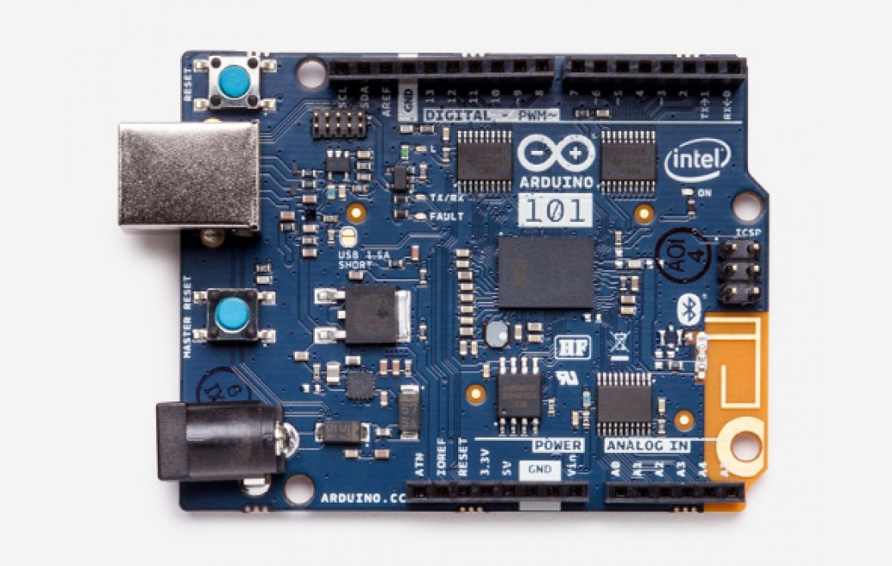

***Note: This page refers to a product that is retired.***

A learning and development board that delivers the performance and low-power consumption of the [Intel® Curie™](/resources/datasheets/intel-curie-module-datasheet.pdf) Module with the simplicity of Arduino at an entry-level price. It keeps the same robust form factor and peripheral list of the UNO with the addition of onboard Bluetooth® Low Energy capabilities and a 6-axis accelerometer/gyro to help you easily expand your creativity into the connected world. 

The module contains two tiny cores, an x86 (Quark) and a [32-bit ARC](https://en.wikipedia.org/wiki/ARC_(processor)) architecture core, both clocked at 32MHz. The Intel toolchain compiles your Arduino sketches optimally across both cores to accomplish the most demanding tasks. The Real-Time Operating Systems (RTOS) and framework developed by Intel is open sourced. See below under Firmware for the download link. The Arduino core communicates with the RTOS via static mailboxes to accomplish a predefined list of tasks (interface with PC using USB, program the sketch into flash, expose Bluetooth® Low Energy functionality to sketch, perform PWM). The RTOS for Intel Curie is still under development and new functions and features will be released in the near future.

The 101 comes with 14 digital input/output pins (of which 4 can be used as PWM outputs), 6 analog inputs, a USB connector for serial communication and sketch upload, a power jack, an ICSP header with SPI signals and I2C dedicated pins. The board operating voltage and I/O is 3.3V but all pins are protected against 5V overvoltage. 

The Arduino 101 has been designed in collaboration with Intel®. 

## Getting Started

In the [Getting Started section](https://www.arduino.cc/en/Guide/Arduino101), you can find all the information you need to configure your board, use the [Arduino Software (IDE)](https://www.arduino.cc/en/Main/Software), and start to tinker with coding and electronics.

### Need Help?

* On the Software [on the Arduino Forum](https://forum.arduino.cc/index.php?board=103.0)
* On Projects [on the Arduino Forum](https://forum.arduino.cc/index.php?board=3.0)
* On the Product itself through [our Customer Support](https://support.arduino.cc/hc)

## Documentation

### OSHW: Schematics

The 101 is open-source hardware! You can build your own board using the following files:

[CAD FILES IN .ZIP](https://content.arduino.cc/assets/Arduino101-reference.zip) 

[SCHEMATICS IN .PDF](https://www.arduino.cc/en/uploads/Main/Arduino101-REV4Schematic.pdf)

### Programming

The 101 can be programmed with the Arduino Software (IDE). Select "Arduino/Genuino 101" from the Tools > Board menu. For details, see the reference and tutorials. The board comes preprogrammed with an RTOS that handles USB connection and allows you to upload new code without the use of an external hardware programmer. It communicates using the DFU protocol (reference).

### Differences with other boards

The 101 has some features in common with both UNO (connectors, available peripherals) and Zero (32bit microcontroller, 3.3V IO) but the low power Intel microcontroller, on-board Bluetooth® Low Energy and motion sensors make it unique.

### Compatibility guide

Please check out the compatibility guide [here.](/resources/datasheets/intel-curie-shield-compat-guide.pdf)

### Firmware

Your 101 board might receive an update of the firmware from time to time. The Arduino Software (IDE) will incorporate the latest Firmware and an automated update procedure from the "Burn Bootloader" menu item. For people interested in compiling their own firmware, the source code and full details on how to use it are made available on [this Github Page](https://github.com/intel/CODK-A).

### Power

The 101 board can be powered via the USB connection or with an external power supply. The power source is selected automatically. External (non-USB) power can come either from an AC-to-DC adapter (wall-wart) or battery. The adapter can be connected by plugging a 2.1mm center-positive plug into the board's power jack. Leads from a battery can be inserted in the GND and Vin pin headers of the POWER connector.

The power pins are as follows:

* VIN. The input voltage to the Arduino board when it's using an external power source (as opposed to 5 volts from the USB connection or other regulated power source). You can supply voltage through this pin, or if supplying voltage via the power jack, access it through this pin.
* 5V. This pin outputs a regulated 5V from the regulator on the board. The board can be supplied with power either from the DC power jack (7 - 12V), the USB connector (5V), or the VIN pin of the board (7-12V). Supplying voltage via the 5V or 3.3V pins bypasses the regulator, and can damage your board if it is not sufficiently regulated. We don't advise it.
* 3.3V. A 3.3 volt supply generated by the on-board regulator. Maximum current draw is 1500 mA. This regulator also provides power to the Curie microcontroller.
* GND. Ground pins.
* IOREF. This pin on the Arduino board provides the voltage reference with which the microcontroller operates. A properly configured shield can read the IOREF pin voltage and select the appropriate power source or enable voltage translators on the outputs for working with the 5V or 3.3V.

### Memory

The Intel Curie module memory is shared between the two microcontrollers, so your sketch can use 196 kB out of 384 kB (flash memory) and 24 kB out of 80 kB (SRAM)

### Input and Output

Each of the 20 general purpose I/O pins on the 101 can be used for digital input or digital output using [pinMode()](https://www.arduino.cc/reference/en/language/functions/digital-io/pinmode/), [digitalWrite()](https://www.arduino.cc/en/Reference/DigitalWrite), and [digitalRead()](https://www.arduino.cc/reference/en/language/functions/digital-io/digitalread/) functions. Pins that can be used for PWM output are: 3, 5, 6, 9 using [analogWrite()](https://www.arduino.cc/en/Reference/AnalogWrite) function. All pins operate at 3.3 volts and can be used as interrupt source. See the attachInterrupt() function for details. Each pin can source or sink a maximum of 20 mA.

In addition, some pins have specialized functions:

* Serial: 0 (RX) and 1 (TX). Used to receive (RX) and transmit (TX) TTL serial data. These pins are connected to the Serial1 class.
* External Interrupts on all pins. Can trigger an interrupt on a low value, high value, a rising or falling edge, or a change in value (change is only supported by pins 2, 5, 7, 8, 10, 11, 12, 13). See the [attachInterrupt()](https://www.arduino.cc/reference/en/language/functions/external-interrupts/attachinterrupt/) function for details.
* SPI: SS, MOSI, MISO, SCK. Located on the SPI header support SPI communication using the [SPI library](https://www.arduino.cc/en/Reference/SPI).
* LED: 13\. There is a built-in LED driven by digital pin 13\. When the pin is HIGH value, the LED is on, when the pin is LOW, it's off.
* Analog Inputs. Six of the 20 general purpose I/O pins on the 101 provide analog input. These are labeled A0 through A5, and each provide 10 bits of resolution (i.e. 1024 different values). They measure from ground to 3.3 volts
* TWI: SDA pin and SCL pin. Support TWI communication using the [Wire library](https://www.arduino.cc/en/Reference/Wire)

## Tech specs

|                             |                                         |
| --------------------------- | --------------------------------------- |
| Microcontroller             | Intel Curie                             |
| Operating Voltage           | 3.3V (5V tolerant I/O)                  |
| Input Voltage (recommended) | 7-12V                                   |
| Input Voltage (limit)       | 7-17V                                   |
| Digital I/O Pins            | 14 (of which 4 provide PWM output)      |
| PWM Digital I/O Pins        | 4                                       |
| Analog Input Pins           | 6                                       |
| DC Current per I/O Pin      | 20 mA                                   |
| Flash Memory                | 196 kB                                  |
| SRAM                        | 24 kB                                   |
| Clock Speed                 | 32MHz                                   |
| LED\_BUILTIN                | 13                                      |
| Features                    | Bluetooth® Low Energy, 6-axis accelerometer/gyro |
| Length                      | 68.6 mm                                 |
| Width                       | 53.4 mm                                 |
| Weight                      | 34 gr.                                  |
