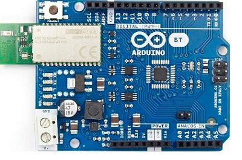
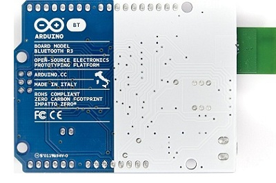

## Arduino BT (Bluetooth)

### Overview

The Arduino BT is a microcontroller board originally was based on the ATmega168, but now is supplied with the 328P ([datasheet](/resources/datasheets/ATmega48A-PA-88A-PA-168A-PA-328-P-DS-DS40002061B.pdf)) and the Bluegiga WT11 Bluetooth® module [datasheet](/resources/datasheets/WT11_Datasheet.pdf)). It supports wireless serial communication over Bluetooth® (but is not compatible with Bluetooth® headsets or other audio devices). It has 14 digital input/output pins (of which 6 can be used as PWM outputs and one can be used to reset the WT11 module), 6 analog inputs, a 16 MHz crystal oscillator, screw terminals for power, an ICSP header, and a reset button. It contains everything needed to support the microcontroller and can be programmed wirelessly over the Bluetooth® connection. Instructions are available for [getting started with the Arduino BT](content/retired/06.getting-started-guides/ArduinoBT).

### Summary

|||
|-|-|
|Microcontroller|ATmega328P|
|Operating Voltage|5V|
|Input Voltage|2.5-12 V|
|Digital I/O Pins|14 (of which 6 provide PWM output)|
|Analog Input Pins|6|
|DC Current per I/O Pin|40 mA|
|DC Current for 3.3V Pin|500 mA (with a 1.5A capable power source)|
|DC Current for 5V Pin|1000 mA (with a 1.5A capable power source)|
|Flash Memory|32 KB (of which 2 KB used by bootloader)|
|SRAM|2 KB|
|EEPROM|1 KB|
|Clock Speed|16 MHz|
|BT Module|2.1 WT11i\-A-AI4|

### Schematic & Reference Design

Reference Design: [Eagle\_File\_Arduino\_BT.zip](//www.arduino.cc/en/uploads/Main/Arduino%5FBT.zip)   
Schematic: [Arduino\_BT.pdf](//www.arduino.cc/en/uploads/Main/Arduino%5FBT.pdf) 

### Power

The Arduino BT can be powered via the V+ and GND screw terminals. The board contains a DC-DC convector that allows it to be powered with as little as 2.5V, a maximum of 12V. **Higher voltages or reversed polarity in the power supply can damage or destroy the board. The protection for reverse polarity connection is ONLY on the screw terminal.** 

The power pins are as follows:

* **+VIN.** The input voltage to the Arduino board (i.e. the same as the V+ screw terminal). You can supply voltage through this pin, or, if supplying voltage via the screw terminals, access it through this pin. **Warning: The protection for reverse polarity connection is ONLY on the screw terminal, do not attach negative voltages to this pin. It will damage the board.**
* **5V.** This pin outputs a regulated 5V from the regulator on the board. The board can be supplied with power either from the screw terminal (2.5V - 12V) or the VIN pin of the board (2.5V-12V). Supplying voltage via the 5V or 3.3V pins bypasses the regulator, and can damage your board. We don't advise it.
* **GND.** Ground pins.

### Memory

The ATmega328P has 32 KB of flash memory for storing code (of which 2 KB is used for the bootloader). It has 1 KB of SRAM and 512 bytes of EEPROM (which can be read and written with the [EEPROM library](http://www.arduino.cc/en/Reference/EEPROM)).

### Input and Output

Each of the 14 digital pins on the BT can be used as an input or output, using [pinMode()](//www.arduino.cc/en/Reference/PinMode), [digitalWrite()](//www.arduino.cc/en/Reference/DigitalWrite), and [digitalRead()](//www.arduino.cc/en/Reference/DigitalRead) functions. They operate at 5 volts. Each pin can provide or receive a maximum of 40 mA and has an internal pull-up resistor (disconnected by default) of 20-50 kOhms. In addition, some pins have specialized functions:

* **Serial: 0 (RX) and 1 (TX).** Used to receive (RX) and transmit (TX) TTL serial data. These pins are connected to the corresponding pins of the Bluegiga WT11 module.
* **External Interrupts: 2 and 3.** These pins can be configured to trigger an interrupt on a low value, a rising or falling edge, or a change in value. See the [attachInterrupt()](//www.arduino.cc/en/Reference/AttachInterrupt) function for details.
* **PWM: 3, 5, 6, 9, 10, and 11.** Provide 8-bit PWM output with the [analogWrite()](//www.arduino.cc/en/Reference/AnalogWrite) function.
* **SPI: 10 (SS), 11 (MOSI), 12 (MISO), 13 (SCK).** These pins support SPI communication, which, although provided by the underlying hardware, is not currently included in the Arduino language.
* **BT Reset: 7.** Connected to the reset line of the Bluegiga WT11 module, which is active high.
* **LED: 13.** There is a built-in LED connected to digital pin 13\. When the pin is HIGH value, the LED is on, when the pin is LOW, it's off.

The BT has 6 analog inputs, each of which provide 10 bits of resolution (i.e. 1024 different values). By default they measure from ground to 5 volts, though is it possible to change the upper end of their range using the AREF pin and some low-level code. Additionally, some pins have specialized functionality:

* **I2C: 4 (SDA) and 5 (SCL).** Support I2C (TWI) communication using the [Wire library](http://wiring.org.co/reference/libraries/Wire/index.html) (documentation on the Wiring website).

There are a couple of other pins on the board:

* **AREF.** Reference voltage for the analog inputs. Used with [analogReference](//www.arduino.cc/en/Reference/AnalogReference)().

See also the [mapping between Arduino pins and ATmega168/328P ports](https://docs.arduino.cc/hacking/hardware/PinMapping168).

### Bluetooth® Communication

The Bluegiga WT11 module on the Arduino BT provides Bluetooth® communication with computers, phones, and other Bluetooth® devices. The WT11 communicates with the ATmega328P via serial (shared with the RX and TX pins on the board). It comes configured for 115200 baud communication. The module should be configurable and detectable by your operating system's Bluetooth® drivers, which should then provide a virtual com port for use by other applications. The Arduino software includes a serial monitor which allows simple textual data to be sent to and from the Arduino board over this Bluetooth® connection. The board can also be reprogrammed using this same wireless connection.

The WT11 is specially configured for use in the Arduino BT. Its name is set to ARDUINOBT and passcode to 12345\. For details, see the complete initialization sketch on the [Arduino BT v1 page](./../arduino-BT-v1/content.md).

### Communication

The Arduino BT has a number of other facilities for communicating. The ATmega328P's UART TTL (5V) serial communication is available on digital pins 0 (RX) and 1 (TX) as well as being connected to the WT11 module.

A [SoftwareSerial library](http://www.arduino.cc/en/Reference/SoftwareSerial) allows for serial communication on any of the BT's digital pins.

The ATmega328P also supports I2C (TWI) and SPI communication. The Arduino software includes a Wire library to simplify use of the I2C bus; see the [documentation on the Wiring website](http://wiring.org.co/reference/libraries/Wire/index.html) for details. To use the SPI communication, please see the ATmega328P datasheet.

### Programming

The Arduino BT can be programmed with the Arduino software ([download](//www.arduino.cc/en/Main/Software)). For details, see the [reference](//www.arduino.cc/en/Reference/HomePage) and [tutorials](https://docs.arduino.cc/tutorials/).

The ATmega328P on the Arduino BT comes preburned with a [bootloader](//www.arduino.cc/en/Tutorial/Bootloader) that allows you to upload new code to it without the use of an external hardware programmer. It communicates using the original STK500 protocol ([reference](/resources/datasheets/doc2525.pdf), [C header files](/resources/datasheets/avr061.zip)).

You can also bypass the bootloader and program the ATmega328P through the ICSP (In-Circuit Serial Programming) header; see [these instructions](//www.arduino.cc/en/Hacking/Programmer) for details.

### Physical Characteristics

The maximum length and width of the BT are approximately 3.2 and 2.1 inches respectively. Three screw holes allow the board to be attached to a surface or case. Note that the distance between digital pins 7 and 8 is 160 mil (0.16"), not an even multiple of the 100 mil spacing of the other pins.
