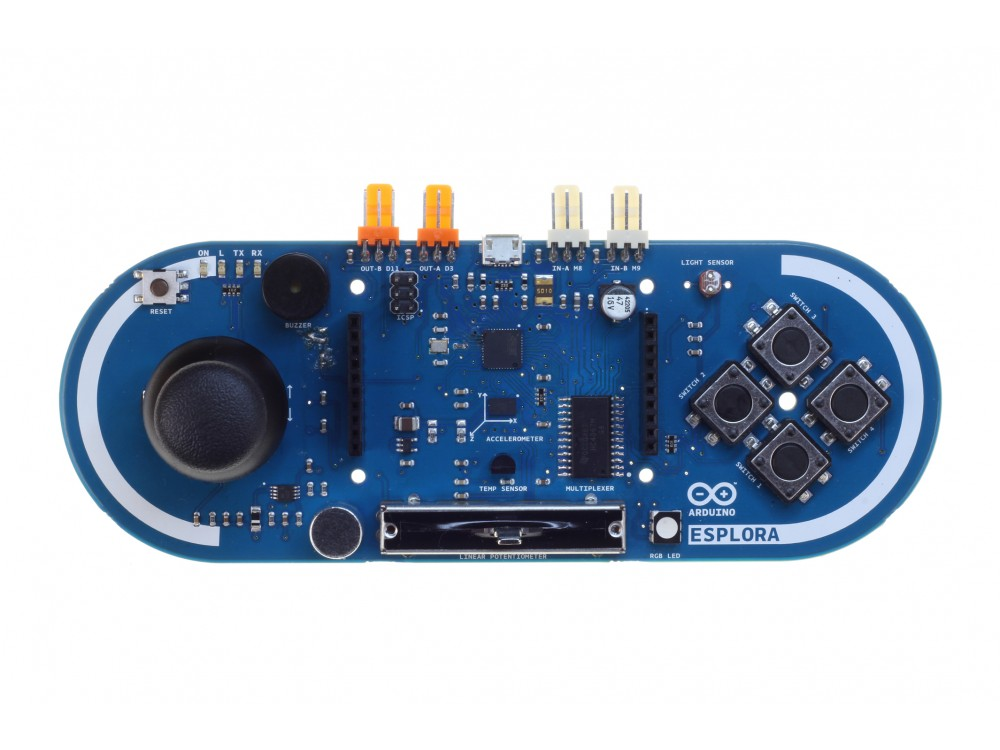
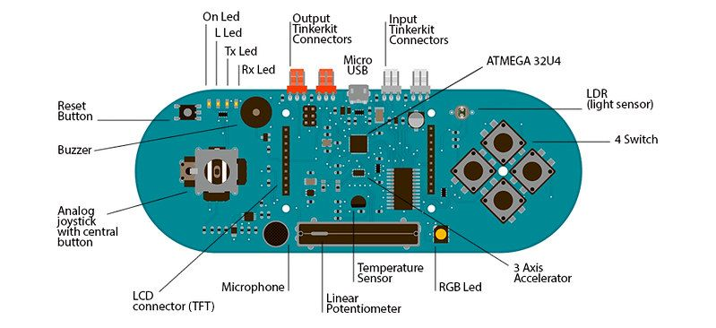

***Note: This page refers to a product that is retired.***

The **Arduino Esplora** is a microcontroller board derived from the [Arduino Leonardo](https://www.arduino.cc/en/Guide/ArduinoLeonardo). The Esplora differs from all preceding Arduino boards in that it provides a number of built-in, ready-to-use set of onboard sensors for interaction. It's designed for people who want to get up and running with Arduino without having to learn about the electronics first. For a step-by-step introduction to the Esplora, check out the [Getting Started with Esplora](https://www.arduino.cc/en/Guide/ArduinoEsplora) guide.

The Esplora has onboard sound and light outputs, and several input sensors, including a joystick, a slider, a temperature sensor, an accelerometer, a microphone, and a light sensor. It also has the potential to expand its capabilities with two Tinkerkit input and output connectors, and a socket for a color TFT LCD screen.

Like the Leonardo board, the Esplora uses an Atmega32U4 AVR microcontroller with 16 MHzcrystal oscillator and a micro USB connection capable of acting as a USB client device, like a mouse or a keyboard.

In the upper left corner of the board there is a reset pushbutton, that you can use to restart the board. There are four status LEDS:

* ON \[green\] indicates whether the board is receiving power supply
* L \[yellow\] connected directly to the microcontroller, accessible through pin 13
* RX and TX \[yellow\] indicates the data being transmitted or received over the USB communication

The board contains everything needed to support the microcontroller; simply connect it to a computer with a USB cable to get started.

The Esplora has built-in USB communication; it can appear to a connected computer as a mouse or keyboard, in addition to a virtual (CDC) serial / COM port. This has other implications for the behavior of the board; these are detailed on the [getting started page](https://www.arduino.cc/en/Guide/ArduinoEsplora).

You can find [here](https://www.arduino.cc/en/Main/warranty) your board warranty information.

## Getting Started

In the [Getting Started section](https://www.arduino.cc/en/Guide/ArduinoEsplora), you can find all the information you need to configure your board, use the [Arduino Software (IDE)](https://www.arduino.cc/en/Main/Software), and start to tinker with coding and electronics.

### Need Help?

* On the Software [on the Arduino Forum](https://forum.arduino.cc/index.php?board=93.0)
* On Projects [on the Arduino Forum](https://forum.arduino.cc/index.php?board=3.0)
* On the Product itself through [our Customer Support](https://support.arduino.cc/hc)

## Documentation

### OSH: Schematics

Arduino Esplora is open-source hardware! You can build your own board using the following files:

[EAGLE FILES IN .ZIP](https://www.arduino.cc/en/uploads/Main/arduino-esplora-reference-design.zip) 

[SCHEMATICS IN DSN](https://www.arduino.cc/en/uploads/Main/arduino-esplora-schematic.pdf)

### Memory

The ATmega32u4 has 32 KB (with 4 KB used for the bootloader). It also has 2.5 KB of SRAM and 1 KB of EEPROM (which can be read and written with the EEPROM library).

### Input and Output

The design of the Esplora board recalls traditional gamepad design with an analog joystick on the left and four pushbuttons on the right.

The Esplora has the following on-board inputs and outputs :

* Analog joystick with central push-button two axis (X and Y) and a center pushbutton.
* 4 push-buttons laid out in a diamond pattern.
* Linear potentiometer slider near the bottom of the board.
* Microphone for getting the loudness (amplitude) of the surrounding environment.
* Light sensor for getting the brightness.
* Temperature sensor reads the ambient temperature
* Three-axis accelerometer measures the board's relation to gravity on three axes (X, Y, and Z)
* Buzzer can produce square-waves.
* RGB led bright LED with Red Green and Blue elements for color mixing.
* 2 TinkerKit Inputs to connect the TinkerKit sensor modules with the 3-pin connectors.
* 2 TinkerKit Outputs to connect the TinkerKit actuator modules with the 3-pin connectors.
* TFT display connector connector for an optional color LCD screen, SD card, or other devices that use the SPI protocol.

In order to utilize the total number of available sensors, the board uses an analog multiplexer. This means a single analog input of the microcontroller is shared among all the input channels (except the 3-axis accelerometer). Four additional microcontroller pins choose which channel to read.

### Communication

The Leonardo the Esplora has a number of facilities for communicating with a computer, another Arduino, or other microcontrollers. The ATmega32U4 provides serial (CDC) communication over USB and appears as a virtual com port to software on the computer. The chip also acts as a full speed USB 2.0 device, using standard USB COM drivers. On Windows, a .inf file is required. The Arduino software includes a serial monitor which allows simple textual data to be sent to and from the Arduino board. The RX and TX LEDs on the board will flash when data is being transmitted via the USB connection to the computer.

The ATmega32U4 also supports SPI communication, that can be accessed through the SPI library.

The Esplora can appear as a generic keyboard and mouse, and can be programmed to control these input devices using the [Keyboard](https://www.arduino.cc/reference/en/language/functions/usb/keyboard/) and [Mouse](https://www.arduino.cc/reference/en/language/functions/usb/mouse/) libraries.

### Programming

The Esplora can be programmed with the Arduino software (download). Select "Arduino Esplora" from the Tools > Board menu. For details, see the [getting started page](https://www.arduino.cc/en/Guide/ArduinoEsplora).

The ATmega32U4 on the Arduino Esplora comes preburned with a bootloader that allows you to upload new code to it without the use of an external hardware programmer. It communicates using the AVR109 protocol.

You can also bypass the bootloader and program the microcontroller through the ICSP (In-Circuit Serial Programming) header; see [these instructions](https://www.arduino.cc/en/Hacking/Programmer) for details.

To facilitate writing sketches for the Esplora, there is a dedicated library that contains methods for reading the sensors and writing to the outputs on-board.

The library offers high level methods which provide pre-processed data, like degrees Fahrenheit or Celsius from the temperature sensor. It also enables easy access to the outputs, like writing values to the RGB LED.

Visit the [Esplora library](https://www.arduino.cc/en/Reference/EsploraLibrary) reference page to see the complete documentation of the library and examples.

### Automatic (Software) Reset and Bootloader initiation

Rather than requiring a physical press of the reset button before an upload, the Esplora is designed in a way that allows it to be reset by software running on a connected computer. The reset is triggered when the Esplora's virtual (CDC) serial / COM port is opened at 1200 baud and then closed. When this happens, the processor will reset, breaking the USB connection to the computer (meaning that the virtual serial / COM port will disappear). After the processor resets, the bootloader starts, remaining active for about 8 seconds. The bootloader can also be initiated by pressing the reset button on the Esplora. Note that when the board first powers up, it will jump straight to the user sketch, if present, rather than initiating the bootloader.

Because of the way the Esplora handles reset it's best to let the Arduino software try to initiate the reset before uploading, especially if you are in the habit of pressing the reset button before uploading on other boards. If the software can't reset the board you can always start the bootloader by pressing the reset button on the board.

### USB Overcurrent Protection

The Esplora has a resettable polyfuse that protects your computer's USB ports from shorts and overcurrent. Although most computers provide their own internal protection, the fuse provides an extra layer of protection. If more than 500 mA is applied to the USB port, the fuse will automatically break the connection until the short or overload is removed.

### Physical Characteristics

The maximum length and width of the Esplora PCB are 6.5 and 2.4 inches respectively, with the USB and TinkerKit connectors extending beyond the latter dimension. Four screw holes allow the board to be attached to a surface or case.

## Tech Specs

|                   |                                        |
| ----------------- | -------------------------------------- |
| Microcontroller   | ATmega32u4                             |
| Operating Voltage | 5V                                     |
| Flash Memory      | 32 KB of which 4 KB used by bootloader |
| SRAM              | 2.5 KB                                 |
| EEPROM            | 1 KB                                   |
| Clock Speed       | 16 MHz                                 |
| Length            | 164.04 mm                              |
| Width             | 60 mm                                  |
| Weight            | 53 gr                                  |