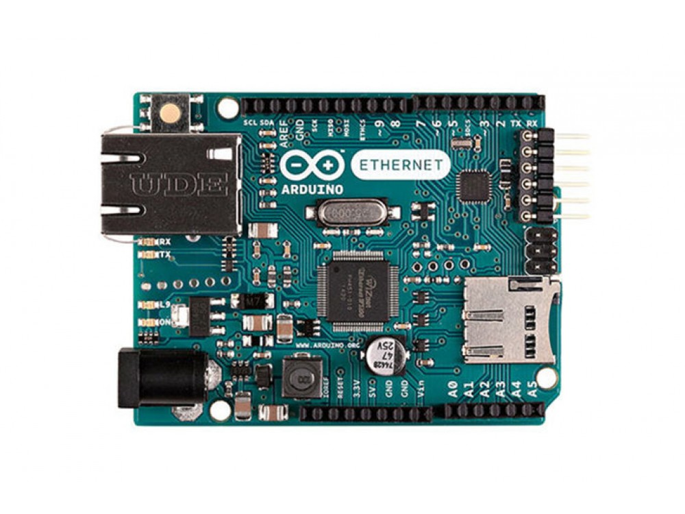

***Note: This page refers to a product that is retired.***

The **Arduino Ethernet** is a microcontroller board based on the ATmega328\. It has 14 digital input/output pins, 6 analog inputs, a 16 MHz crystal oscillator, a RJ45 connection, a power jack, an ICSP header, and a reset button.

*NB: Pins 10, 11, 12 and 13 are reserved for interfacing with the Ethernet module and should not be used otherwise. This reduces the number of available pins to 9, with 4 available as PWM outputs.*

An optional Power over Ethernet module can be added to the board as well.

The Ethernet differs from other boards in that it does not have an onboard USB-to-serial driver chip, but has a Wiznet Ethernet interface. This is the same interface found on the Ethernet shield.

An onboard microSD card reader, which can be used to store files for serving over the network, is accessible through the SD Library. Pin 10 is reserved for the Wiznet interface, SS for the SD card is on Pin 4.

The 6-pin serial programming header is compatible with the [USB Serial](https://www.arduino.cc/en/Main/USBSerial) adapter and also with the FTDI USB cables or with Sparkfun and Adafruit FTDI-style basic USB-to-serial breakout boards. It features support for automatic reset, allowing sketches to be uploaded without pressing the reset button on the board. When plugged into a USB to Serial adapter, the Arduino Ethernet is powered from the adapter.

The Revision 3 of the board introduces the standardized 1.0 pinout, that consist in:

* added **SDA** and **SCL** pins that are near to the AREF pin and two other new pins placed near to the RESET pin, this will the opportunity to shield that use i2c or TWI components to be compatible with all the Arduino boards;
* the **IOREF** that allow the shields to adapt to the voltage provided from the board. Shields that use the IOREF pin will be compatible both with the board that use the AVR, which operate with 5V and with the Arduino Due that operate with 3.3V. Next to the IOREF pin there is a not connected pin, that is reserved for future purposes.

## Getting Started

Use the [Arduino Software (IDE)](https://www.arduino.cc/en/Main/Software), and start to tinker with coding and electronics. You can find your board warranty information [here](https://www.arduino.cc/en/Main/warranty).

### Need Help?

* On the Ethernet Shield V2 [on the Ethernet V2 Library](https://www.arduino.cc/en/Reference/Ethernet)
* On Projects [on the Arduino Forum](https://forum.arduino.cc/index.php?board=3.0)
* On the Product itself through [our Customer Support](https://support.arduino.cc/hc)

A separate power-over-Ethernet (PoE) module can be soldered to the board to provide power from a conventional twisted pair Category 5 Ethernet cable. It is IEEE802.3af compliant, and works with all compliant PoE injectors currently available. Compatible with PoE Module 12V (X000002).

## Documentation

### OSH: Schematics

Arduino Ethernet is open-source hardware! You can build your own board using the following files:

[EAGLE FILES IN .ZIP](https://www.arduino.cc/en/uploads/Main/arduino-ethernet-R3-reference-design.zip) 

[SCHEMATICS IN .PDF](https://www.arduino.cc/en/uploads/Main/arduino-ethernet-R3-schematic.pdf)

### Power

The board can also be powered via an external power supply, an optional Power over Ethernet (PoE) module, or by using a FTDI cable/USB Serial connector.

External power can come either from an AC-to-DC adapter (wall-wart) or battery. The adapter can be connected by plugging a 2.1mm center-positive plug into the board's power jack. Leads from a battery can be inserted in the Gnd and Vin pin headers of the POWER connector.

The board can operate on an external supply of 6 to 20 volts. If supplied with less than 7V, however, the 5V pin may supply less than five volts and the board may be unstable. If using more than 12V, the voltage regulator may overheat and damage the board. The recommended range is 7 to 12 volts.

The power pins are as follows:

* VIN. The input voltage to the Arduino board when it's using an external power source (as opposed to 5 volts from the USB connection or other regulated power source). You can supply voltage through this pin, or, if supplying voltage via the power jack, access it through this pin.
* 5V. This pin outputs a regulated 5V from the regulator on the board. The board can be supplied with power either from the DC power jack (7 - 12V), the USB connector (5V), or the VIN pin of the board (7-12V). Supplying voltage via the 5V or 3.3V pins bypasses the regulator, and can damage your board. We don't advise it.
* 3V3\. A 3.3 volt supply generated by the on-board regulator. Maximum current draw is 50 mA.
* GND. Ground pins.
* IOREF. This pin on the Arduino board provides the voltage reference with which the microcontroller operates. A properly configured shield can read the IOREF pin voltage and select the appropriate power source or enable voltage translators on the outputs for working with the 5V or 3.3V.

The optional PoE module is designed to extract power from a conventional twisted pair Category 5 Ethernet cable:

* IEEE802.3af compliant
* Low output ripple and noise (100mVpp)
* Input voltage range 36V to 57V
* Overload and short-circuit protection
* 9V Output
* High efficiency DC/DC converter: typ 75% @ 50% load
* 1500V isolation (input to output)

*NB: the Power over Ethernet module is proprietary hardware not made by Arduino, it is a third party accessory. For more information, see the [datasheet](https://www.arduino.cc/en/uploads/Main/PoE-datasheet.pdf)* 

When using the power adapter, power can come either from an AC-to-DC adapter (wall-wart) or battery. The adapter can be connected by plugging a 2.1mm center-positive plug into the board's power jack. Leads from a battery can be inserted in the Gnd and Vin pin headers of the POWER connector. The board can operate on an external supply of 6 to 20 volts. If supplied with less than 7V, however, the 5V pin may supply less than five volts and the board may be unstable. If using more than 12V, the voltage regulator may overheat and damage the board. The recommended range is 7 to 12 volts.

### Memory

The ATmega328 has 32 KB (with 0.5 KB used for the bootloader). It also has 2 KB of SRAM and 1 KB of EEPROM (which can be read and written with the [EEPROM library](https://www.arduino.cc/en/Reference/EEPROM)).

### Input and Output

Each of the 14 digital pins on the Ethernet board can be used as an input or output, using[pinMode()](https://www.arduino.cc/reference/en/language/functions/digital-io/pinmode/), [digitalWrite()](https://www.arduino.cc/en/Reference/DigitalWrite), and [digitalRead()](https://www.arduino.cc/reference/en/language/functions/digital-io/digitalread/) functions. They operate at 5 volts. Each pin can provide or receive a maximum of 40 mA and has an internal pull-up resistor (disconnected by default) of 20-50 kOhms. In addition, some pins have specialized functions:

* Serial: 0 (RX) and 1 (TX). Used to receive (RX) and transmit (TX) TTL serial data.
* External Interrupts: 2 and 3\. These pins can be configured to trigger an interrupt on a low value, a rising or falling edge, or a change in value. See the [attachInterrupt()](https://www.arduino.cc/reference/en/language/functions/external-interrupts/attachinterrupt/) function for details.
* PWM: 3, 5, 6, 9, and 10\. Provide 8-bit PWM output with the [analogWrite()](https://www.arduino.cc/en/Reference/AnalogWrite) function.
* SPI: 10 (SS), 11 (MOSI), 12 (MISO), 13 (SCK). These pins support SPI communication using the[SPI library](https://www.arduino.cc/en/Reference/SPI).
* LED: 9\. There is a built-in LED connected to digital pin 9\. When the pin is HIGH value, the LED is on, when the pin is LOW, it's off. On most other arduino boards, this LED is found on pin 13\. It is on pin 9 on the Ethernet board because pin 13 is used as part of the SPI connection.

The Ethernet board has 6 analog inputs, labeled A0 through A5, each of which provide 10 bits of resolution (i.e. 1024 different values). By default they measure from ground to 5 volts, though is it possible to change the upper end of their range using the AREF pin and the [analogReference](https://www.arduino.cc/reference/en/language/functions/analog-io/analogreference/)() function. Additionally, some pins have specialized functionality:

* TWI: A4 (SDA) and A5 (SCL). Support TWI communication using the [Wire library](https://www.arduino.cc/en/Reference/Wire).

There are a couple of other pins on the board:

* AREF. Reference voltage for the analog inputs. Used with [analogReference](https://www.arduino.cc/reference/en/language/functions/analog-io/analogreference/)().
* Reset. Bring this line LOW to reset the microcontroller. Typically used to add a reset button to shields which block the one on the board.

See also the [mapping between Arduino pins and ATmega328 ports](http://arduino.cc/en/Hacking/PinMapping168).

### Communication

The Arduino Ethernet has a number of facilities for communicating with a computer, another Arduino, or other microcontrollers.

A [SoftwareSerial library](http://www.arduino.cc/en/Reference/SoftwareSerial) allows for serial communication on any of the Uno's digital pins.

The ATmega328 also supports TWI and SPI communication. The Arduino software includes a Wire library to simplify use of the TWI bus; see the [documentation](https://www.arduino.cc/en/Reference/Wire) for details. For SPI communication, use the [SPI library](https://www.arduino.cc/en/Reference/SPI).

The board also can connect to a wired network via ethernet. When connecting to a network, you will need to provide an IP address and a MAC address. The [Ethernet Library](https://www.arduino.cc/en/Reference/Ethernet) is fully supported.

The onboard microSD card reader is accessible through the [SD Library](https://www.arduino.cc/en/Reference/SD). When working with this library, SS is on Pin 4.

### Programming

It is possible to program the Arduino Ethernet board in two ways: through the 6 pin serial programming header, or with an external ISP programmer.

The 6-pin serial programming header is compatible with FTDI USB cables and the Sparkfun and Adafruit FTDI-style basic USB-to-serial breakout boards including the Arduino USB-Serial connector. It features support for automatic reset, allowing sketches to be uploaded without pressing the reset button on the board. When plugged into a FTDI-style USB adapter, the Arduino Ethernet is powered off the adapter.

You can also bypass the bootloader and program the microcontroller through the ICSP (In-Circuit Serial Programming) header using [Arduino ISP](https://www.arduino.cc/en/Main/ArduinoISP) or similar; see [these instructions](https://www.arduino.cc/en/Hacking/Programmer) for details.

All the Ethernet example sketches work as they do with the Ethernet shield. Make sure to change the network settings for your network.

### Physical Characteristics

The maximum length and width of the Ethernet PCB are 2.7 and 2.1 inches respectively, with theRJ45 connector and power jack extending beyond the former dimension. Four screw holes allow the board to be attached to a surface or case. Note that the distance between digital pins 7 and 8 is 160 mil (0.16"), not an even multiple of the 100 mil spacing of the other pins.

### Setup

If you want to use a FTDI cable to download your sketches on the Arduino Ethernet, please refer to this guide: [Upgrade the Arduino Ethernet bootloader to the latest version](http://scuola.arduino.cc/en/content/upgrade-arduino-ethernet-bootloader-latest-version)

## Tech Specs

|                                                |                                                        |
|------------------------------------------------|--------------------------------------------------------|
| Microcontroller                                |[ATmega328](http://www.atmel.com/Images/Atmel-42735-8-bit-AVR-Microcontroller-ATmega328-328P_Datasheet.pdf)|
| Operating Voltage                              | 5V|
| Input Voltage Plug (recommended)               | 7-12V|
| Input Voltage Plug (limits)                    | 6-20V|
| Input Voltage PoE (limits)                     | 36-57V|
| Digital I/O Pins                               | 14 (of which 4 provide PWM output)|
| Arduino Pins reserved:                         ||
|                                                | 10 to 13 used for SPI|
|                                                | 4 used for SD card|
|                                                | 2 W5100 interrupt (when bridged)|
| Analog Input Pins                              | 6|
| DC Current per I/O Pin                         | 40 mA|
| DC Current for 3.3V Pin                        | 50 mA|
| Flash Memory                                   | 32 KB (ATmega328) of which 0.5 KB used by bootloader|
| SRAM                                           | 2 KB (ATmega328)|
| EEPROM                                         | 1 KB (ATmega328)|
| Clock Speed                                    | 16 MHz|
| W5100 TCP/IP Embedded Ethernet Controller      ||
| Power Over Ethernet ready Magnetic Jack        ||
| Micro SD card, with active voltage translators ||
| Length                                         | 68.6 mm|
| Width                                          | 53.3 mm|
| Weight                                         | 28 gr|