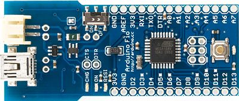

***Note: This page refers to a product that is retired.***



## Overview

The Arduino Fio is a microcontroller board based on the ATmega328P ([datasheet](http://www.atmel.com/Images/Atmel-8271-8-bit-AVR-Microcontroller-ATmega48A-48PA-88A-88PA-168A-168PA-328-328P_datasheet.pdf)) runs at 3.3V and 8 MHz. It has 14 digital input/output pins (of which 6 can be used as PWM outputs), 8 analog inputs, an on-board resonator, a reset button, and holes for mounting pin headers. It has connections for a Lithium Polymer battery and includes a charge circuit over USB. An XBee socket is available on the bottom of the board.

The Arduino Fio is intended for wireless applications. The user can upload sketches with an a FTDI cable or Sparkfun breakout board. Additionally, by using a modified USB-to-XBee adaptor such as XBee Explorer USB, the user can upload sketches wirelessly. The board comes without pre-mounted headers, allowing the use of various types of connectors or direct soldering of wires.

The Arduino Fio was designed by Shigeru Kobayashi and SparkFun Electronics, and manufactured by SparkFun Electronics.

## Schematic & Reference Design

EAGLE files: [arduino-fio-reference-design.zip](https://arduino.cc/en/uploads/Main/arduino-fio-reference-design.zip)

Schematic: [Arduino-Fio-schematic.pdf](https://arduino.cc/en/uploads/Main/Arduino-Fio-schematic.pdf)

## Summary

|||
|-|-|
|Microcontroller|	ATmega328P|
|Operating Voltage|	3.3V|
|Input Voltage|	3.35 -12 V|
|Input Voltage for Charge|	3.7 - 7 V|
|Digital I/O Pins|	14 (of which 6 provide PWM output)|
|Analog Input Pins|	8|
|DC Current per I/O Pin|	40 mA|
|Flash Memory|	32 KB (of which 2 KB used by bootloader)|
|SRAM|	2 KB|
|EEPROM|	1 KB|
|Clock Speed|	8 MHz|
|Width|	28 mm|
|Length|	65 mm|
|Weight|	9 g|

## Power

The Arduino Fio can be powered with an FTDI cable or breakout board connected to its six pin headers (as marked on the bottom side), or with a regulated 3.3V supply on the 3V3 pin or a Lithium Polymer battery on the BAT pins.

The power pins are as follows:

- BAT. For supplying a Lithium Polymer battery to the board.
- 3V3. The regulated 3.3 volt supply pins.
- GND. Ground pins.

## Memory

The ATmega328P has 32 KB of flash memory for storing code (of which 2 KB is used for the bootloader). It has 2 KB of SRAM and 1 KB of EEPROM (which can be read and written with the [EEPROM library](http://www.arduino.cc/en/Reference/EEPROM)).

## Input and Output

Each of the 14 digital pins on the Fio can be used as an input or output, using [pinMode()](https://arduino.cc/en/Reference/PinMode), [digitalWrite()](https://arduino.cc/en/Reference/DigitalWrite), and [digitalRead()](https://www.arduino.cc/reference/en/language/functions/digital-io/digitalread/) functions. They operate at 3.3 volts. Each pin can provide or receive a maximum of 40 mA and has an internal pull-up resistor (disconnected by default) of 20-50 kOhms. In addition, some pins have specialized functions:

-Serial: RXI (D0) and TXO (D1). Used to receive (RX) and transmit (TX) TTL serial data. These pins are connected to the DOUT and DIN pins of the XBee modem socket.

-External Interrupts: 2 and 3. These pins can be configured to trigger an interrupt on a low value, a rising or falling edge, or a change in value. See the [attachInterrupt()](https://www.arduino.cc/reference/en/language/functions/external-interrupts/attachinterrupt/) function for details.
-PWM: 3, 5, 6, 9, 10, and 11. Provide 8-bit PWM output with the [analogWrite()](https://arduino.cc/en/Reference/AnalogWrite) function.
-SPI: 10 (SS), 11 (MOSI), 12 (MISO), 13 (SCK). These pins support SPI communication, which, although provided by the underlying hardware, is not currently included in the Arduino language.
-LED: 13. There is a built-in LED connected to digital pin 13. When the pin is HIGH value, the LED is on, when the pin is LOW, it's off.

The Fio has 8 analog inputs, each of which provide 10 bits of resolution (i.e. 1024 different values). The analog inputs measure from ground to Vcc. Additionally, some pins have specialized functionality:

- I2C: 4 (SDA) and 5 (SCL). Support I2C (TWI) communication using the [Wire library](https://arduino.cc/en/Reference/Wire).

There are couple of another pins on the board:

- AREF. Reference voltage for the analog inputs. Used with [analogReference()](https://www.arduino.cc/reference/en/language/functions/analog-io/analogreference/).
- DTR. Bring this line LOW to reset the microcontroller. Typically used to add a reset button to shields which block the one on the board.

There are also 8 unsoldered holes on the board:

- BAT + and BAT -. To be connected to a battery. Typically used when you don't want to connect a battery to the battery connector.
- CHG 5V and CHG -. To be connected to charging terminals. Typically used to add an external connector for charging.
- SW. Connected to the power switch on the board. Typically used to add an external power switch.
- CTS. Connected to the #CTS/DIO7 pin of the XBee socket. Typically used to do sleep control for a XBee modem.
- DTR. Connected to the #DTR/SLEEP_RQ/DI8 pin of the XBee socket. Typically used to do sleep control for a XBee modem.

See also the [mapping between Arduino pins and ATmega328P ports](https://docs.arduino.cc/hacking/hardware/Atmega168Hardware).

## Communication

The Arduino Fio has a number of facilities for communicating with a computer, another Arduino, or other microcontrollers. The ATmega328P provides UART TTL serial communication, which is available on digital pins 0 (RX) and 1 (TX). The Arduino software includes a serial monitor which allows simple textual data to be sent to and from the Arduino Fio board via an external serial connection. We recommend using an FTDI Basic or FTDI cable. The on board mini-USB connector is only used for charging and does not allow for serial communication.

A [SoftwareSerial library](http://www.arduino.cc/en/Reference/SoftwareSerial) allows for serial communication on any of the Fio's digital pins.

The ATmega328P also supports I2C (TWI) and SPI communication. The Arduino software includes a Wire library to simplify use of the I2C bus; see the [reference](https://arduino.cc/en/Reference/Wire) for details. To use the SPI communication, please see the ATmega328P datasheet.

## Physical Characteristics

The dimensions of the Fio PCB are approximately 1.1" x 2.6".

---

## Useful Fio Programming Tips

The Arduino Fio is not quite as simple as the standard Arduino modules, because programming over the XBee wireless link has some complications. If you're aware of those complications, though, it's a simple board to use. Here are some tips that will make using it easier.

### Use the bootloader's baudrate when possible

The Atmega328P bootloader communicates at 57600bps. This is why you have to configure your XBee radios to 57600bps in the examples above. If your sketches are going to communicate using the XBee radio serial link at a different baudrate, you will need to reconfigure the radios to that rate after programming. So if you're programming wirelessly, and you can choose the baudrate for your application, use the bootloader rate of 57600bps. It'll save you the time of reconfiguring the radios.

If you have to use a different baudrate for your application, consider programming the Fio using a wired link instead. While programming over a wired link, remove the XBee radio to avoid conflict.

### Use ASCII-encoded communication when possible

The XBee radios have two modes, data mode, in which data is sent across them transparently, and command mode, in which they are configured serially. To switch from data mode to command mode, you send the string `+++`@.

Sending sensor values as binary values can accidentally cause the XBees to switch from command to data mode. For example, imagine you're sending an analog reading like so:

```arduino
   int sensorReading = analogRead(0) /4;
   Serial.print(sensorReading, BYTE);
```

If the sensor's reading happens to have the value 43 (which corresponds to ASCII '+') three times in a row, it will set the Fio's radio into command mode. To avoid this, use ASCII-based communication with the Fio whenever possible.

### Be aware of the automatic (software) reset

Like other Arduinos, the Arduino Fio does not require a physical press of the reset button before an upload. It can be reset by software running on a connected computer. When the Fio is connected to either a computer running Mac OS X or Linux, it resets each time a serial connection is made to it from software (via USB). To avoid problems, you should make sure that the Fio sends the initial communication to any program that's talking to it serially.

The sketch below sends a byte on startup. The receiving program should look for that message, and not send to the Arduino before it receives this byte.

```arduino
void setup() {
   Serial.begin(57600);
   Serial.print(255);
}

void loop() {
   int sensorReading = analogRead(0);
   Serial.println(sensorReading, DEC);
}
```

If you use this sketch as your default when designing serial applications for the Fio, you should have fewer problems.

Here's why it matters:

One of the pins on the FTDI programming header is connected to the reset line of the ATmega328P via a 100 nanofarad capacitor. This pin connects to one of the hardware flow control lines of any FTDI USB-to-serial converter connected to the header: RTS when using an FTDI cable, DTR when using the Sparkfun breakout board. When this line is taken low, the reset line drops long enough to reset the chip. The Arduino software uses this capability to allow you to upload code by simply pressing the upload button in the Arduino environment. This means that the bootloader can have a shorter timeout, as the lowering of the reset line can be coordinated with the start of the upload.

For the following half-second or so, the bootloader is running on the Fio. While it is programmed to ignore bad data (i.e. anything besides an upload of new code), it will intercept the first few bytes of data sent to the board after a connection is opened. If a sketch running on the board receives one-time configuration or other data when it first starts, make sure that the software with which it communicates waits a second after opening the connection and before sending this data.
