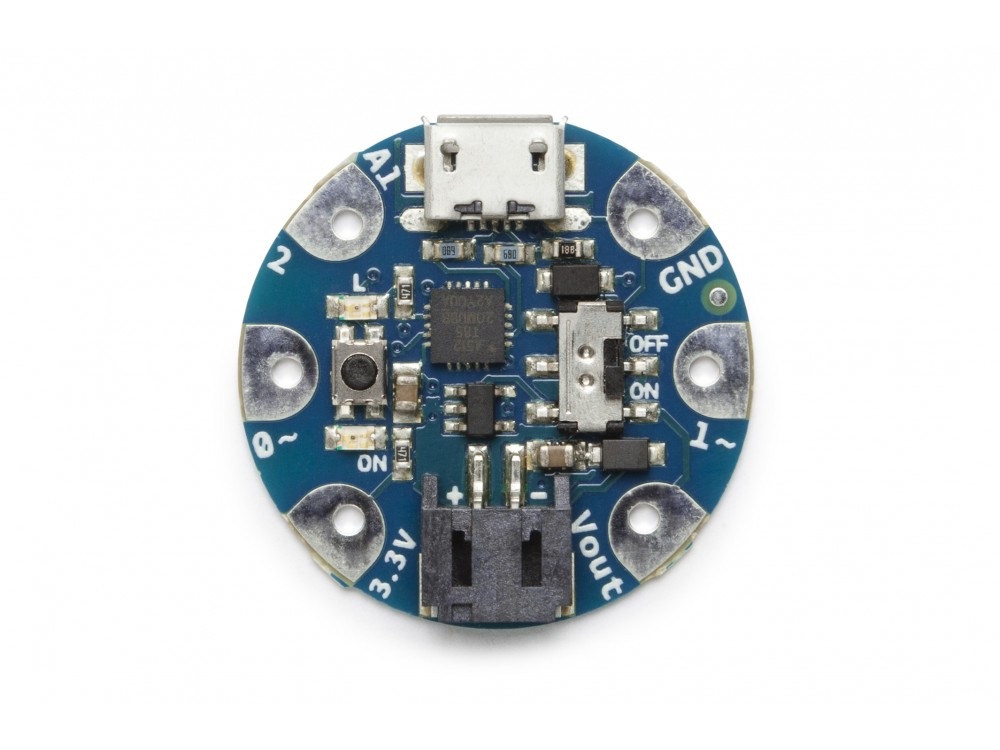

***Note: This page refers to a product that is retired.***

The **Arduino Gemma** is a microcontroller board made by [Adafruit](https://www.adafruit.com/) based on the [ATtiny85](http://www.atmel.com/assets/atmel-2586-avr-8-bit-microcontroller-attiny25-attiny45-attiny85_datasheet.pdf). It has 3 digital input/output pins (of which 2 can be used as PWM outputs and 1 as analog input), an 8 MHz resonator, a micro USB connection, a JST connector for a 3.7V battery, and a reset button. It contains everything needed to support the microcontroller; simply connect it to a computer with a USB cable or power it with a battery to get started.

You can find your board warranty information [here](https://www.arduino.cc/en/Main/warranty).

## Getting Started

In the [Getting Started section](https://www.arduino.cc/en/Guide/ArduinoGemma), you can find all the information you need to configure your board, use the [Arduino Software (IDE)](https://www.arduino.cc/en/Main/Software), and start to tinker with coding and electronics.

### Need Help?

* On Projects [on the Arduino Forum](https://forum.arduino.cc/index.php?board=13.0)
* On the Product itself through [our Customer Support](https://support.arduino.cc/hc)

## Documentation

### OSH: Schematics

Arduino Gemma is open-source hardware! You can build your own board using the following files:

[EAGLE FILES IN .ZIP](https://www.arduino.cc/en/uploads/Main/arduino-gemma-reference-design.zip) 

[SCHEMATICS IN .PDF](https://www.arduino.cc/en/uploads/Main/arduino-gemma-schematic.pdf)

### Power

The Arduino Gemma can be powered via the micro USB connection or with a 3.7V Li-Ion battery (connected to the JST connector on the board). Either power source is regulated down to the operating voltage (3.3V) by the on-board MIC5225.

The board can be turned on and off with the on-board switch. With the switch in the ON position, the microcontroller receives power and the board runs. With the switch in the "OFF" position, the microcontroller doesn't receive power. (This is true whether the board is powered via USB or a battery.)

Half of the pads on the Gemma are related to power in and out: 3Vo , Vout and GND. The power pins are as follows:

* **Vout**: This is a voltage OUTPUT pin, it will be connected to either the USB power or the battery input, whichever has the higher voltage. This output does not connect to the regulator so you can draw as much current as your USB port / Battery can provide (in general, that's about 500mA).
* **3Vo**: This is the 3.3V OUTPUT pad from the voltage regulator. It can provide up to 150mA at a steady 3.3V. Good for sensors or small LEDs or other 3V devices.
* **GND**: Is the common ground pin, used for logic and power. It is connected to the USB ground and the power regulator, etc. This is the pin you'll want to use for any and all ground connections

### Memory

The ATtiny85 has 8 kB (with 2.75 kB used for the bootloader). It also has 512 Bytes of SRAM and 512 Bytes of EEPROM (which can be read and written with the [EEPROM library](https://www.arduino.cc/en/Reference/EEPROM)).

### Input and Output

Each of the 3 digital I/O pins on the Arduino Gemma can be used as an input or output, using[pinMode()](https://www.arduino.cc/reference/en/language/functions/digital-io/pinmode/), [digitalWrite()](https://www.arduino.cc/en/Reference/DigitalWrite), and [digitalRead()](https://www.arduino.cc/reference/en/language/functions/digital-io/digitalread/) functions. They operate at 3.3V volts. Each pin can provide or receive a maximum of 20 mA and has an internal pull-up resistor (disconnected by default) of 20-50 kOhms.

In addition, some pins have specialized functions:

* **TWI**: D0 (SDA) and D1 (SCL). Support a simple TWI communication using the [Tiny Wire library](https://github.com/adafruit/TinyWireM).
* **PWM**: D0, D1 Provide 8-bit PWM output with the [analogWrite()](https://www.arduino.cc/en/Reference/AnalogWrite) function. The Gemma doesn't have a 16bit timer, so to drive servos the [Soft Servo](https://github.com/adafruit/Adafruit_SoftServo) library is suggested.
* **LED**: 1\. There is a built-in LED connected to digital pin 1\. When the pin is HIGH value, the LED is on, when the pin is LOW, it's off.
* **Analog Input**: A1 The Arduino Gemma has 1 analog input, labeled A1, which can also be used as digital I/O. The analog input provide 10 bits of resolution (i.e. 1024 different values). By default the analog input measure from ground to 3.3 volts.

### Communication

The Arduino Gemma doesn't support the Serial Monitor, but [SoftwareSerial library](https://www.arduino.cc/en/Reference/SoftwareSerial) allows serial communication on any of the Gemma's digital pins.

### Programming

The Arduino Gemma can be programmed with the Arduino [Arduino Software](https://www.arduino.cc/en/Main/Software) (IDE).

The ATtiny85 on the Gemma comes preburned with a [bootloader](https://www.arduino.cc/en/Hacking/Bootloader?from=Tutorial.Bootloader) that allows you to upload new code to it without the use of an external hardware programmer. It communicates using the AVR109 protocol.

You can also bypass the bootloader and program the microcontroller through the SPI pins. The bottom of the board has a large pad that is connected to the Reset pin, you can use it soldering a wire to it.  
  
*Note: Some computers' USB v3 ports don't recognize the Gemma's bootloader. Simply use a USB v2 port or a USB Hub in between.*

### Reset and Bootloader Initiation

The Arduino Gemma requires a physical press of the reset button before an upload. After the processor resets, the bootloader starts, remaining active for about 10 seconds.

### Physical Characteristics

The Arduino Gemma is a circle, approximately 27.98mm (1.1") round in diameter. The Micro USB connector extends slightly beyond this diameter. The board itself is .8mm (1/32") thick (approximately 6.5mm (1/4") including components, the tallest of which is the JST battery connector).

## Tech Specs

|                        |                                                     |
| ---------------------- | --------------------------------------------------- |
| Microcontroller        | ATtiny85                                            |
| Operating Voltage      | 3.3V                                                |
| Input Voltage          | 4V-16V                                              |
| Digital I/O Pins       | 3                                                   |
| PWM Channels           | 2                                                   |
| Analog Input Channels  | 1                                                   |
| DC Current per I/O Pin | 20 mA                                               |
| Absorption             | 9 mA while running                                  |
| Flash Memory           | 8 kB (ATtiny85) of which 2.75 kB used by bootloader |
| SRAM                   | 512 Bytes (ATtiny85)                                |
| EEPROM                 | 512 Bytes (ATtiny85)                                |
| Clock Speed            | 8 MHz                                               |
| LED_BUILTIN            | 1                                                   |
| Diameter               | 27.94 mm                                            |