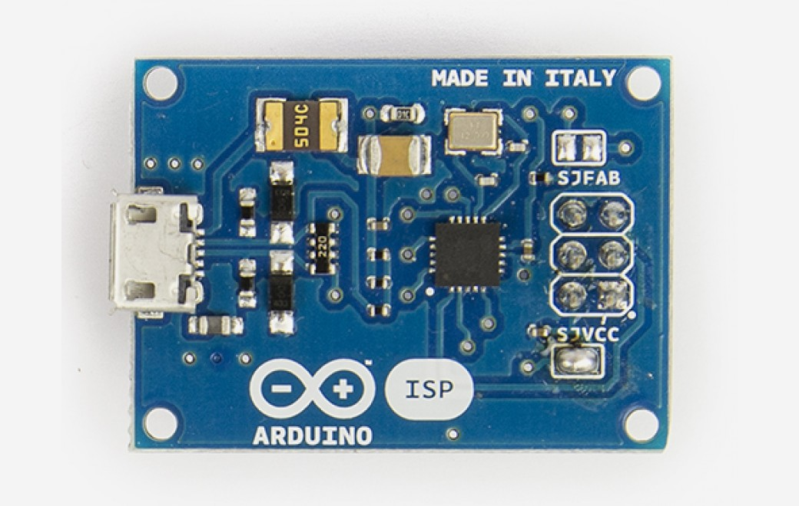

***Note: This page refers to a product that is retired.***

The **Arduino ISP** is a tiny AVR-ISP (in-system programmer) based on David Mellis' project FabISP([http://fab.cba.mit.edu/content/projects/fabisp/](http://fab.cba.mit.edu/content/archive/projects/fabisp/)). With this programmer you can upload sketches and burn the bootloader on any AVR based boards, including Arduinos. By uploading a sketch with an external programmer you can remove the bootloader and use the extra space for your sketch. The Arduino ISP can also be used to burn the Arduino bootloader, so you can recover your chip if you accidentally corrupt the bootloader. Burning the bootloader is also necessary when you use a new ATmega microcontroller in your Arduino, and you wish to use the bootloader to upload a sketch via the USB-Serial connection.

You can find [here](https://www.arduino.cc/en/Main/warranty) your board warranty information.

## Getting Started

You can find in the [Getting Started section](https://www.arduino.cc/en/Guide/HomePage) all the information you need to configure your board, use the Arduino So ftware (IDE), and start tinker with coding and electronics.

### Need Help?

* On the Software [on the Arduino Forum](https://forum.arduino.cc/index.php?board=63.0)
* On Projects [on the Arduino Forum](https://forum.arduino.cc/index.php?board=3.0)
* On the Product itself through [our Customer Support](https://support.arduino.cc/hc)

## Documentation

### OSH: Schematics

Arduino ISP is open-source hardware! You can build your own board using the following files:

[EAGLE FILES IN .ZIP](https://content.arduino.cc/assets/arduino-isp-reference-design.zip) 

[SCHEMATICS IN .PDF](https://content.arduino.cc/assets/arduino-isp-schematic.pdf) 

[WINDOWS DRIVERS](https://www.arduino.cc/en/uploads/Main/ArduinoISP_WindowsDrivers.zip)

### How to use

Connect the Arduino ISP to your Arduino board's ICSP headers. Make sure to match the orientation of the plugs by looking at the white dot on the corner of the connector. Once connected, open the Arduino IDE and select "Arduino ISP" under the *"Tools > Programmers"*menu. To upload a sketch using the Arduino ISP, choose *"Upload using programmer"* option in the*File* menu, or use the keyboard shortcut: *"CTRL+SHIFT+U"*. If you want to burn the bootloader into the AVR microcontroller select the "Burn bootloader" option under the *"Tools"* menu.

**Note:** The Arduino ISP is only supported by Arduino IDE 1.5.7 or later.  

For more details about using the Arduino ISP please visit the [Getting Started](https://www.arduino.cc/en/Guide/ArduinoISP) page

### Tutorials 

* [Using an Arduino as an AVR ISP](https://www.arduino.cc/en/Tutorial/ArduinoISP): how to use an Arduino board as an AVR ISP (in-system programmer). This allows you to use the board to burn the bootloader onto an AVR (e.g. theATmega168 or ATmega328 used in Arduino).
* [Programming an ATtiny with Arduino ISP](http://scuola.arduino.cc/courses/lessons/cover/qX1117g): How to install the ATtiny core for the Arduino IDE for programming AVR ATtiny microcontrollers using the Arduino software and the Arduino ISP programmer.
* [How to read your Arduino built-in EEPROM](http://scuola.arduino.cc/courses/lessons/view/B7PlK61): How to read the content of the onboard EEPROM on an AVR microcontroller by dumping the flash memory using the Arduino ISP programmer.

### Powering the target board

The Arduino ISP is able to provide the 5V power supply voltage to the board being programmed. If you want to power the board through the ISP you have to close the SJVCC jumper on the board.

### Reprogramming the on board ATtiny44

The firmware on the ATtiny44 inside the Arduino ISP can be updated or replaced. To program theATtiny you have to close the SJFAB jumper and connect an ISP programmer in the ICSP connector.

### Troubleshooting

**Verification error problem**

If you encounter this kind of problem you should power the board you are trying to program with the Arduino ISP with external power rather than with USB power. For example if you are burning the bootloader to an Arduino Leonardo you have to power the Leonardo through the power jack with a 9V wall wart power supply.

**Unknown USB device**

If your computer does not recognize the device try a different USB port. Some particular USB ports cause problems during the communication, changing the USB port usually fixes the problem.