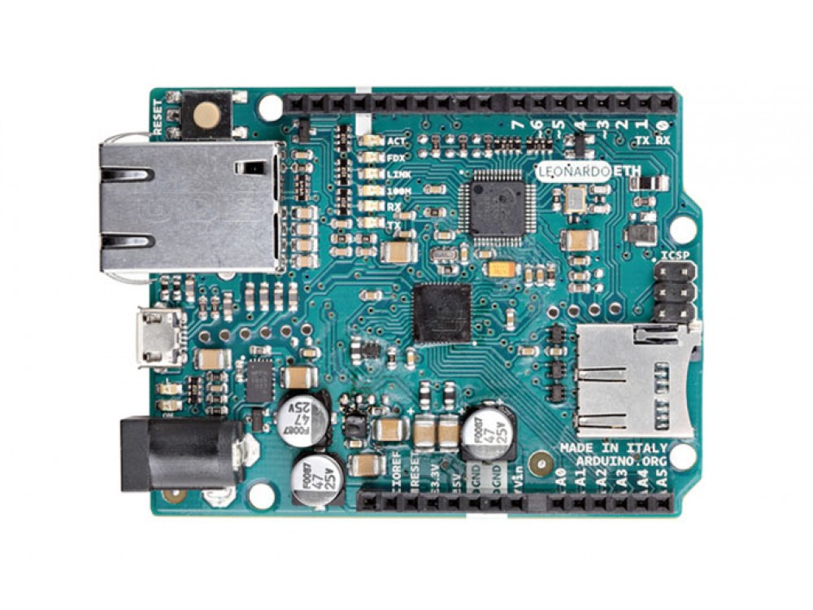

***Note: This page refers to a product that is retired.***

The **Leonardo ETH** is a microcontroller board based on the ATmega32U4 (datasheet) and the new W5500 TCP/IP Embedded Ethernet Controller (datasheet). It has 20 digital input/output pins (of which 7 can be used as PWM outputs and 12 as analog inputs), a 16 MHz crystal oscillator, a RJ45 connection, a micro USB connector, a power jack, an ICSP header, and a reset button. It contains everything needed to support the microcontroller; simply connect it to a computer with a USB cable or power it with a AC-to-DC adapter or battery to get started.

The Leonardo ETH differs from the preceding Ethernet board in that the ATmega32u4 has built-in USB communication, eliminating the need for an external USB-to-serial converter. This allows the Leonardo ETH to appear to a connected computer as a mouse and keyboard, in addition to a virtual (CDC) serial / COM port. It also has other implications for the behaviour of the board. Plus, it has the new W5500 TCP/IP Embedded Ethernet Controller onboard.

An optional Power over Ethernet module can be added to the board as well. The Leonardo ETH has the same Wiznet Ethernet interface as the Ethernet Shield 2\. An onboard microSD card reader, which can be used to store files for serving over the network, is accessible through the SD Library. Pin 10 is reserved for the Wiznet interface, SS for the SD card is on Pin 4.

* added SDA and SCL pins: beside the AREF pin, two TWI pins have been added. This will allow to connect the Leonardo ETH to Shields that use the I2C or TWI bus communication for their functioning.
* the IOREF: it allows the shields to adapt to the IO voltage level provided by the Board. The Shield that uses the IOREF pin will be compatible with both 3V3 and 5V (e.g Due and Uno) IO levels Arduino Boards. Next to the IOREF pin you can find another (currently not in use) pin, that is reserved for future usage.

## Getting Started

You can find in the [Getting Started section](https://www.arduino.cc/en/Guide/HomePage) all the information you need to configure your board, use the [Arduino Software (IDE)](https://www.arduino.cc/en/Main/Software), and start tinker with coding and electronics..

### Need Help?

* On the Software [on the Arduino Forum](https://forum.arduino.cc/index.php?board=63.0)
* On Projects [on the Arduino Forum](https://forum.arduino.cc/index.php?board=3.0)
* On the Product itself through [our Customer Support](https://support.arduino.cc/hc)

## Documentation

### OSH: Schematics

The Arduino Leonardo ETH is open-source hardware! You can build your own board using the following files (Please note that the schematics are revision 1):

[EAGLE FILES IN .ZIP](https://content.arduino.cc/assets/LeonardoEth_V1.0.zip) 

[SCHEMATICS IN .PDF](https://content.arduino.cc/assets/LeonardoEth_V1.0_sch.pdf)

### Power

The board can be powered also via an external power supply, via an optional Power over Ethernet (PoE) module, or using the micro USB connection. External (non-USB) power can come either from an AC-to-DC adapter (wall-wart) or battery. When using the power adapter, it can be connected by plugging a 2.1mm center-positive plug into the board's power jack. Leads from a battery can be inserted in the Gnd and Vin pin headers of the POWER connector. The board can operate on an external supply of 6 to 20 volts. If supplied with less than 7V, however, the 5V pin may supply less than five volts and the board may be unstable. If using more than 12V, the voltage regulator may overheat and damage the board. The recommended range is from 7 to 12 volts. The power pins are as follows:

* VIN. The input voltage to the Arduino board when it's using an external power source (as opposed to 5 volts from the USB connection or other regulated power source). You can supply voltage through this pin, or, if supplying voltage via the power jack, access it through this pin.
* 5V. This pin outputs a regulated 5V from the regulator on the board. The board can be supplied with power either from the DC power jack (7 - 12V), the USB connector (5V), or the VIN pin of the board (7-12V). Supplying voltage via the 5V or 3.3V pins bypasses the regulator, and can damage your board. We don't advise it.
* 3V3\. A 3.3 volt supply generated by the on-board regulator. Maximum current draw is 50 mA.
* GND. Ground pins.
* IOREF. This pin on the Arduino board provides the voltage reference with which the microcontroller operates. A properly configured shield can read the IOREF pin voltage and select the appropriate power source or enable voltage translators on the outputs for working with the 5V or 3.3V.

The optional PoE module is designed to extract power from a conventional twisted pair Category 5 Ethernet cable. PoE module features are as follows: IEEE802.3af compliant Input voltage range 36V to 57V Overload and short-circuit protection 12V Output High efficiency DC/DC converter: typ 85% @ 80% load 1500V isolation (input to output)

### Memory

The ATmega32u4 has 32 KB (with 4 KB used for the bootloader). It also has 2.5 KB of SRAM and 1 KB of EEPROM (which can be read and written with the EEPROM library).

### Input and Output

Each of the 14 digital pins on the Leonardo ETH board can be used as input or output, using the pinMode(), digitalWrite(), and digitalRead() functions. They operate at 5 volts. Each pin can provide or receive a maximum of 40 mA and has an internal pull-up resistor (disconnected by default) of 20-50 kOhms. In addition, some pins have specialized functions:

* Serial: 0 (RX) and 1 (TX): used to receive (RX) and transmit (TX) TTL serial data using the ATmega32U4 hardware serial capability. Note that on the Leonardo ETH, the Serial class refers to USB (CDC) communication; for TTL serial on pins 0 and 1, use the Serial1 class.
* TWI: 2 (SDA) and 3 (SCL): they support TWI communication using the Wire library.
* External Interrupts: 3 (interrupt 0), 2 (interrupt 1), 0 (interrupt 2), 1 (interrupt 3) and 7 (interrupt 4). These pins can be configured to trigger an interrupt on a low value, a rising or falling edge, or a change in value. See the attachInterrupt() function for details.
* PWM: 3, 5, 6, 9, 10, 11 and 13\. Provide 8-bit PWM output with the analogWrite() function.
* SPI: on the ICSP header. These pins support SPI communication using the SPI library. Note that the SPI pins are not connected to any of the digital I/O pins as they are on the Uno, They are only available on the ICSP connector. This means that if you have a shield that uses SPI, but does NOT have a 6-pin ICSP connector that connects to the Leonardo's 6-pin ICSP header, the shield will not work.
* LED: 13\. There is a built-in LED connected to the digital pin 13\. When the pin is HIGH value, the LED is on, when the pin is LOW, it's off.
* Analog Inputs: A0-A5, A6 - A11 (on digital pins 4, 6, 8, 9, 10, and 12). The Leonardo has 12 analog inputs, labeled A0 through A11, all of which can also be used as digital i/o. Pins A0-A5 appear in the same locations as on the Uno; inputs A6-A11 are on digital i/o pins 4, 6, 8, 9, 10, and 12 respectively. Each analog input provides 10 bits of resolution (i.e. 1024 different values). By default, the analog inputs measure from ground to 5 volts, though it is possible to change the upper end of their range using the AREF pin and the analogReference() function.

There are a couple of other pins on the board:

* AREF. Reference voltage for the analog inputs. Used with analogReference().
* Reset. Bring this line LOW to reset the microcontroller. Typically used to add a reset button to shields that block the one on the board.

### Communication

The Arduino Leonardo ETH has a number of facilities for communicating with a computer, another Arduino, or other microcontrollers. The ATmega32U4 provides UART TTL (5V) serial communication, which is available on digital pins 0 (RX) and 1 (TX). The 32U4 also allows for serial (CDC) communication over USB and appears as a virtual COM port to software on the computer. The chip also acts as a full speed USB 2.0 device, using standard USB COM drivers. On Windows, a .inf file is required. The Arduino software includes a serial monitor allowing simple textual data to be sent to and from the Arduino board. The RX and TX LEDs on the board will flash when data is being transmitted via the USB connection to the computer (but not for serial communication on pins 0 and 1). A SoftwareSerial library allows for serial communication on any of the Leonardo ETH's digital pins. The ATmega32U4 also supports I2C (TWI) and SPI communication. The Arduino software includes a Wire library to simplify the use of the I2C bus. For SPI communication, use the SPI library. The Leonardo ETH appears as a generic keyboard and mouse, and can be programmed to control these input devices using the Keyboard and Mouse classes. The board can also connect to a wired network via Ethernet. When connecting to a network, you will need to provide an IP address and a MAC address. The Ethernet Library is fully supported. The onboard microSD card reader is accessible through the SD Library. When working with this library, SS is on Pin 4.

### Programming

The Leonardo ETH can be programmed with the Arduino software ([download](https://www.arduino.cc/en/Main/Software)). Select "Arduino Leonardo ETH from the Tools > Board menu. For details, see the referenceand tutorials.

The ATmega32U4 on the Arduino Leonardo ETH comes pre-burned with a bootloader that allows you to upload new code to it without the use of an external hardware programmer. It communicates using the AVR109 protocol. You can also bypass the bootloader and program the microcontroller through the ICSP (In-Circuit Serial Programming) header using Arduino ISP or similar. All the Leonardo ETH example sketches work as they do with the Ethernet shield 2\. Make sure to change the network settings for your network.

### Automatic (Software) Reset

Rather than requiring pressing the reset button before an upload, the Leonardo ETH is designed in a way that allows it to be reset by software running on a connected computer. The reset is triggered when the Leonardo's virtual (CDC) serial / COM port is opened at 1200 baud and then closed. When this happens, the processor will reset, breaking the USB connection to the computer (meaning that the virtual serial / COM port will disappear). After the processor resets, the bootloader starts, remaining active for about 8 seconds. The bootloader can also be initiated by pressing the reset button on the Leonardo. Note that when the board first powers up, it will jump straight to the user sketch, if present, rather than initiating the boot loader. Because of the way the Leonardo ETH handles the reset, the best thing to do is to let the Arduino software try to initiate the reset before uploading, especially if you are used to pressing the reset button before uploading on other boards. If the software can't reset the board, you can always start the bootloader pressing the reset button on the board.

### USB Overcurrent Protection

The Leonardo ETH has a resettable polyfuse that protects your computer's USB ports from shorts and overcurrent. Although most computers provide their own internal protection, the fuse provides an extra layer of protection. If more than 500 mA is applied to the USB port, the fuse will automatically break the connection until the short or overload is removed.

### Physical Characteristics

The maximum length and width of the Leonardo ETH PCB are 2.7 and 2.1 inches respectively, with the RJ45 connector and power jack extending beyond the former dimension. Four screw holes allow the board to be attached to a surface or case. Note that the distance between digital pins 7 and 8 is 160 mil (0.16"), not an even multiple of the 100 mil spacing of the other pins.

## Tech Specs

### Microprocessor

|           |                     |
| --------- | ------------------- |
| Processor | 802.3 10/100 Mbit/s |

### Arduino Microcontroller

|                         |                                                                                |
| ----------------------- | ------------------------------------------------------------------------------ |
| Microcontroller         | ATmega32u4                                                                     |
| Architecture            | AVR                                                                            |
| Operating Voltage       | 5V                                                                             |
| Flash memory            | 32 KB of which 4 KB used by bootloader                                         |
| SRAM                    | 2.5Kb                                                                          |
| Clock Speed             | 16 MHz                                                                         |
| Analog I/O Pins         | 12                                                                             |
| EEPROM                  | 1 KB                                                                           |
| DC Current per I/O Pins | 40 mA on I/O Pins; 1A on 3.3 V Pin only when powered via external power supply |

### General

|                   |                                                     |
| ----------------- | --------------------------------------------------- |
| Input Voltage     | 7-12 V                                              |
| Digital I/O Pins  | 36-57 V                                             |
| Reserved Pins     | 4 used for SD card select; 10 used for W5500 select |
| Digital I/O Pins  | 20                                                  |
| PWM Output        | 7                                                   |
| Power Consumption | 82 mA                                               |
| PCB Size          | 53.34 x 68.58 mm                                    |
| Card Reader       | Micro SD card, with active voltage translators      |
| Weight            | 28g                                                 |
| Product Code      | A000108                                             |