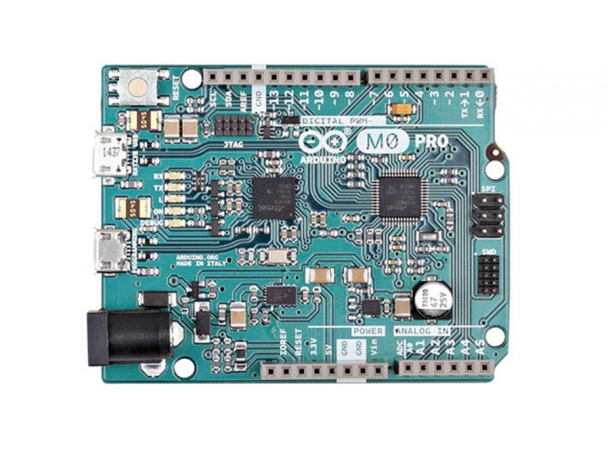

***Note: This page refers to a product that is retired.***

With the new **Arduino M0 Pro** board, the more creative individual will have the potential to create one’s most imaginative and new ideas for IoT devices, wearable technologies, high tech automation, wild robotics and other not yet thinkable adventures in the world of makers. The Arduino M0 pro represents a simple, yet powerful, 32-bit extension of the Arduino UNO platform. The board is powered by Atmel’s SAMD21 MCU, featuring a 32-bit ARM Cortex® M0 core.

With the addition of the M0 board, the Arduino family becomes larger with a new member providing increased performance. The power of its Atmel’s core gives this board an upgraded flexibility and boosts the scope of projects one can think of and make; moreover, it makes the M0 Pro the ideal educational tool for learning about 32-bit application development. Atmel’s Embedded Debugger (EDBG), integrated in the board, provides a full debug interface with no need for additional hardware, making debugging much easier. EDBG additionally supports a virtual COM port for device programming and traditional Arduino boot loader functionality uses.

### Getting Started

You can find in the [Getting Started section](https://www.arduino.cc/en/Guide/HomePage) all the information you need to configure your board, use the [Arduino Software (IDE)](https://www.arduino.cc/en/Main/Software), and start tinker with coding and electronics..

### Need Help?

* On the Software [on the Arduino Forum](https://forum.arduino.cc/index.php?board=63.0)
* On Projects [on the Arduino Forum](https://forum.arduino.cc/index.php?board=3.0)
* On the Product itself through [our Customer Support](https://support.arduino.cc/hc)

### Tech Specs

### Arduino Microcontroller

|                         |                          |
| ----------------------- | ------------------------ |
| Microcontroller         | ATSAMD21G18, 48pins LQFP |
| Architecture            | ARM Cortex-M0+           |
| Operating Voltage       | 3.3V                     |
| Flash memory            | 256 KB                   |
| SRAM                    | 32Kb                     |
| Clock Speed             | 48 MHz                   |
| Analog I/O Pins         | 6 + 1 DAC                |
| DC Current per I/O Pins | 7 mA (I/O Pins)          |

### General

|                   |                  |
| ----------------- | ---------------- |
| Input Voltage     | 5-15 V           |
| Digital I/O Pins  | 20               |
| PWM Output        | 12               |
| Power Consumption | 44 mA            |
| PCB Size          | 53.34 x 68.58 mm |
| Weight            | 22g              |
| Product Code      | A000111          |