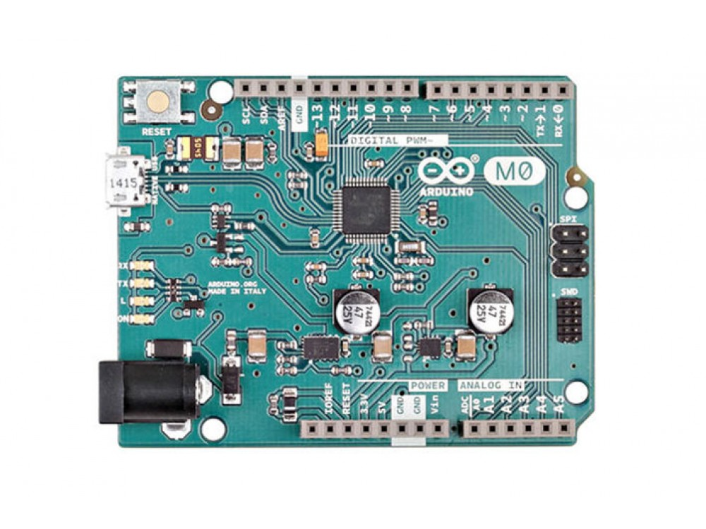

***Note: This page refers to a product that is retired.***

With the new **Arduino M0** board, the more creative individual will have the potential to create one’s most imaginative and new ideas for IoT devices, wearable technologies, high tech automation, wild robotics and other not yet thinkable adventures in the world of makers. The Arduino M0 represents a simple, yet powerful, 32-bit extension of the Arduino UNO platform. The board is powered by Atmel’s SAMD21 MCU, featuring a 32-bit ARM Cortex® M0 core. With the addition of the M0 board, the Arduino family becomes larger with a new member providing increased performance.

The power of its Atmel’s core gives this board an upgraded flexibility and boosts the scope of projects one can think of and make; moreover, it makes the M0 the ideal educational tool for learning about 32-bit application development.

## Getting Started

You can find in the [Getting Started section](https://www.arduino.cc/en/Guide/HomePage) all the information you need to configure your board, use the [Arduino Software (IDE)](https://www.arduino.cc/en/Main/Software), and start tinker with coding and electronics..

### Need Help?

* On the Software [on the Arduino Forum](https://forum.arduino.cc/index.php?board=63.0)
* On Projects [on the Arduino Forum](https://forum.arduino.cc/index.php?board=3.0)
* On the Product itself through [our Customer Support](https://support.arduino.cc/hc)

## Documentation

### OSH: Schematics

The Arduino M0 is open-source hardware! You can build your own board using the following files:

[EAGLE FILES IN .ZIP](https://www.arduino.cc/en/uploads/Main/arduino-M0-reference-design.zip) 

[SCHEMATICS IN .PDF](https://www.arduino.cc/en/uploads/Main/arduino-M0-schematic.pdf)

### Power

The Arduino M0 can be powered via the micro USB connection or with an external power supply. The power source is selected automatically. External (non-USB) power can come either from an AC-to-DC adapter (wall-wart) or battery. The adapter can be connected to the board by plugging a 2.1mm center-positive plug into the board's power jack. Leads from a battery can be inserted in the Gnd and Vin pin headers of the POWER connector. The board will automatically detect which power sources are available and choose which one to use according to the following priority:

* External power
* Target USB

External power is required when the 500mA through the USB connector is not enough to power a connected USB device in a USB host application. The power pins are as follows:

* VIN. The input voltage to the Arduino board when it's using an external power source (as opposed to 5 volts from the USB connection or other regulated power source). You can supply voltage through this pin, or, if supplying voltage via the power jack, access it through this pin. The allowed input voltage range for this pin (and for the power jack connector) is 6-20V.
* 5V. The regulated power supply used to power the microcontroller and other components on the board. This can come either from VIN via an on-board regulator, or be supplied by USB or another regulated 5V supply. The maximum current output provided by the on-board regulator is 1A (according to the power input source).
* 3V3\. A 3.3 volt supply generated by the on-board regulator. Maximum current draw is 1A (according to the power input source).
* GND. Ground pins.
* IOREF. The voltage at which the i/o pins of the board are operating (i.e. VCC for the board). This is 3.3V on the M0.

### Memory

The ATSAMD21G18 has 256 KB of flash program memory (with 4 KB used for the bootloader). The bootloader is factory pre burnt by Atmel and is stored in a dedicated ROM memory. The bootloader is protected using the NVM fuse. It also carries 32 KB of SRAM.

### Input and Output

Each of the 14 digital i/o pins on the M0 can be used as an input or output, using pinMode(), digitalWrite(), and digitalRead() functions. They operate at 3.3 volts. 7mA as maximum DC current for I/O pins and an internal pull-up resistor (disconnected by default) of 20-60 kOhms. In addition, some pins have specialized functions:

* Serial: 0 (RX) and 1 (TX). Used to receive (RX) and transmit (TX) TTL serial data using the ATSAMD21G18 hardware serial capability. Note that on the M0, the SerialUSB class refers to USB (CDC) communication; for serial on pins 0 and 1, use the Serial5 class.
* TWI: SDA and SCL. Support TWI communication using the Wire library.
* PWM: Pins 2 to 13 Provide 8-bit PWM output with the analogWrite() function. The resolution of the PWM can be changed with the analogWriteResolution() function. Note1 The pins 4 and 10 can not be used simultaneously as PWM. Note2 The pins 5 and 12 can not be used simultaneously as PWM.
* SPI: on the ICSP header. These pins support SPI communication using the SPI library. Note that the SPI pins are not connected to any of the digital I/O pins as they are on the Uno, They are only available on the ICSP connector. This means that if you have a shield that uses SPI, but does NOT have a 6-pin ICSP connector that connects to the M0's 6-pin ICSP header, the shield will not work.
* LED: 13\. There is a built-in LED connected to digital pin 13\. When the pin is HIGH value, the LED is on, when the pin is LOW, it's off.
* Analog Inputs: A0-A5\. The M0 has 6 analog inputs, labeled A0 through A5\. Pins A0-A5 appear in the same locations as on the Uno; Each analog input provides 12 bits of resolution (i.e. 4096 different values). By default the analog inputs measure from ground to 3.3 volts, though is it possible to change the upper end of their range using the AREF pin and the analogReference() function.
* DAC: pin A0 provides true analog outputs with 10-bits resolution (1023 levels) with the analogWrite() function. This pin can be used to create an audio output using the Audio library.
* Reset: Bring this line LOW to reset the microcontroller. This is typically used to add a reset button when shields are used that block the one already present on the board.

### Communication

The Arduino M0 has a number of facilities for communicating with a computer, with another Arduino or other microcontrollers, and with different devices like phones, tablets, cameras and so on. The SAMD21 provides one hardware UART and three hardware USARTs for 3.3V serial communication. The Arduino software includes a serial monitor allowing simple textual data to be sent to and from the board. The RX and TX LEDs on the board will flash when data is being transmitted via the ATSAMD21G18chip and USB connection to the computer (but not for serial communication on pins 0 and 1). The Native USB port is connected to the SAMD21\. It allows for serial (CDC) communication over USB. This provides a serial connection to the Serial Monitor or other applications on your computer. The SAMD21 also supports TWI and SPI communication. The Arduino software includes a Wire library to simplify use of the TWI bus. For SPI communication, you can use the SPI library.

### Programming

The Arduino M0 can be programmed with the Arduino software ([download](https://www.arduino.cc/en/Main/Software)). If you use Linux-based OS follow the guide [Arduino IDE](https://docs.arduino.cc/software/ide-v1/tutorials/Linux) on Linux-based OS. Uploading sketches to the SAMD21 is different from how it works with the AVR microcontrollers found in other Arduino boards: the flash memory needs to be erased before being re-programmed. Upload operation is managed by a dedicated ROM area on the SAMD21\. USB port: To use this port, select "Arduino M0 (Native USB Port)" as your board in the Arduino IDE. The Native USB port is connected directly to the SAMD21\. Connect the M0 Native USB port (the one closest to the reset button) to your computer. Opening and closing the Native port at 1200bps triggers a 'soft erase' procedure: the flash memory is erased and the board is restarted with the boot loader. Opening and closing the native port at a different baudrate will not reset the SAMD21.

### USB Overcurrent Protection

The M0 has a resettable polyfuse that protects your computer's USB ports from shorts and overcurrent. Although most computers provide their own internal protection, the fuse provides an extra layer of protection. If more than 500 mA flows through to the USB port, the fuse will automatically break the connection until the short or overload is removed.

### Physical Characteristics

The maximum length and width of the M0 PCB are 2.7 and 2.1 inches respectively, with the USB connector and power jack extending beyond the former dimension. Four screw holes allow the board to be attached to a surface or case. Note that the distance between digital pins 7 and 8 is 160 mil (0.16"), not an even multiple of the 100 mil spacing of the other pins.

## Tech Specs

### Arduino Microcontroller

|                         |                          |
| ----------------------- | ------------------------ |
| Microcontroller         | ATSAMD21G18, 48pins LQFP |
| Architecture            | ARM Cortex-M0+           |
| Operating Voltage       | 3.3V                     |
| Flash memory            | 256 KB                   |
| SRAM                    | 32Kb                     |
| Clock Speed             | 48 MHz                   |
| Analog I/O Pins         | 6 +1 DAC                 |
| DC Current per I/O Pins | 7 mA (I/O Pins)          |

### General

|                   |                          |
| ----------------- | ------------------------ |
| Input Voltage     | 5-15 V                   |
| Digital I/O Pins  | 20, with 12 PWM and UART |
| PWM Output        | 12                       |
| Power Consumption | 29 mA                    |
| PCB Size          | 53 x 68.5 mm             |
| Weight            | 21g                      |
| Product Code      | A000103                  |