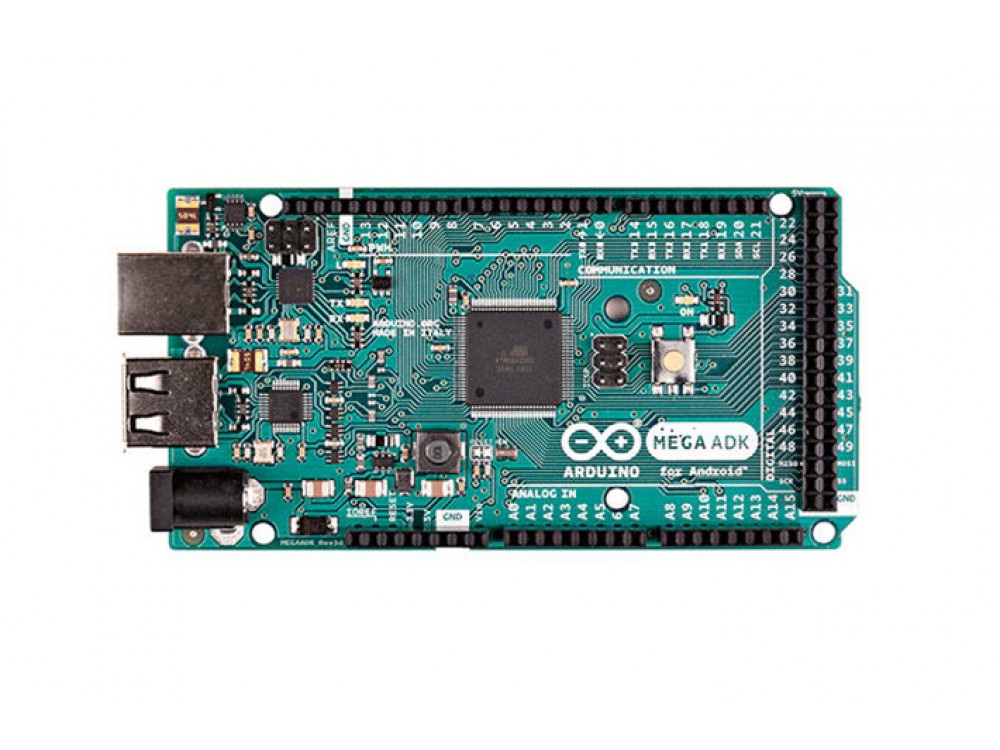

***Note: This page refers to a product that is retired.***

The **Arduino MEGA ADK** is a microcontroller board based on the ATmega2560\. It has a USB host interface to connect with Android based phones, based on the MAX3421e IC. It has 54 digital input/output pins (of which 15 can be used as PWM outputs), 16 analog inputs, 4 UARTs(hardware serial ports), a 16 MHz crystal oscillator, a USB connection, a power jack, an ICSP header, and a reset button.

The MEGA ADK is based on the [Mega 2560](https://www.arduino.cc/en/Main/ArduinoBoardMega2560).

Similar to the Mega 2560 and Uno, it features an ATmega8U2 programmed as a USB-to-serial converter.  

Revision 2 of the Mega ADK board has a resistor pulling the 8U2 HWB line to ground, making it easier to put into [DFU mode](https://www.arduino.cc/en/Hacking/DFUProgramming8U2).  

Revision 3 of the board has the following new features:

* 1.0 pinout: added SDA and SCL pins that are near to the AREF pin and two other new pins placed near to the RESET pin, the IOREF that allow the shields to adapt to the voltage provided from the board. In future, shields will be compatible both with the board that use the AVR, which operate with 5V and with the Arduino Due that operate with 3.3V. The second one is a not connected pin, that is reserved for future purposes.
* Stronger RESET circuit.

For information on using the board with the Android OS, see:

You can find your board warranty information [here](https://www.arduino.cc/en/Main/warranty).

### Getting Started

In the [Getting Started section](https://www.arduino.cc/en/Guide/ArduinoADK), you can find all the information you need to configure your board, use the [Arduino Software (IDE)](https://www.arduino.cc/en/Main/Software), and start to tinker with coding and electronics.

### Need Help?

* On Projects [on the Arduino Forum](https://forum.arduino.cc/index.php?board=3.0)
* On the Product itself through [our Customer Support](https://support.arduino.cc/hc)

### Documentation

### OSH: Schematics

Arduino Mega ADK is open-source hardware! You can build your own board using the following files:

[EAGLE FILES IN .ZIP](https://www.arduino.cc/en/uploads/Main/arduino-mega-adk-reference-design.zip) 

[SCHEMATICS IN .PDF](https://www.arduino.cc/en/uploads/Main/arduino-mega-adk-schematic.pdf)

### Power

The Arduino MEGA ADK can be powered via the USB connection or with an external power supply. The power source is selected automatically.

External (non-USB) power can come either from an AC-to-DC adapter (wall-wart) or battery. The adapter can be connected by plugging a 2.1mm center-positive plug into the board's power jack. Leads from a battery can be inserted in the Gnd and Vin pin headers of the POWER connector.

*NB: Because the MEGA ADK is a USB Host, the phone will attempt to draw power from it when it needs to charge. When the ADK is powered over USB, 500mA total is available for the phone and board.The external power regulator can supply up to 1500mA. 750mA is available for the phone and MEGA ADK board. An additional 750mA is allocated for any actuators and sensors attached to the board. A power supply must be capable of providing 1.5A to use this much current.*

The board can operate on an external supply of 5.5 to 16 volts. If supplied with less than 7V, however, the 5V pin may supply less than five volts and the board may be unstable. If using more than 12V, the voltage regulator may overheat and damage the board. The recommended range is 7 to 12 volts.

The power pins are as follows:

* VIN. The input voltage to the Arduino board when it's using an external power source (as opposed to 5 volts from the USB connection or other regulated power source). You can supply voltage through this pin, or, if supplying voltage via the power jack, access it through this pin.
* 5V. This pin outputs a regulated 5V from the regulator on the board. The board can be supplied with power either from the DC power jack (7 - 12V), the USB connector (5V), or the VIN pin of the board (7-12V). Supplying voltage via the 5V or 3.3V pins bypasses the regulator, and can damage your board. We don't advise it.
* 3V3\. A 3.3 volt supply generated by the on-board regulator. Maximum current draw is 50 mA.
* GND. Ground pins.
* IOREF. This pin on the Arduino board provides the voltage reference with which the microcontroller operates. A properly configured shield can read the IOREF pin voltage and select the appropriate power source or enable voltage translators on the outputs for working with the 5V or 3.3V.

### Memory

The MEGA ADK has 256 KB of flash memory for storing code (of which 8 KB is used for the bootloader), 8 KB of SRAM and 4 KB of EEPROM (which can be read and written with the [EEPROM library](http://www.arduino.cc/en/Reference/EEPROM)).

### Input and Output

Each of the 50 digital pins on the MEGA ADK can be used as an input or output, using [pinMode()](https://www.arduino.cc/reference/en/language/functions/digital-io/pinmode/),[digitalWrite()](https://www.arduino.cc/en/Reference/DigitalWrite), and [digitalRead()](https://www.arduino.cc/reference/en/language/functions/digital-io/digitalread/) functions. They operate at 5 volts. Each pin can provide or receive a maximum of 40 mA and has an internal pull-up resistor (disconnected by default) of 20-50 kOhms. In addition, some pins have specialized functions:

* Serial: 0 (RX) and 1 (TX); Serial 1: 19 (RX) and 18 (TX); Serial 2: 17 (RX) and 16 (TX); Serial 3: 15 (RX) and 14 (TX). Used to receive (RX) and transmit (TX) TTL serial data. Pins 0 and 1 are also connected to the corresponding pins of the ATmega8U2 USB-to-TTL Serial chip.
* External Interrupts: 2 (interrupt 0), 3 (interrupt 1), 18 (interrupt 5), 19 (interrupt 4), 20 (interrupt 3), and 21 (interrupt 2). These pins can be configured to trigger an interrupt on a low value, a rising or falling edge, or a change in value. See the [attachInterrupt()](https://www.arduino.cc/reference/en/language/functions/external-interrupts/attachinterrupt/) function for details.
* PWM: 2 to 13 and 44 to 46\. Provide 8-bit PWM output with the [analogWrite()](https://www.arduino.cc/en/Reference/AnalogWrite) function.
* SPI: 50 (MISO), 51 (MOSI), 52 (SCK), 53 (SS). These pins support SPI communication using the [SPI library](https://www.arduino.cc/en/Reference/SPI). The SPI pins are also broken out on the ICSP header, which is physically compatible with the Uno, Duemilanove and Diecimila.
* USB Host: MAX3421E.

The MAX3421E communicate with Arduino with the SPI bus. So it uses the following pins:

* Digital: 7 (RST), 50 (MISO), 51 (MOSI), 52 (SCK).  
*NB:Please do not use Digital pin 7 as input or output because is used in the communication with MAX3421E*
* Non broken out on headers: PJ3 (GP\_MAX), PJ6 (INT\_MAX), PH7 (SS).
* LED: 13.There is a built-in LED connected to digital pin 13\. When the pin is HIGH value, the LED is on, when the pin is LOW, it's off.
* TWI: 20 (SDA) and 21 (SCL). Support TWI communication using the [Wire library](https://www.arduino.cc/en/Reference/Wire). Note that these pins are not in the same location as the TWI pins on the Duemilanove or Diecimila.

The MEGA ADK has 16 analog inputs, each of which provide 10 bits of resolution (i.e. 1024 different values). By default they measure from ground to 5 volts, though is it possible to change the upper end of their range using the AREF pin and analogReference() function.

There are a couple of other pins on the board:

* AREF. Reference voltage for the analog inputs. Used with [analogReference](https://www.arduino.cc/reference/en/language/functions/analog-io/analogreference/)().
* Reset. Bring this line LOW to reset the microcontroller. Typically used to add a reset button to shields which block the one on the board.

### Communication

The Arduino MEGA ADK has a number of facilities for communicating with a computer, another Arduino, or other microcontrollers. The ATmega2560 provides four hardware UARTs for TTL (5V) serial communication. An ATmega8U2 on the board channels one of these over USB and provides a virtual com port to software on the computer (Windows machines will need a .inf file, but OSX and Linux machines will recognize the board as a COM port automatically. The Arduino software includes a serial monitor which allows simple textual data to be sent to and from the board. The RX and TX LEDs on the board will flash when data is being transmitted via the ATmega8U2/16U2 chip and USB connection to the computer (but not for serial communication on pins 0 and 1).

A [SoftwareSerial library](http://www.arduino.cc/en/Reference/SoftwareSerial) allows for serial communication on any of the MEGA ADK's digital pins.

The ATmega2560 also supports TWI and SPI communication. The Arduino software includes a Wire library to simplify use of the TWI bus; see the [Wire library](https://www.arduino.cc/en/Reference/Wire) for details. For SPI communication, use the [SPI library](https://www.arduino.cc/en/Reference/SPI).

The USB host interface given by MAX3421E IC allows the Arduino MEGA ADK to connect and interact to any type of device that have a USB port. For example, allows you to interact with many types of phones, controlling Canon cameras, interfacing with keyboard, mouse and games controllers as Wiimote and PS3.

### Programming

The Arduino MEGA ADK can be programmed with the Arduino software ([download](https://www.arduino.cc/en/Main/Software)). For details, see the [reference](https://www.arduino.cc/en/Reference/HomePage) and [tutorials](https://www.arduino.cc/en/Tutorial/HomePage).

The ATmega2560 on the Arduino MEGA ADK comes preburned with a [bootloader](https://www.arduino.cc/en/Tutorial/Bootloader) (the same on Mega 2560) that allows you to upload new code to it without the use of an external hardware programmer. It communicates using the original STK500v2 protocol ([reference](http://www.atmel.com/dyn/resources/prod_documents/doc2525.pdf), [C header files](http://www.atmel.com/dyn/resources/prod_documents/avr061.zip)).

You can also bypass the bootloader and program the microcontroller through the ICSP (In-Circuit Serial Programming) header using [Arduino ISP](https://www.arduino.cc/en/Main/ArduinoISP) or similar; see [these instructions](https://www.arduino.cc/en/Hacking/Programmer) for details.

The ATmega8U2 firmware source code is available [in the Arduino repository](https://github.com/arduino/ArduinoCore-avr/tree/master/firmwares). The ATmega8U2 is loaded with a DFU bootloader, which can be activated by:

* On Rev1 boards: connecting the solder jumper on the back of the board (near the map of Italy) and then resetting the 8U2.
* On Rev2 or later boards: there is a resistor that pulling the 8U2/16U2 HWB line to ground, making it easier to put into DFU mode. You can then use [Atmel's FLIP software](http://www.atmel.com/dyn/products/tools_card.asp?tool_id=3886) (Windows) or the [DFU programmer](http://dfu-programmer.sourceforge.net/) (Mac OS X and Linux) to load a new firmware. Or you can use the ISP header with an external programmer (overwriting the DFU bootloader). 

### Automatic (Software) Reset

Rather then requiring a physical press of the reset button before an upload, the Arduino MEGA ADK is designed in a way that allows it to be reset by software running on a connected computer. One of the hardware flow control lines (DTR) of the ATmega8U2 is connected to the reset line of the ATmega2560 via a 100 nanofarad capacitor. When this line is asserted (taken low), the reset line drops long enough to reset the chip. The Arduino software uses this capability to allow you to upload code by simply pressing the upload button in the Arduino environment. This means that the bootloader can have a shorter timeout, as the lowering of DTR can be well-coordinated with the start of the upload.

This setup has other implications. When the MEGA ADK is connected to either a computer running Mac OS X or Linux, it resets each time a connection is made to it from software (via USB). For the following half-second or so, the bootloader is running on the MEGA ADK. While it is programmed to ignore malformed data (i.e. anything besides an upload of new code), it will intercept the first few bytes of data sent to the board after a connection is opened. If a sketch running on the board receives one-time configuration or other data when it first starts, make sure that the software with which it communicates waits a second after opening the connection and before sending this data.

The MEGA ADK contains a trace that can be cut to disable the auto-reset. The pads on either side of the trace can be soldered together to re-enable it. It's labeled "RESET-EN". You may also be able to disable the auto-reset by connecting a 110 ohm resistor from 5V to the reset line.

### USB Overcurrent Protection

The Arduino MEGA ADK has a resettable polyfuse that protects your computer's USB ports from shorts and overcurrent. Although most computers provide their own internal protection, the fuse provides an extra layer of protection. If more than 500 mA is applied to the USB port, the fuse will automatically break the connection until the short or overload is removed.

### Physical Characteristics and Shield Compatibility

The maximum length and width of the MEGA ADK PCB are 4 and 2.1 inches respectively, with the USB connector and power jack extending beyond the former dimension. Three screw holes allow the board to be attached to a surface or case. Note that the distance between digital pins 7 and 8 is 160 mil (0.16"), not an even multiple of the 100 mil spacing of the other pins.

The MEGA ADK is designed to be compatible with most shields designed for the Uno, Diecimila or Duemilanove. Digital pins 0 to 13 (and the adjacent AREF and GND pins), analog inputs 0 to 5, the power header, and ICSP header are all in equivalent locations. Further the main UART (serial port) is located on the same pins (0 and 1), as are external interrupts 0 and 1 (pins 2 and 3 respectively). SPI is available through the ICSP header on both the MEGA ADK and Duemilanove / Diecimila.*Please note that I2C is not located on the same pins on the MEGA ADK (20 and 21) as the Duemilanove / Diecimila (analog inputs 4 and 5).*

### Tech Specs

|                             |                                         |
| --------------------------- | --------------------------------------- |
| Microcontroller             | ATmega2560                              |
| Operating Voltage           | 5V                                      |
| Input Voltage (recommended) | 7-12V                                   |
| Input Voltage (limits)      | 6-20V                                   |
| Digital I/O Pins            | 54 (of which 15 provide PWM output)     |
| Analog Input Pins           | 16                                      |
| DC Current per I/O Pin      | 40 mA                                   |
| DC Current for 3.3V Pin     | 50 mA                                   |
| Flash Memory                | 256 KB of which 8 KB used by bootloader |
| SRAM                        | 8 KB                                    |
| EEPROM                      | 4 KB                                    |
| Clock Speed                 | 16 MHz                                  |
| USB Host Chip               | MAX3421E                                |
| Length                      | 101.52 mm                               |
| Width                       | 53.3 mm                                 |
| Weight                      | 36 g                                    |