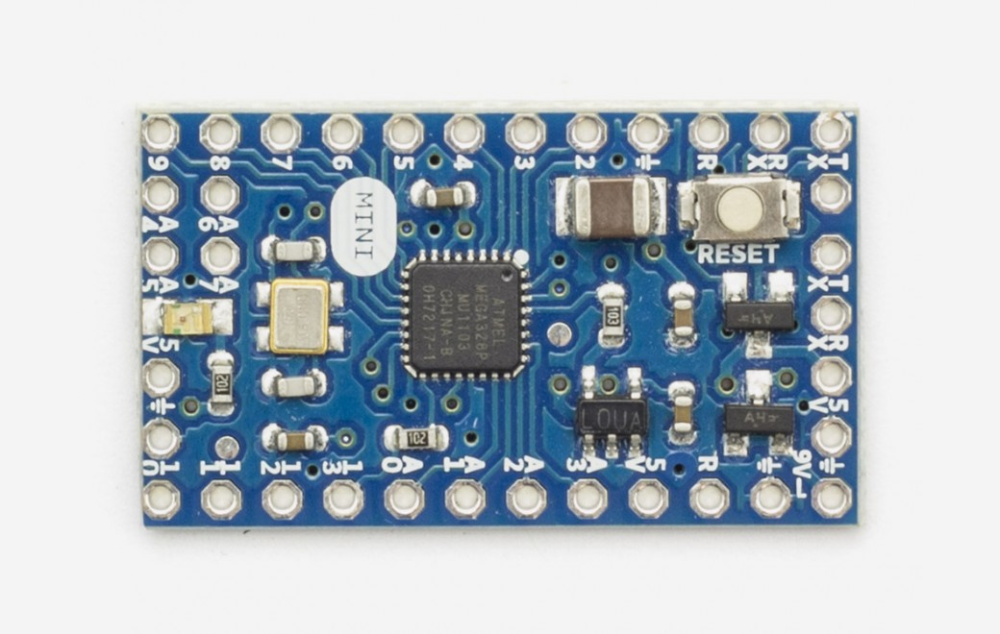

***Note: This page refers to a product that is retired.***

The **Arduino Mini 05** is a small microcontroller board originally based on the ATmega168, but now supplied with the 328.([datasheet](http://www.atmel.com/assets/Atmel-8271-8-bit-AVR-Microcontroller-ATmega48A-48PA-88A-88PA-168A-168PA-328-328P_datasheet_Complete.pdf)), intended for use on breadboards and when space is at a premium. It has 14 digital input/output pins (of which 6 can be used as PWM outputs), 8 analog inputs, and a 16 MHz crystal oscillator. It can be programmed with the [USB Serial adapter](https://www.arduino.cc/en/Main/USBSerial) or other USB or RS232 to TTL serial adapter.

The new Mini (revision 05) has a new package for the ATmega328, which enables all components to be on the top of the board. It also has an onboard reset button. The new version has the same pin configuration as revision 04.

Warning: Don't power the Arduino mini with more than 9 volts, or plug the power in backwards: you'll probably kill it.

You can find [here](https://www.arduino.cc/en/Main/warranty) your board warranty information.

## Getting Started

In the [Getting Started section](https://www.arduino.cc/en/Guide/ArduinoMini), you can find all the information you need to configure your board, use the [Arduino Software (IDE)](https://www.arduino.cc/en/Main/Software), and start to tinker with coding and electronics.

### Need Help?

* On the Software [on the Arduino Forum](https://forum.arduino.cc/index.php?board=93.0)
* On Projects [on the Arduino Forum](https://forum.arduino.cc/index.php?board=3.0)
* On the Product itself through [our Customer Support](https://support.arduino.cc/hc)