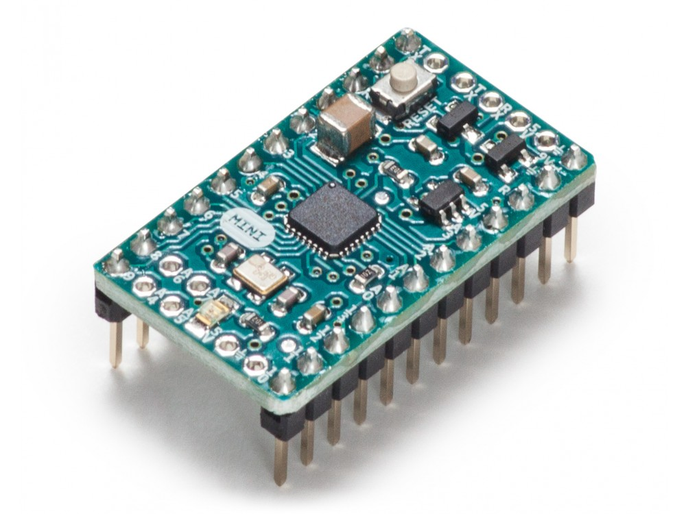
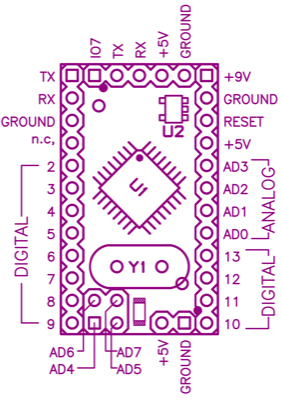

***Note: This page refers to a product that is retired.***

The **Arduino Mini 05** is a small microcontroller board originally based on the ATmega168, but now supplied with the 328.([datasheet](/resources/datasheets/Atmel-8271-8-bit-AVR-Microcontroller-ATmega48A-48PA-88A-88PA-168A-168PA-328-328P_datasheet_Complete.pdf)), intended for use on breadboards and when space is at a premium. It has 14 digital input/output pins (of which 6 can be used as PWM outputs), 8 analog inputs, and a 16 MHz crystal oscillator. It can be programmed with the [USB Serial adapter](https://www.arduino.cc/en/Main/USBSerial) or other USB or RS232 to TTL serial adapter.

The new Mini (revision 05) has a new package for the ATmega328, which enables all components to be on the top of the board. It also has an onboard reset button. The new version has the same pin configuration as revision 04.

Warning: Don't power the Arduino mini with more than 9 volts, or plug the power in backwards: you'll probably kill it.

You can find [here](https://www.arduino.cc/en/Main/warranty) your board warranty information.

## Getting Started

In the [Getting Started section](https://www.arduino.cc/en/Guide/ArduinoMini), you can find all the information you need to configure your board, use the [Arduino Software (IDE)](https://www.arduino.cc/en/Main/Software), and start to tinker with coding and electronics.

### Need Help?

* On the Software [on the Arduino Forum](https://forum.arduino.cc/index.php?board=93.0)
* On Projects [on the Arduino Forum](https://forum.arduino.cc/index.php?board=3.0)
* On the Product itself through [our Customer Support](https://support.arduino.cc/hc)

## Documentation

### OSH: Schematics

Arduino Mini is open-source hardware! You can build your own board using the following files:

[ARDUINO MINI 05](https://www.arduino.cc/en/uploads/Main/arduino_mini_schematic05.pdf) 
[ARDUINO MINI 04](https://www.arduino.cc/en/uploads/Main/arduino_mini_schematic04.pdf) 
[ARDUINO MINI 03](https://www.arduino.cc/en/uploads/Main/arduino_mini_schematic03.pdf)

[EAGLE FILES MINI 05](https://www.arduino.cc/en/uploads/Main/ArduinoMini05-EAGLE.zip) 
[GERBER FILES MINI 04](https://www.arduino.cc/en/uploads/Main/ArduinoMini04-gerber.zip) 
[USB ADAPTOR ZIP FILES](https://www.arduino.cc/en/uploads/Main/ArduinoMini04-gerber.zip)

### Programming

The Arduino Mini can be programmed with the Arduino software ([download](https://www.arduino.cc/en/Main/Software)). For details, see the[reference](https://www.arduino.cc/en/Reference/HomePage) and [tutorials](https://www.arduino.cc/en/Tutorial/HomePage).

To program the Arduino Mini, you will need a [USB Serial adapter](https://www.arduino.cc/en/Main/USBSerial) or other USB or RS232 to TTL serial adapter. See the page on [getting started with the Arduino Mini](https://www.arduino.cc/en/Guide/ArduinoMini) for instructions.

The ATmega328 on the Arduino Mini comes preburned with a [bootloader](https://www.arduino.cc/en/Tutorial/Bootloader) that allows you to upload new code to it without the use of an in-system-programmer. The bootloader communicates using the original STK500 protocol ([reference](http://www.atmel.com/dyn/resources/prod_documents/doc2525.pdf), [C header files](http://www.atmel.com/dyn/resources/prod_documents/avr061.zip)).

You can also bypass the bootloader and program the ATmega328 with ICSP (In-Circuit Serial Programming); see the page on [bootloading the Mini](http://www.arduino.cc/en/Hacking/MiniBootloader) for information on wiring up an ICSP header to the Mini and the [programmer](https://www.arduino.cc/en/Hacking/Programmer) for instructions on using a programmer to upload a sketch. 

### Input and Output

Each of the 14 digital pins on the Mini can be used as an input or output. They operate at 5 volts. Each pin can provide or receive a maximum of 40 mA and has an internal pull-up resistor (disconnected by default) of 20-50 kOhms. Pins 3, 5, 6, 9, 10, and 11 can provide PWM output; for details see the [analogWrite()](http://www.arduino.cc/en/Reference/AnalogWrite) function. If anything besides the Mini USB (or other) adapter is connected to pins 0 and 1, it will interfere with the USB communication, preventing new code from being uploaded or other communication with the computer.

The Mini has 8 analog inputs, each of which provide 10 bits of resolution (i.e. 1024 different values). Inputs 0 to 3 are broken out onto pins; input 4 to 7 require soldering into the provided holes. By default the analog inputs measure from ground to 5 volts, though is it possible to change the upper end of their range using the AREF pin and some low-level code.

See also the [mapping between Arduino pins and ATmega168/328 ports](https://www.arduino.cc/en/Hacking/PinMapping168).

### Pinout

Note: the pinout changed from version 03 to version 04 of the Mini, please be sure you use the right diagram.

*Pin out of the Arduino Mini 03.* (older versions are compatible, but missing theIO7 header at the top)

*Pin out of the Arduino Mini 04 and 05.*(Note that the ground pin on the left has moved down one pin.)

## Tech Specs

|                        |                                          |
| ---------------------- | ---------------------------------------- |
| Microcontroller        | ATmega328                                |
| Operating Voltage      | 5V                                       |
| Input Voltage          | 7-9 V                                    |
| Digital I/O Pins       | 14 (of which 6 provide PWM output)       |
| Analog Input Pins      | 8 (of which 4 are broken out onto pins)  |
| DC Current per I/O Pin | 40 mA                                    |
| Flash Memory           | 32 KB (of which 2 KB used by bootloader) |
| SRAM                   | 2 KB                                     |
| EEPROM                 | 1 KB                                     |
| Clock Speed            | 16 MHz                                   |
| Length                 | 30 mm                                    |
| Width                  | 18 mm                                    |