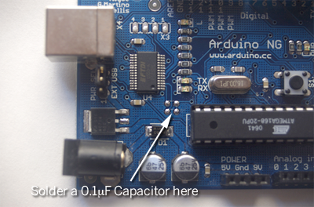
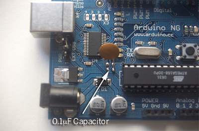

***Note: This page refers to a product that is retired.***

## Upgrading an Arduino NG to Auto-Reset

If you have an Arduino NG and you're envious of all the seconds saved by those Diecimila owners who don't have to press the reset button anymore, this page is for you. You can upgrade an Arduino NG to take advantage of the auto-reset functionality in Arduino 0009 and beyond with just a 0.1uF capacitor and a soldering iron.

First, unplug your board from power and heat up your soldering iron. 

Near the ATmega168 chip on the NG, there are four unused solder pads, as shown below. Solder a 0.1 uF capacitor across the bottom two pads:

Here's the board shown with the capacitor installed:

That's it. Now plug the board back into your computer and upload a new program, but don't hit the reset button. It should upload with no problems.

You may want to burn the Diecimila bootloader onto your chip as well, to eliminate the delay that happens between the end of upload and the beginning of your program.