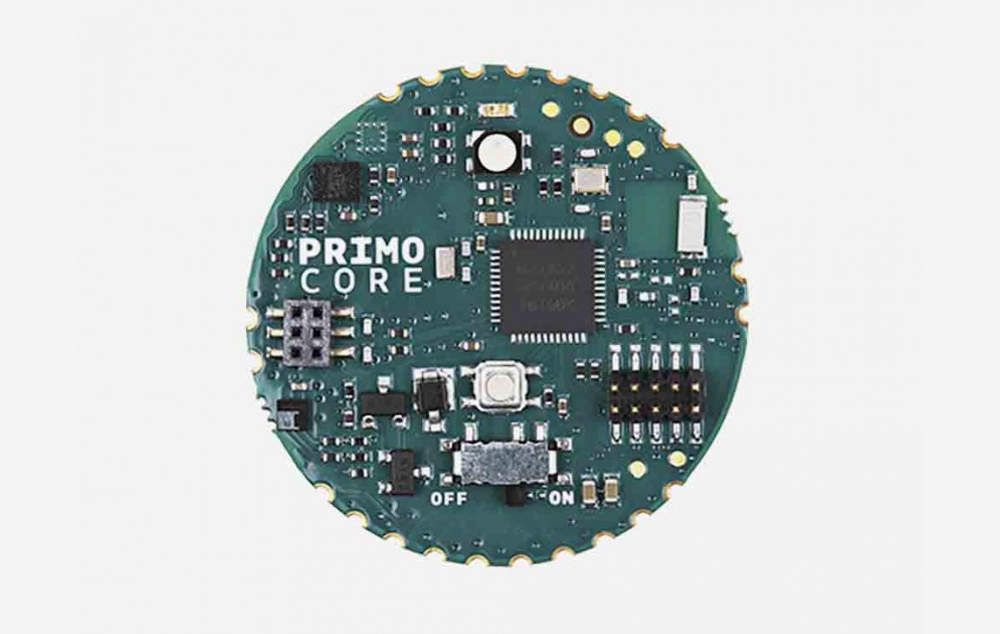

***Note: This page refers to a product that is retired.***

Arduino Primo Core is the compact Arduino board developed in cooperation with [Nordic Semiconductor](http://www.nordicsemi.com/).  

For the little dimension, the Bluetooth® integrated and the Low Power the board is ideal for IoT world and in particular for the wearables.  

The Microcontroller used is the same of the Arduino Primo, the Nordic microcontroller [nRF52832](/resources/datasheets/nRF52832_PS_v1.1.pdf).

It needs an external programmer, for example Atmel ICE, or an [Arduino Primo](https://store.arduino.cc/arduino-primo-936).

Furthermore the Arduino Primo Core has: 

* 10 digital input/output pins
* 10 PWM (all digital pins)
* 8 analog pins (from D0 at D7)
* Accelerometer and Gyroscope
* Temperature and Humidity sensor
* RGB Led
* SWD connector (to program the board using an external programmer)
* A coin cell battery connector
* Bluetooth® Low Energy interface
* LED
* NFC connector (to use an external NFC Antenna)
* Reset buttons (to reset the microcontroller)
* On/Off switch for powering the board

The Arduino Primo Core can be programmed in different ways, using:  

* an external programmer, for example Atmel ICE;
* an Arduino Primo.

## Documentation

### OSH: Schematics

Arduino Primo Core is open-source hardware! You can build your own board using the following files:

[SCHEMATICS IN .PDF](https://www.arduino.cc/en/uploads/Main/ARDUINO_PRIMO_CORE_V02_SCH.pdf) 

[DSN FILES IN .ZIP](https://www.arduino.cc/en/uploads/Main/ARDUINO_PRIMO_CORE.zip)

### Power

The Arduino Primo Core can be powered using the integrated slot for an external battery.  

The battery used in the slot is the button cell CR2032 of 3V.  

Furthermore it is also possible to use an external power supply to the Vin pin.  

### Memory

The nRF52832 has 512 KB of Flash memory and 64 KB of SRAM. There is no onboard EEPROM memory.

### Input and Output

Each of the 10 digital pins on the Arduino Primo Core can be used as an input or output, using [pinMode()](https://www.arduino.cc/reference/en/language/functions/digital-io/pinmode/), [digitalWrite()](https://www.arduino.cc/en/Reference/DigitalWrite), and [digitalRead()](https://www.arduino.cc/reference/en/language/functions/digital-io/digitalread/) functions. They operate at 3.3V. Each pin can provide or receive a maximum current of 14 mA.   
In addition, some pins have specialized functions:  
  
* Serial: RX and TX: these pins are used to receive (RX) and transmit (TX) TTL serial data.
* External Interrupts: all pins can be used as external interrupts. Keep in mind that you can’t use more than eight interrupt pins at the same time. These pins can be configured to trigger an interrupt on a low value, a rising or falling edge, or a change in value. See the [attachInterrupt()](https://www.arduino.cc/reference/en/language/functions/external-interrupts/attachinterrupt/) function for details.
* PWM: pulse width modulation is available on all pins. The 12-bit PWM output resolution can be adjusted using the [analogWriteResolution()](https://www.arduino.cc/reference/en/language/functions/zero-due-mkr-family/analogwriteresolution/) function.
* SPI: a Serial Peripheral Interface (SPI) bus is available using pins 4 (MOSI), 5 (MISO), and 6 (SCK) and 7 (SS) but it is possible to change them and use other pins. For more information about it visit the [SPI library](https://www.arduino.cc/en/Reference/SPI).
* TWI: Two-wire interface (TWI) communication is available from the serial data line (SDA) and serial clock line (SCL) pins. TWI communication is supported using the [Wire library](https://www.arduino.cc/en/Reference/Wire).
* RESET. Bringing the reset line LOW will reset the microcontroller.
* NFC1 and NFC2 for NFC communication
The Primo Core has also 8 analog inputs, labeled D0 through D7, each of which provide up to 14 bits of resolution (i.e., 16384 different values). By default they measure from ground to 3.3 volts, though it is possible to change the upper end of their range using the [analogReference()](https://www.arduino.cc/reference/en/language/functions/analog-io/analogreference/) function.  
  
Onboard there are some sensors and actuators:  
  
* A Led managed using the macro USER\_LED or LED\_BUILTIN. When the pin is HIGH value, the LED is on, when the pin is LOW, it's off.
* A RGB managed using the macro RED\_LED, BLUE\_LED and GREEN\_LED.
* Temperature and Humidity sensor (ST HT221)
* Accelerometer and Gyroscope (ST LSM6DS3)

### Communication

The Arduino Primo Core has a number of facilities available for communicating with other devices.  
  
In particular it has a Bluetooth® interface 4.0 that allows to communicate with PC, tablet and smartphone and to program the board. This interface is managed from the Bluetooth® Low Energy library. This library is contained in the nRF52 platform, downloadable from [Board Manager](https://www.arduino.cc/en/Guide/Cores) of the [Arduino IDE 1.8.x or later](https://www.arduino.cc/en/Main/Software).  
  
The board supports also the NFC communication until to 106 kbps as bit rate and 13,56 MHz of frequency. It needs only to connect the NFC antenna in the corresponding connector. The NFC is managed from NFC library and also this is contained in the nRF52 platform.  
  
Furthermore the [nRF52832](/resources/datasheets/nRF52832_PS_v1.1.pdf) supports also the I2C (TWI) communication. The Arduino software includes a [Wire library](https://www.arduino.cc/en/Reference/Wire) to simplify use of the I2C bus.  
  
In the Arduino Primo Core is also possible to use the SPI communication, using the default configuration (MOSI=4, MISO=5, SCK=6, SS=7) or defining the pins that you use directly in the sketch. For more information visit the [SPI library](https://www.arduino.cc/en/Reference/SPI).

### Programming

The Arduino Primo Core can be programmed in different ways, using:
* an external programmer, for example Atmel ICE;
* an Arduino Primo.
All these procedures use the [Arduino IDE](https://www.arduino.cc/en/Guide/Environment). The board is available from [Arduino IDE 1.8.x ](https://www.arduino.cc/en/Main/Software) version, downloading the corresponding platform (Arduino NRF52) from the [Board Manager](https://www.arduino.cc/en/Guide/Cores).  
  
### Physical Characteristics

The Arduino Primo Core is characterized from small size so that can be used wearable. The length and width of board is 32 x 32 mm respectively.   