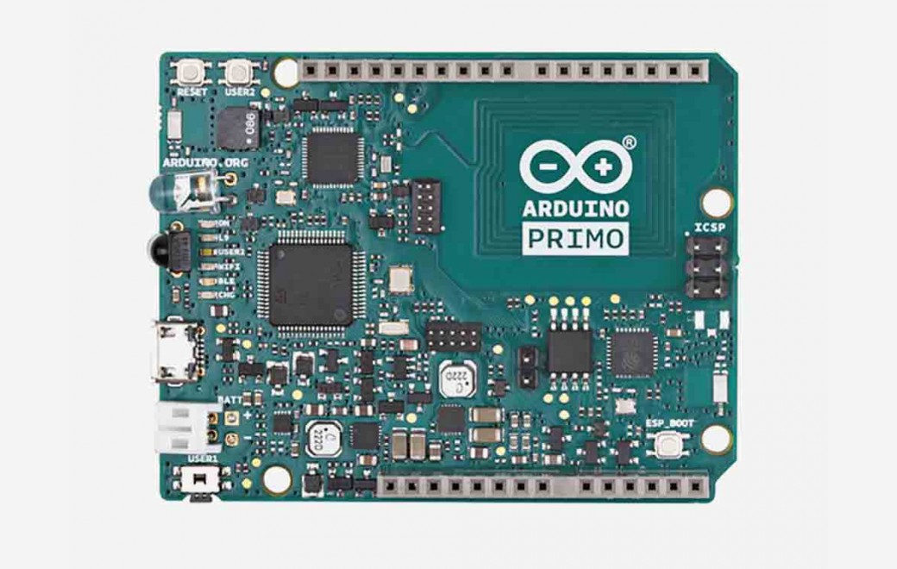

***Note: This page refers to a product that is retired.***



The Arduino Primo is the first board developed in cooperation with [Nordic Semiconductor](http://www.nordicsemi.com/). It brings new benefits for the IoT world all on one platform: advanced 32-bit microcontroller architecture, Bluetooth® low energy, Wi-Fi, near-field communications (NFC), and infrared (IR) transmit and receive capability.  
  
There are three onboard microcontrollers: 

* [nRF52832](/resources/datasheets/nRF52832_PS_v1.1.pdf), the main Arduino microcontroller with integrated Bluetooth® Low Energy and NFC
* [STM32f103](/resources/datasheets/en.CD00161566.pdf), a service microcontroller used for advanced debugging and programming of the other microcontrollers
* [ESP8266](https://espressif.com/en/products/hardware/esp8266ex/overview), for Wi-Fi and related internet connectivity functions.

The board has: 

* 14 digital input/output pins (of which 12 can be used as PWM outputs)
* 6 analog inputs
* 64 MHz ceramic resonator
* micro-USB connector
* ICSP header
* battery charger
* Infrared receiver and transmitter
* NFC antenna
* Bluetooth® Low Energy interface
* Buzzer
* two service buttons
* LEDs
* reset buttons (to reset the various microcontrollers).

Arduino Primo can be connected to a computer using a micro-USB cable, or it can be powered using a battery, connected via a 2-pin JST-PH connector. Having both Bluetooth® and Wi-Fi connectivity on board makes it easy to get started in the IoT world

## Documentation

### OSH: Schematics

Arduino Primo is open-source hardware! You can build your own board using the following files:

[SCHEMATICS IN .PDF](https://www.arduino.cc/en/uploads/Main/ARDUINO_PRIMO-V022_SCH.pdf) 

[DSN FILES IN .ZIP](https://www.arduino.cc/en/uploads/Main/ARDUINO_PRIMO.zip)

### Programming

The Arduino Primo can be programmed with the [Arduino IDE software](https://www.arduino.cc/en/Main/Software), as well as 3rd party software. The Arduino is available from [Arduino IDE 1.8.x](https://www.arduino.cc/en/Main/Software) version, downloading the corresponding platform (Arduino NRF52) from the [Board Manager](https://www.arduino.cc/en/Guide/Cores).

### Power

The Arduino Primo can be powered three different ways:  
* using a micro-USB connector
* connecting a power supply to the Vin pin
* using an external battery connected via the 2-pin JST-PH connector.
The Primo has integrated a charger and power management circuit that allows to run on battery or an external 5V and also to charge a Li-Ion and Li-Pol battery.   
When it runs an external 5V(4.75\~5.25V ) then it cuts off the battery if the voltage is lower than 3.5V and the switching from a source at the other one is done automatically.

### Charger 

The charge current is 340mA as default setting but you can close the solder bridges, in the back of the board, when you need more current.  
\-MED :810mA  
\-HIGH: 910mA

The power pins are as follows:

* VIN. The input voltage to the Arduino board can be supplied using an external power source or battery. It must supply between 2.7V and 5.5V.
* 5V. This pin outputs a regulated 5V power supply voltage that is generated from the onboard regulator. Connecting an input power source to the 5V or 3.3V pins bypasses the regulator, and can damage your board. We don't advise it.
* 3V3\. This pin outputs a regulated 3.3V power supply voltage that is generated from the onboard regulator. Maximum current draw is 50 mA.
* GND. Ground pins.
* IOREF. This pin on the Arduino board provides the voltage reference at which the microcontroller operates. A properly configured shield can read the voltage on the IOREF pin to select the appropriate power source, or to enable voltage translators on the 5V or 3.3V outputs.

### Memory

The nRF52832 has 512 KB of Flash memory and 64 KB of SRAM. There is no onboard EEPROM memory. 

### Input and Output

Each of the 14 digital pins on the Primo can be used as an input or output, using [pinMode()](https://www.arduino.cc/reference/en/language/functions/digital-io/pinmode/), [digitalWrite()](https://www.arduino.cc/en/Reference/DigitalWrite) , and [digitalRead()](https://www.arduino.cc/reference/en/language/functions/digital-io/digitalread/) functions. They operate at 3.3V. Each pin can provide or receive a maximum current of 14 mA. In addition, some pins have specialized functions:
* Serial: 0 (RX) and 1 (TX): Pins 0 and 1 are used to receive (RX) and transmit (TX) TTL serial data. On Primo TX and RX LEDs are missing but the ON LED blinks every time you send data over the Serial port of the nRF52
* External Interrupts: all pins (digital and analog) can be used as external interrupts except pins 0 and 1\. Keep in mind that you can’t use more than eight interrupt pins at the same time. These pins can be configured to trigger an interrupt on a low value, a rising or falling edge, or a change in value. See the [attachInterrupt()](https://www.arduino.cc/reference/en/language/functions/external-interrupts/attachinterrupt/) function for details.
* PWM: pulse width modulation is available on all digital pins except pins 0 and 1\. The 12-bit PWM output resolution can be adjusted using the [analogWriteResolution()](https://www.arduino.cc/reference/en/language/functions/zero-due-mkr-family/analogwriteresolution/) function.
* SPI: A serial peripheral interface (SPI) bus is available using pins 10 (SS), 11 (MOSI), 12 (MISO), and 13 (SCK) as well as using the onboard ICSP header. SPI communication is available using the [SPI library](https://www.arduino.cc/en/Reference/SPI).
* LED: There is a built-in LED connected to digital pin 9\. When the pin is HIGH value, the LED is on, when the pin is LOW, it's off.
The Primo has 6 analog inputs, labeled A0 through A5, each of which provide up to 14 bits of resolution (i.e., 16384 different values). By default they measure from ground to 3.3 volts, though it is possible to change the upper end of their range using the [analogReference()](https://www.arduino.cc/reference/en/language/functions/analog-io/analogreference/) function. A few additional pins are on the headers and those pins have specialized functions:
* TWI: Two-wire interface (TWI) communication is available from the serial data line (SDA) and serial clock line (SCL) pins (located near AREF). TWI communication is supported using the [Wire library](https://www.arduino.cc/en/Reference/Wire).
* AREF. Unlike some other Arduino boards, the analog reference (AREF) pin cannot be used to connect an external reference voltage for the analogRead() command.
* RESET. Bringing the reset line LOW will reset the microcontroller. RESET pin will reset only nRF52832 microcontroller. In order to reset all the three microcontrollers on board use reset button instead

### Communication

The Arduino Primo has a number of facilities available for communicating with a computer, tablet, or smartphone; another Arduino; or other microcontrollers and devices.  
  
The easiest method to communicate is to use a USB cable between the micro-USB port on a Primo, and a standard USB port on a PC. This is the same method used to communicate between the classic Arduino UNO and a PC, in order to upload sketches. Also like the UNO, the Primo supports a serial monitor function, which enables checking the communication between the board and a PC, and sending text messages and sensor data to help debug or analyze the operation of a sketch.   
  
A [SoftwareSerial library](https://www.arduino.cc/en/Reference/SoftwareSerial) allows for serial communication over any of the digital pins.  
  
The [nRF52832](/resources/datasheets/nRF52832_PS_v1.1.pdf) also supports I2C (TWI) and SPI communication. The Arduino software includes a [Wire library](https://www.arduino.cc/en/Reference/Wire) to simplify use of the I2C bus and the [SPI library](https://www.arduino.cc/en/Reference/SPI) for the SPI communication.  
  
The board allows wireless communication with other devices via Bluetooth, NFC, WiFi and IR, using specific libraries for each protocol.  
  
The Bluetooth® Low Energy interface allows Primo to communicate with other Bluetooth® Low Energy devices. It can also be used by PCs, tablets, and smartphones. The library used is Bluetooth® Low Energy that allows peripheral and central capabilities.  
  
The NFC peripheral supports type A communication signals at a106 kbps rate. The NFC library is contained in the NRF52 platform for [Arduino software](https://www.arduino.cc/en/Main/Software) (Arduino IDE 1.8.x or later).  
  
The Primo Wi-Fi communication is supported by the ESP8266 module, which includes a self-contained SoC with integrated TCP/IP protocol stack. This module allows connecting the Primo to a Wi-Fi network. The Primo Wi-Fi configuration supports access point (AP) mode, station (STA) mode, and the combination of the two: AP + STA by the [WiFi Link library](https://github.com/arduino-org/arduino-library-wifilink)  
  
The [CIR library](https://github.com/arduino-org/arduino-core-nrf52/tree/master/libraries/CIR) allows the Primo board to interact with a large number of IR sensors. The board has both receiver and transmitter capability, to give full flexibility to your sketches.

### Physical Characteristics

The length and width of the Primo printed circuit board (PCB) is 2.7 x 2.1 inches respectively. It includes a micro-USB connector and a 2-pin adapter for power via a battery or external supply. Four screw holes allow the board to be attached to a surface or case.  
 
Note that like the Arduino Uno and several other boards, the distance between digital pins 7 and 8 is 160 mil (0.16"), not an even multiple of the 100 mil spacing of the other pins.

## Tech Specs

|                             | WiFi Microcontroller       | Arduino Microcontroller  | Service Microcontroller |
| --------------------------- | -------------------------- | ------------------------ | ----------------------- |
| **Processor**               | ESP8266                    | Nordic nRF52832          | STM32F103RBT6           |
| **Architecture**            | Tensilica Xtensa LX106     | ARM Cortex-M4F           | ARM Cortex-M3           |
| **Operating Voltage**       | 3.3 V                      | 3.3 V                    | 2.0 to 3.6 V            |
| **Flash Memory**            | 4 MB                       | 512 KB                   | 64 KB                   |
| **SRAM / RAM**              | 8 MB instruction12 MB data | 64 KB                    | 20 KB                   |
| **Clock Speed**             | 80 MHz                     | 64 MHz                   | up to 72 MHz            |
| **WiFi**                    | 802.11 b/g/n 2.4 GHz       | \-                       | \-                      |
| **Wake up time**            | < 2ms                      | \-                       | \-                      |
| **Analog I/O Pins**         | \-                         | 6 + 1 DAC                | \-                      |
| **DC Current per I/O Pins** | \-                         | 15 mA                    | \-                      |
| **Bluetooth® Smart**         | \-          | BLE4.0: TX power up to +4dBm \-96dBm sensitivity in Bluetooth® Low Energy mode | \- |

- Other features: PDM interface, AES HW enc, NFC tag, USB/Uart converter, CMSIS-DAP, GPIO expander, Board power management, IrDA

---

## Configure a Linux machine for Arduino Primo usage

Execute this script to configure a Linux machine for Arduino Primo usage

```arduino
\# arduino-linux-setup.sh : A simple Arduino setup script for Linux systems  
\# Copyright (C) 2015 Arduino Srl  
#  
\# Author : Arturo Rinaldi  
\# E-mail : arturo@arduino.org  
\# Project URL : https://github.com/artynet/arduino-linux-setup  
#  
\# This program is free software: you can redistribute it and/or modify  
\# it under the terms of the GNU General Public License as published by  
\# the Free Software Foundation, either version 3 of the License, or  
\# (at your option) any later version.  
#  
\# This program is distributed in the hope that it will be useful,  
\# but WITHOUT ANY WARRANTY; without even the implied warranty of  
\# MERCHANTABILITY or FITNESS FOR A PARTICULAR PURPOSE. See the  
\# GNU General Public License for more details.  
#  
\# You should have received a copy of the GNU General Public License  
\# along with this program. If not, see <http://www.gnu.org/licenses/>.  
#  
\# Release v8 changelog :  
#  
\# + rules are now created in /tmp folder  
#  
\# Release v7 changelog :  
#  
\# + Adding project URL  
\# + minor bugfixing  
#  
\# Release v6 changelog :  
#  
\# + removing sudocheck function and control  
#  
\# Release v5 changelog :  
#  
\# + adding UDEV rule for stm32 DFU mode  
#  
\# Release v4 changelog :  
#  
\# + The rules are generated in a temporary folder  
#  
\# + the user should run it without sudo while having its permissions  
#  
\# Release v3 changelog :  
#  
\# + The most common linux distros are now fully supported  
#  
\# + now the script checks for SUDO permissions  
#  
  
#! /bin/bash  
  
\# if \[\[ $EUID != 0 \]\] ; then  
\# echo This must be run as root!  
\# exit 1  
\# fi  
  
refreshudev () {  
  
 echo ""  
 echo "Restarting udev"  
 echo ""  
  
 sudo service udev restart  
 sudo udevadm control --reload-rules  
 sudo udevadm trigger  
  
}  
  
groupsfunc () {  
  
 echo ""  
 echo "\*\*\*\*\*\*\* Add User to dialout,tty, uucp, plugdev groups \*\*\*\*\*\*\*"  
 echo ""  
  
 sudo usermod -a -G tty $1  
 sudo usermod -a -G dialout $1  
 sudo usermod -a -G uucp $1  
 sudo groupadd plugdev  
 sudo usermod -a -G plugdev $1  
  
}  
  
acmrules () {  
  
 echo ""  
 echo "# Setting serial port rules"  
 echo ""  
  
cat <<EOF  
"KERNEL="ttyUSB\[0-9\]\*", TAG+="udev-acl", TAG+="uaccess", OWNER="$1"  
"KERNEL="ttyACM\[0-9\]\*", TAG+="udev-acl", TAG+="uaccess", OWNER="$1"  
EOF  
  
}  
  
openocdrules () {  
  
 echo ""  
 echo "# Adding Arduino M0/M0 Pro, Primo UDEV Rules for CMSIS-DAP port"  
 echo ""  
  
cat <<EOF  
ACTION!="add|change", GOTO="openocd\_rules\_end"  
SUBSYSTEM!="usb|tty|hidraw", GOTO="openocd\_rules\_end"  
  
#Please keep this list sorted by VID:PID  
  
#CMSIS-DAP compatible adapters  
ATTRS{product}=="\*CMSIS-DAP\*", MODE="664", GROUP="plugdev"  
  
LABEL="openocd\_rules\_end"  
EOF  
  
}  
  
avrisprules () {  
  
 echo ""  
 echo "# Adding AVRisp UDEV rules"  
 echo ""  
  
cat <<EOF  
SUBSYSTEM!="usb\_device", ACTION!="add", GOTO="avrisp\_end"  
\# Atmel Corp. JTAG ICE mkII  
ATTR{idVendor}=="03eb", ATTRS{idProduct}=="2103", MODE="660", GROUP="dialout"  
\# Atmel Corp. AVRISP mkII  
ATTR{idVendor}=="03eb", ATTRS{idProduct}=="2104", MODE="660", GROUP="dialout"  
\# Atmel Corp. Dragon  
ATTR{idVendor}=="03eb", ATTRS{idProduct}=="2107", MODE="660", GROUP="dialout"  
  
LABEL="avrisp\_end"  
EOF  
  
}  
  
dfustm32rules () {  
  
 echo ""  
 echo "# Adding STM32 bootloader mode UDEV rules"  
 echo ""  
  
cat <<EOF  
\# Example udev rules (usually placed in /etc/udev/rules.d)  
\# Makes STM32 DfuSe device writeable for the "plugdev" group  
  
ACTION=="add", SUBSYSTEM=="usb", ATTRS{idVendor}=="0483", ATTRS{idProduct}=="df11", MODE="664", GROUP="plugdev", TAG+="uaccess"  
EOF  
  
}  
  
dfuarduino101rules (){  
  
 echo ""  
 echo "# Arduino 101 in DFU Mode"  
 echo ""  
  
cat <<EOF  
SUBSYSTEM=="tty", ENV{ID\_REVISION}=="8087", ENV{ID\_MODEL\_ID}=="0ab6", MODE="0666", ENV{ID\_MM\_DEVICE\_IGNORE}="1", ENV{ID\_MM\_CANDIDATE}="0"  
SUBSYSTEM=="usb", ATTR{idVendor}=="8087", ATTR{idProduct}=="0aba", MODE="0666", ENV{ID\_MM\_DEVICE\_IGNORE}="1"  
EOF  
  
}  
  
removemm () {  
  
 echo ""  
 echo "\*\*\*\*\*\*\* Removing modem manager \*\*\*\*\*\*\*"  
 echo ""  
  
 if \[ -f /etc/lsb-release -a ! -f /etc/SuSE-release \] || \[ -f /etc/debian\_version \] || \[ -f /etc/linuxmint/info \]  
 then  
 #Only for Ubuntu/Mint/Debian  
 sudo apt-get -y remove modemmanager  
 elif \[ -f /etc/SuSE-release \]  
 then  
 #Only for Suse  
 sudo zypper remove modemmanager  
 elif \[ -f /etc/fedora-release \] || \[ -f /etc/redhat-release \]  
 then  
 #Only for Red Hat/Fedora/CentOS  
 sudo yum remove modemmanager  
 else  
 echo ""  
 echo "Your system is not supported, please take care of it with your package manager"  
 echo ""  
 fi  
  
}  
  
  
if \[ "$1" = "" \]  
then  
 echo ""  
 echo "Run the script with command ./arduino-linux-setup.sh \\$USER"  
 echo ""  
else  
  
 \[ \`whoami\` != $1 \] && echo "" && echo "The user name is not the right one, please double-check it !" && echo "" && exit 1  
  
 groupsfunc $1  
  
 removemm  
  
 acmrules $1 > /tmp/90-extraacl.rules  
  
 openocdrules > /tmp/98-openocd.rules  
  
 avrisprules > /tmp/avrisp.rules  
  
 dfustm32rules > /tmp/40-dfuse.rules  
  
 dfuarduino101rules > /tmp/99-arduino-101.rules  
  
 sudo mv /tmp/\*.rules /etc/udev/rules.d/  
  
 refreshudev  
  
 echo ""  
 echo "\*\*\*\*\*\*\*\*\*\*\* Please Reboot your system \*\*\*\*\*\*\*\*\*\*\*\*"  
 echo ""  
fi  
```