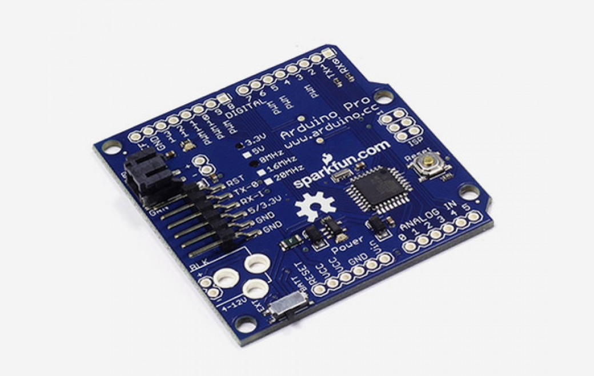

***Note: This page refers to a product that is retired.***

The **Arduino Pro** is a microcontroller board based on the ATmega328\. The Pro comes in both 3.3V/8MHz and 5V/16MHz versions. It has 14 digital input/output pins (of which 6 can be used as PWM outputs), 6 analog inputs, a battery power jack, a power switch, a reset button, and holes for mounting a power jack, an ICSP header, and pin headers. A six pin header can be connected to an FTDI cable or Sparkfun breakout board to provide USB power and communication to the board. The Arduino Pro is intended for semi-permanent installation in objects or exhibitions. The board comes without pre-mounted headers, allowing the use of various types of connectors or direct soldering of wires. The pin layout is compatible with Arduino shields. The 3.3V versions of the Pro can be powered with a battery. The Arduino Pro was designed and manufactured by SparkFun Electronics.

You can find [here](https://www.arduino.cc/en/Main/warranty) your board warranty information.

## Getting Started

You can find in the [Getting Started section](https://www.arduino.cc/en/Guide/ArduinoPro) all the information you need to configure your board, use the [Arduino Software (IDE)](https://www.arduino.cc/en/Main/Software), and start tinker with coding and electronics.

### Need Help?

* On the Software [on the Arduino Forum](https://forum.arduino.cc/index.php?board=63.0)
* On Projects [on the Arduino Forum](https://forum.arduino.cc/index.php?board=3.0)
* On the Product itself through [our Customer Support](https://support.arduino.cc/hc)

## Documentation

### OSH: Schematics

Arduino PRO is open-source hardware! You can build your own board using the following files:

[EAGLE FILES IN .ZIP](https://www.arduino.cc/en/uploads/Main/arduino-pro-reference-design.zip) 

[SCHEMATICS IN .PDF](https://www.arduino.cc/en/uploads/Main/Arduino-Pro-schematic.pdf)

### Power

The Arduino Pro can be powered via the USB header, with a battery, or with an external power supply. The battery power jack is a JST header. A power jack for an external supply can be soldered to the board. The power pins are as follows:

* **VIN:** The voltage supplied to the board from a battery or the DC power jack (according to the position of the switch). You can supply voltage through this pin, or, if supplying voltage via a battery or DC power supply, access it through this pin.
* **VCC:** The regulated power supply on the board. This comes from the battery or DC power supply via the regulator, or from the USB-to-TTL Serial converter.
* **GND:** Ground pins.

### Memory

The ATmega328 has 32KB of flash, 2KB of SRAM, and 1KB of EEPROM.

### Input and Output

Each of the 14 digital pins on the Pro can be used as an input or output, using [pinMode](https://www.arduino.cc/reference/en/language/functions/digital-io/pinmode/),[digitalWrite](https://www.arduino.cc/reference/en/language/functions/digital-io/digitalwrite/), and [digitalRead](https://www.arduino.cc/reference/en/language/functions/digital-io/digitalread/) functions. They operate at 3.3 or 5 volts (depending on the model). They operate at 3.3 volts. Each pin can provide or receive a maximum of 40 mA and has an internal pull-up resistor (disconnected by default) of 20-50 kOhms. In addition, some pins have specialized functions:

* **Serial: 0 (RX) and 1 (TX).** Used to receive (RX) and transmit (TX) TTL serial data. These pins are connected to the TX-0 and RX-1 pins of the six pin header.
* **External Interrupts: 2 and 3.** These pins can be configured to trigger an interrupt on a low value, a rising or falling edge, or a change in value. See the [attachInterrupt()](https://www.arduino.cc/reference/en/language/functions/external-interrupts/attachinterrupt/) function for details.
* **PWM: 3, 5, 6, 9, 10, and 11.** Provide 8-bit PWM output with the [analogWrite()](https://www.arduino.cc/en/Reference/AnalogWrite) function.
* **SPI: 10 (SS), 11 (MOSI), 12 (MISO), 13 (SCK).** These pins support SPI communication, which, although provided by the underlying hardware, is not currently included in the Arduino language.
* **LED: 13.** There is a built-in LED connected to digital pin 13\. When the pin is HIGH value, the LED is on, when the pin is LOW, it's off. The Pro has 6 analog inputs, each of which provide 10 bits of resolution (i.e. 1024 different values). By default they measure from ground to VCC, though is it possible to change the upper end of their range using the AREF pin and some low-level code.
* **I2C: 4 (SDA) and 5 (SCL).** Support I2C (TWI) communication using the [Wire library](https://www.arduino.cc/en/Reference/Wire).
* **AREF:** Reference voltage for the analog inputs. Used with [analogReference](https://www.arduino.cc/reference/en/language/functions/analog-io/analogreference/)().
* **Reset:** Bring this line LOW to reset the microcontroller. Typically used to add a reset button to shields which block the one on the board.

### Communication

The Arduino Pro has a number of facilities for communicating with a computer, another Arduino, or other microcontrollers. The ATmega328 provides UART TTL serial communication, which is available on digital pins 0 (RX) and 1 (TX). The Arduino software includes a serial monitor which allows simple textual data to be sent to and from the Arduino board via a USB connection.  

A [SoftwareSerial library](https://docs.arduino.cc/learn/built-in-libraries/software-serial) allows for serial communication on any of the Pro's digital pins.   
  
The ATmega328 also supports I2C (TWI) and SPI communication. The Arduino software includes a Wire library to simplify use of the I2C bus; see the [reference](https://www.arduino.cc/reference/en/language/functions/communication/wire/) for details. To use the SPI communication, please see the ATmega328 datasheet.

### Programming

The Arduino Pro can be programmed with the Arduino software [download](https://www.arduino.cc/en/software). For details, see the[reference](https://www.arduino.cc/reference/en/) and [tutorials](https://docs.arduino.cc/tutorials/). The ATmega328 on the Arduino Pro comes preburned with a [bootloader](https://docs.arduino.cc/hacking/software/Bootloader)that allows you to upload new code to it without the use of an external hardware programmer. It communicates using the original STK500 protocol [reference](http://www.atmel.com/dyn/resources/prod_documents/doc2525.pdf), [C header files](http://www.atmel.com/dyn/resources/prod_documents/avr061.zip).   

You can also bypass the bootloader and program or ATmega328 with an external programmer; see[these instructions](https://docs.arduino.cc/hacking/software/Programmer) for details.

### Automatic (Software) Reset

Rather then requiring a physical press of the reset button before an upload, the Arduino Pro is designed in a way that allows it to be reset by software running on a connected computer. One of the pins on the six-pin header is connected to the reset line of the ATmega328 via a 100 nanofarad capacitor. This pin connects to one of the hardware flow control lines of the USB-to-serial converter connected to the header: RTS when using an FTDI cable, DTR when using the Sparkfun breakout board. When this line is asserted (taken low), the reset line drops long enough to reset the chip.   

The Arduino software uses this capability to allow you to upload code by simply pressing the upload button in the Arduino environment. This means that the bootloader can have a shorter timeout, as the lowering of the reset line can be well-coordinated with the start of the upload.   

This setup has other implications. When the Pro is connected to either a computer running Mac OS X or Linux, it resets each time a connection is made to it from software (via USB). For the following half-second or so, the bootloader is running on the Pro. While it is programmed to ignore malformed data (i.e. anything besides an upload of new code), it will intercept the first few bytes of data sent to the board after a connection is opened.   

If a sketch running on the board receives one-time configuration or other data when it first starts, make sure that the software with which it communicates waits a second after opening the connection and before sending this data.

### Physical Characteristics

The maximum length and width of the Pro PCB are 2.05 and 2.10 inches respectively, with the six pin header and power switch extending slightly beyond the edges. Four screw holes allow the board to be attached to a surface or case. Note that the distance between digital pins 7 and 8 is 160 mil (0.16"), not an even multiple of the 100 mil spacing of the other pins.

## Tech Specs

|                           |                                                |
| ------------------------- | ---------------------------------------------- |
| Microcontroller           | ATmega328                                      |
| Board Power Supply        | 3.35 -12 V (3.3V model) or 5 - 12 V (5V model) |
| Circuit Operating Voltage | 3.3V or 5V (depending on model)                |
| Digital I/O Pins          | 14                                             |
| PWM Pins                  | 6                                              |
| UART                      | 1                                              |
| SPI                       | 1                                              |
| I2C                       | 1                                              |
| Analog Input Pins         | 6                                              |
| External Interrupts       | 2                                              |
| DC Current per I/O Pin    | 40mA                                           |
| Flash Memory              | 32KB of which 2KB used by bootloader           |
| SRAM                      | 2KB                                            |
| EEPROM                    | 1KB                                            |
| Clock Speed               | 8MHz (3.3V versions) or 16MHz (5V versions)    |
| LED_BUILTIN               | 13                                             |