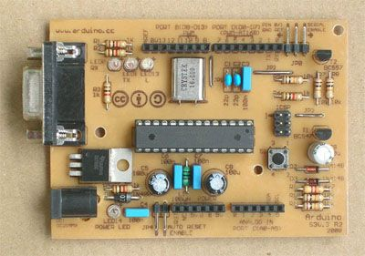

***Note: This page refers to a product that is retired.***

## Arduino Single-Sided Serial Board (version 3)

If you don't have an easy way to order an Arduino board or kit, you can etch this PCB design by hand and solder it together. It is pin-compatible with the Arduino Diecimila, and should work with any Arduino shield.

This is the third revision of the board: the Arduino Single-Sided Serial version 3, or s3v3, or Arduino Severino. It was designed by Adilson Akashi, based on the previous version.

[A4 Image for Toner Transfer (.png)](//www.arduino.cc/en/uploads/Main/Arduino%5FS3v3%5FR2%5FA4%5F4x2.png) 

[Schematic (.png)](//www.arduino.cc/en/uploads/Main/ArduinoSeverinoSchematic.png) 

[EAGLE files (.zip)](//www.arduino.cc/en/uploads/Main/Arduino%5FS3v3%5FR2%5FEAGLE%5Fagain.zip) 

[Manual (.pdf)](//www.arduino.cc/en/uploads/Main/ArduinoSeverinoManual2.pdf) 

[Mounting diagram (.png)](//www.arduino.cc/en/uploads/Main/ArduinoSeverinoMountingDiagram.png) 

These files are licensed under the [Creative Commons Attribution Share-Alike 2.5 license](http://creativecommons.org/licenses/by-sa/2.5/).