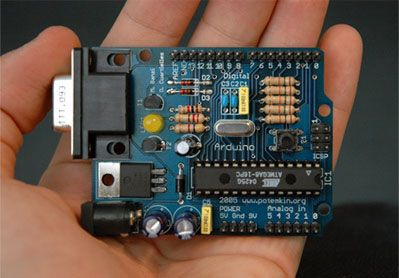

***Note: This page refers to a product that is retired.***

## Arduino Board - Serial Interface 

**This page has been updated for historical purposes and we cannot guarantee that the files will be available forever.**   

 

It's a basic board that uses RS232 as an interface to a computer for programming or communication. This board is easy to assemble even as a learning exercise. It has been designed to use the simplest component as possible so that it's easy to build even if you look for parts at the shop around the corner.

These reference designs for arduino are distributed under a Creative Commons license [Attribution-ShareAlike 2.5](http://creativecommons.org/licenses/by-sa/2.5/) 

Version 1 (Obsolete - **NOT available any longer**)

*Note: as for 2005/03/30 these were the original designs manufactured for the first time* 

  
Version 2

[Download Eagle Cad files](https://content.arduino.cc/assets/release%5Farduino%5Frs232%5Fv2.zip) / [schematic](https://content.arduino.cc/assets/arduino%5Frs232%5Fv2.png) / [part list](https://content.arduino.cc/assets/partlist.txt)

**Note: design from 2005/10/02**   
  
*Last update 2019/12/03 by SM* 

---

## Part List for the Serial (RS232) Arduino

*Digikey parts from Tom Igoe*
Arduino RS232 BOM

|||||||||
|-|-|-|-|-|-|-|-|
|Parts|Qty|Value|Device|Farnell|RS|Distrelec|Digikey|
|S1|1||Reset pusbutton|535916|||SW400\-ND|
|IC2|1|78xxL|7805 TO220|701853|||LM7805CT\-ND|
|X1|1|| DB9 PCB female connector|4106118|||A2100-ND|
|LED1|1|| Green LED|656719|||160-1144-ND|
|POWER|1|| 4 pin header|3291777|||A26509-20-ND|
|J2|1|| 6pins header||||A26509-20-ND|
|J1, J3|2|| 8 pins header||||A26509-20-ND|
|X2|1|| 2.1mm power jack|224959|||CP-102AH-ND|
|Q1|1|| 16 MHz Quartz|641029|||300-6034-ND|
|D1|1|1N4004|1N4004 or equivalent|251707|||1N4004GICT-ND|
|D2, D3|2|1N4148|1N4148|399390|||1N4148FS-ND|
|R7|1|1k|1/4 W resistor|509164|||1.0KQBK-ND|
|R3|1|4k7|1/4 W resistor|509243|||4.7KQBK-ND|
|R1, R4, R5, R6, R8|5|10k|1/4 W resistor|509280|||10KQBK-ND|
|C8|1|10u|Electrolitic Capacitor|920502|||P11250-ND|
|C2, C3|2|22p|Polyester Capacitor|896410|||1330PH-ND|
|C1, C5|2|100n|Polyester Capacitor|146079|||P4201-ND|
|C6, C7|2|100u|Electrolitic Capacitor|920629|||P10269-ND|
|R2|1|220|1/4 W resistor|509097|||220QBK-ND|
|X3|1||28pin IC socket||||ED3128\-ND|
|IC1|1|ATMEGA8|Atmega8 28pin DIP microcontroller|3917927|||ATMEGA8\-16PI-ND|
|T1|1|BC547|Transistor|357054|||BC547BOS\-ND|
|T2|1|BC557|Transistor|4399821|||BC327OS\-ND|
|ICSP|1|ICSP|2x3 pins header|3291947|||A26509-20-ND|

## Part List for the Arduino Serial Board (RS232) V2

*APPROVED 20051017 by David Cuartielles* 

*Digikey parts from Tom Igoe* 

Arduino RS232 BOM

|||||||||
|-|-|-|-|-|-|-|-|
|Parts|Qty|Value|Device|Farnell|RS|ELFA|Digikey|
|S1|1||Reset pusbutton|535916||35-656-29|SW400\-ND|
|IC2|1|78xxL|7805 TO220|701853||73-000-16|LM7805CT\-ND|
|X1|1|| DB9 PCB female connector|4106118|| 44-057-00|A2100-ND|
|LED1|1|| Green LED|656719|| 75-012-08|160-1144-ND|
|POWER|1|| 4 pin header|3291777|| 43-782-79|A26509-20-ND|
|J2|1|| 6pins header|||  43-782-95|A26509-20-ND|
|J1, J3|2|| 8 pins header|||  43-783-11|A26509-20-ND|
|X2|1|| 2.1mm power jack|224959|| 42-051-67|CP-102AH-ND|
|Q1|1|| 16 MHz Quartz|641029|| 74-517-01|300-6034-ND|
|D1|1|1N4004|1N4004 or equivalent|251707|| 70-003-91|1N4004GICT-ND|
|D2, D3|2|1N4148|1N4148|399390|| 70-005-57|1N4148FS-ND|
|R1|1|4k7|1/4 W resistor|509243|| 60-785-70|4.7KQBK-ND|
|R2|1|220|1/4 W resistor|509097|| 60-784-14|220QBK-ND|
|R3,R4|2|1k|1/4 W resistor|509164|| 60-784-97|1.0KQBK-ND|
|R5, R6, R7, R8, R9|5|10k|1/4 W resistor|509280|| 60-786-12|10KQBK-ND|
|C1, C5|2|100n|Polyester Capacitor|146079|| 65-505-29|P4201-ND|
|C2, C3|2|22p|Polyester Capacitor|896410|| 65-861-68|1330PH-ND|
|C6, C7|2|100u|Electrolitic Capacitor|920629|| 67-010-80|P10269-ND|
|C8|1|10u|Electrolitic Capacitor|920502|| 67-008-01|P11250-ND|
|IC1|1|ATMEGA8|Atmega8 28pin DIP microcontroller|3917927|| 73-672-04|ATMEGA8\-16PI-ND|
|X3|1|| 28pin IC socket|||  48-161-87|ED3128\-ND|
|T1|1|BC547|Transistor|357054|| 71-072-87|BC547BOS\-ND|
|T2|1|BC557|Transistor|4399821|| 71-072-95|BC327OS\-ND|
|ICSP|1|ICSP|2x3 pins header|3291947|| 43-717-12|A26509-20-ND|