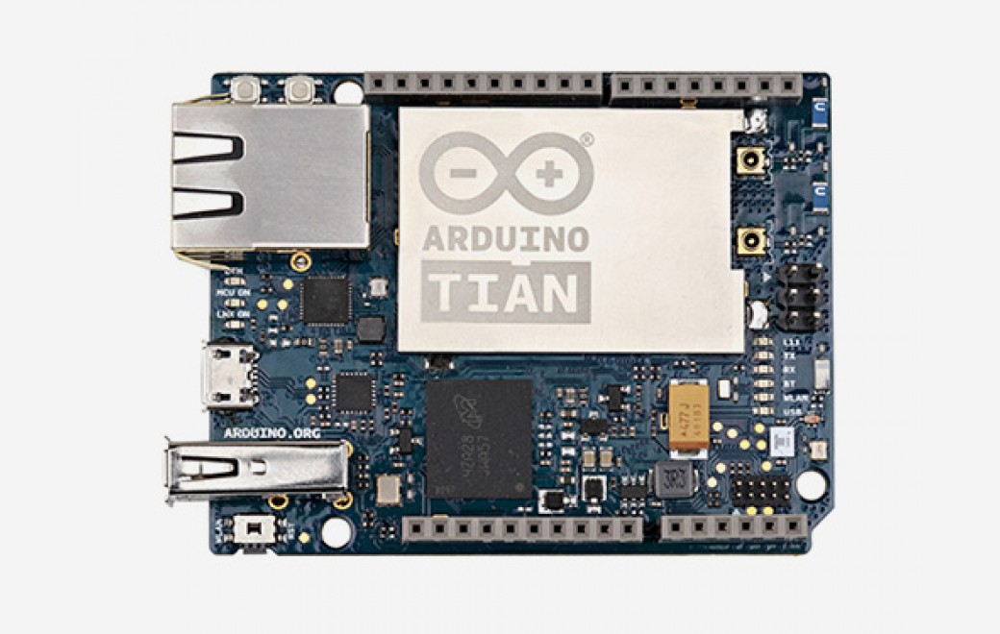

***Note: This page refers to a product that is retired.***

The new **Arduino Tian** board is powered by Atmel’s SAMD21 MCU, featuring a 32-bit ARM Cortex® M0+ core and a Qualcomm Atheros AR9342, which is an highly integrated MIPS processor operating at up to 533MHz and feature-rich IEEE802.11n 2x2 2.4/5 GHz dual-band WiFi module. Qualcomm Atheros MIPS supports a Linux distribution, based on OpenWRT named Linino. The Arduino Tian has also a build in 4GB eMMC memory that will can be helpful to build your projects. It is possible to Switch ON/OFF the Linux port from the MCU to reduce the power consumption.

**NB:** In some countries, it is prohibited to sell WiFi enabled devices without government approval. While waiting for proper certification, some local distributors are disabling WiFi functionality. Check with your dealer before purchasing a Tian if you believe you may live in such a country.

**NB:** Before to start to run Arduino Tian must install CP201x driver on the computer. Find Drivers link [here](https://www.silabs.com/developers/usb-to-uart-bridge-vcp-drivers?tab=downloads).

## Getting Started

You can find in the [Getting Started section](https://www.arduino.cc/en/Guide/HomePage) all the information you need to configure your board, use the [Arduino Software (IDE)](https://www.arduino.cc/en/Main/Software), and start tinker with coding and electronics.

### Need Help?

* On the Software [on the Arduino Forum](https://forum.arduino.cc/index.php?board=63.0)
* On Projects [on the Arduino Forum](https://forum.arduino.cc/index.php?board=3.0)
* On the Product itself through [our Customer Support](https://support.arduino.cc/hc)

## Documentation

### OSH: Schematics

The Arduino Tian is open-source hardware! You can build your own board using the following files:

[DSN FILES IN .ZIP](https://www.arduino.cc/en/uploads/Main/TIAN-V03-20160219.DSN.zip) 

[SCHEMATICS IN .PDF](https://www.arduino.cc/en/uploads/Main/TIAN-V03-20160219.pdf) 

### Power

The Arduino Tian can be powered via the micro USB connection or with an external power supply. The power source is selected automatically. External (non-USB) power can come either from an AC-to-DC adapter (wall-wart) or a battery inserted in the Gnd and Vin pin headers. The board will automatically detect which power sources are available and choose which one to use according to the following priority:

* External power
* Target USB

External power required is of 600mA and 5V. The power pins are as follows:

* VIN. The input voltage to the Arduino board when it's using an external power source. You can supply voltage through this pin. The allowed input voltage range for this pin 5V.
* 5V. The regulated power supply used to power the microcontroller and other components on the board. This can come either from VIN via an on-board regulator, or be supplied by USB or another regulated 5V supply. The maximum current output provided by the on-board regulator is 2A (according to the power input source). 3V3\. A 3.3 volt supply generated by the on-board regulator. Maximum current draw is 2A (according to the power input source).
* GND. Ground pins.
* IOREF. The voltage at which the i/o pins of the board are operating (i.e. VCC for the board). This is 3.3V on the Tian.

### Memory

The ATSAMD21G18 has 256 KB of flash program memory (with 69 KB used for the bootloader). The bootloader is factory pre burnt by Atmel and is stored in a dedicated ROM memory. The bootloader is protected using the NVM fuse. It also carries 32 KB of SRAM.

### Input and Output

It is not possible to access the I/O pins of the Atheros AR9342\. All I/O lines are tied to the Atmel SAMD21\. The Atheros is connected a usb hub with 4 ports (see the block diagram) to which are connected the Bluetooth, memory eMMCs, the SAMD21 and the USB Host port.

Each of the 20 digital i/o pins on the Tian can be used as an input or output, using pinMode(), digitalWrite(), and digitalRead() functions. They operate at 3.3 volts. Each pin can provide or receive a maximum of 40 mA and has an internal pull-up resistor (disconnected by default) of 20-50 kOhms. In addition, some pins have specialized functions:

* Serial: 0 (RX) and 1 (TX). Used to receive (RX) and transmit (TX) 3.3V serial data using the Atmel SAMD21 hardware serial capability. Note that on the Tian, the Serial class refers to USB (CDC) communication; for 3.3V serial on pins 0 and 1, use the Serial5 class. The hardware serials of the Atmel SAMD21 and the AR9342 on the Tian are connected together and are used to communicate between the two processors via SerialUSB.
* TWI: SDA and SCL support TWI communication using the Wire library. Note that the TWI pins are not connected to any of the digital I/O pins.
* External Interrupts: all pins can be external interrupt except pin2: 0 (interrupt 0), 1 (interrupt 1), …. These pins can be configured to trigger an interrupt on a low value, a rising or falling edge, or a change in value. See the attachInterrupt() function for details. Pin 7 is connected to the AR9342 processor and it may be used as handshake signal in future. Is recommended to be careful of possible conflicts if you intend to use it as interrupt.
* LINUX (MIPS) on/off: it possible turn on/off the Linux side via pin32 ( digitalWrite(32, HIGH) - digitalWrite(32, LOW) ).
* PWM: From pins 2 to 13 provide 8-bit PWM output with the analogWrite() function. The resolution of the PWM can be changed with the analogWriteResolution() function. Note: The pins 4 and 10 can not be used simultaneously as PWM. Note: The pins 5 and 12 can not be used simultaneously as PWM.
* SPI: on the ICSP header. These pins support SPI communication using the SPI library. Note that the SPI pins are not connected to any of the digital I/O pins as they are on the Uno, They are only available on the ICSP connector. This means that if you have a shield that uses SPI, but does NOT have a 6-pin ICSP connector that connects to the Tian's 6-pin ICSP header, the shield will not work.
* LED: 13\. There is a built-in LED connected to digital pin 13\. When the pin is HIGH value, the LED is on, when the pin is LOW, it's off. There are several other status LEDs on the Tian, indicating power, WLAN connection, WAN connection, Bluetooth® and USB.
* Analog Inputs: A0 - A5, A6 - A11 (on digital pins 4, 6, 8, 9, 10, and 12). The Tian has 12 analog inputs, labeled A0 through A11, all of which can also be used as digital i/o. Pins A0-A5 appear in the same locations as on the Uno; inputs A6-A11 are on digital i/o pins 4, 6, 8, 9, 10, and 12 respectively. Each analog input provide 10 bits of resolution (i.e. 1024 different values). By default the analog inputs measure from ground to 5 volts, though is it possible to change the upper end of their range using the AREF pin and the analogReference() function.
* AREF. Reference voltage for the analog inputs. Used with analogReference().
* 10-bit DAC is on pin A0 and can be used with the analogWrite() function.

There are 3 reset buttons with different functions on the board: MCU-RST to reset SAMD21, LNX-RST to reboot AR9342 and WLAN RST to reset WiFi (7-10 seconds) and to reset default configuration (more 30 seconds).

### Communication

The Arduino Tian has a number of facilities for communicating with a computer, with another Arduino or other microcontrollers, and with different devices like phones, tablets, cameras and so on. The SAMD21 provides one hardware UART and three hardware USARTs for 3.3V serial communication. The Arduino software includes a serial monitor allowing simple textual data to be sent to and from the board. The RX and TX LEDs on the board will flash when data is being transmitted via the ATSAMD21G18 chip and USB connection to the computer (but not for serial communication on pins 0 and 1). The USB port is connected to the CP2105\. It allows for serial (CDC) communication over USB. This provides a serial connection to the Serial Monitor or other applications on your computer. When the board is connected to the computer appear 2 COM ports/ttyUSB, one is connected to the UART of SAMD21, while the other is connected to the serial port of the Linux processor. The SAMD21 also supports TWI and SPI communication. The Arduino software includes a Wire library to simplify use of the TWI bus. For SPI communication, you can use the SPI library.

### Programming

The Arduino Tian can be programmed with the Arduino software ([download](https://www.arduino.cc/en/Main/Software)). If you use Linux-based OS follow the guide Arduino IDE onLinux-basedOS. Uploading sketches to the SAMD21 is different from how it works with the AVR microcontrollers found in other Arduino boards: the flash memory needs to be erased before being re-programmed. Upload operation is managed by a dedicated ROM area on the SAMD21\. USB port: To use this port, select "Arduino Tian as your board in the Arduino IDE. The USB port is connected to the CP2105\. Install the driver the user view two serial ports: one for SAMD21 and other for AR9342\. Connect the Tian USB port (the one closest to the reset button) to your computer. Opening and closing the USB port at 1200bps triggers a 'soft reset' procedure:the board is restarted with the boot loader. Note: Keep in mind that every time you open the Serial Terminal then the Microcontroller is reset. Note: At the moment the Bridge library isn't compatible but it is possible to use the [Ciao library](https://www.arduino.cc/en/Reference/Ciao).

### Automatic (Software) Reset

Rather than requiring a physical press of the reset button before an upload, the Tian is designed in a way that allows it to be reset by software running on a connected computer. The reset is triggered when the Tian's virtual (CDC) serial / COM port is opened at 1200 baud and then closed. When Initiation this happens, the processor will reset, breaking the USB connection to the computer (meaning that the virtual serial / COM port will disappear). After the processor resets, the bootloader starts, remaining active for about 8 seconds. The bootloader can also be initiated by pressing the MCU-RST button on the Tian. Note that when the board first powers up, it will jump straight to the user sketch, if present, rather than initiating the boot loader. Because of the way the Tian handles reset it's best to let the Arduino software try to initiate the reset before uploading, especially if you are in the habit of pressing the MCU-RSTbutton before uploading on other boards. If the software can't reset the board you can always start the bootloader by pressing the reset button on the board.

## Tech Specs

### Arduino Microprocessor

|                   |                                |
| ----------------- | ------------------------------ |
| Processor         | Atheros AR9342                 |
| Architecture      | MIPS                           |
| Operating Voltage | 3.3V                           |
| Flash Memory      | 16MB + 4GB eMMC                |
| Ram               | 64MB DDR2                      |
| Clock Speed       | 560 MHz                        |
| WiFi              | 802.11 b/g/n 2.4 GHz dual-band |
| Ethernet          | 802.3 10/100/1000 Mbit/s       |
| USB               | 2.0 Host                       |

### Arduino Microcontroller

|                         |                |
| ----------------------- | -------------- |
| Microcontroller         | SAMD21G18      |
| Architecture            | ARM Cortex-M0+ |
| Operating Voltage       | 3.3V           |
| Flash Memory            | 256 KB         |
| SRAM                    | 32 KB          |
| Clock Speed             | 48 MHz         |
| Analog I/O Pins         | 6              |
| DC Current per I/O Pins | 7mA (I/O Pins) |

### General

|                   |                                       |
| ----------------- | ------------------------------------- |
| Input Voltage     | 5 V                                   |
| DAC               | x                                     |
| PWM Output        | 12                                    |
| Power Consumption | 470 mA                                |
| PCB Size          | 53 x 68.5 mm                          |
| Bluetooth®         | CSR8510, Bluetooth® with EDR / Bluetooth® Low Energy 4.0 |
| Weight            | 36g                                   |
| Product Code      | A000116                               |