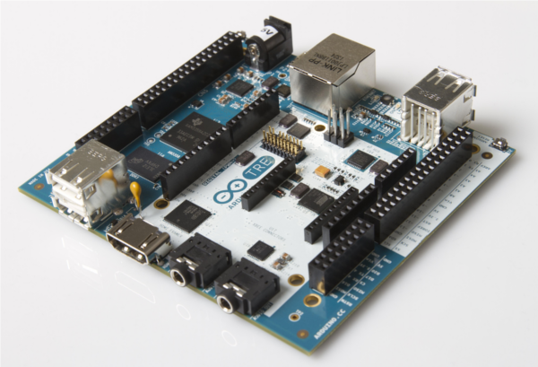

***Note: This page refers to a product that is retired.***

## Arduino TRE (discontinued)

  
Arduino TRE, the first Arduino board manufactured in the U.S.

Thanks to the 1-GHz Sitara AM335x processor, Arduino developers get up to 100 times more performance with the Sitara-processor-based TRE than they do on the Arduino Leonardo or Uno. This performance opens the doors to more advanced Linux-powered applications. The Sitara-processor-based Linux Arduino can run high-performance desktop applications, processing-intensive algorithms or high-speed communications.

The Arduino TRE is a Sitara-processor-based Linux Arduino plus a full AVR-based Arduino, while leveraging the simplicity of the Arduino software experience. The integration of the AVR Arduino enables the Arduino TRE to use the existing shield ecosystem so that innovators can expand the Arduino TRE to develop a wide range of high-performance applications such as 3D printers, gateways for building automation and lighting automation, telemetry hubs that collect data from nearby sensors wirelessly, and other connected applications that require host control plus real-time operations. 

In addition, the Arduino TRE is partially the result of a close collaboration between Arduino and the BeagleBoard.org foundation. These open hardware pioneers share a passion for expanding open source development and making technology accessible for artists, designers and hobbyists. Arduino TRE design builds upon the experience of both Arduino and BeagleBoard.org, combining the benefits of both community based boards. Arduino TRE final board will be available within a few months, pending results of Beta Testing Program.

  
**Technical Specifications (preliminary)** 

|||
|-|-|
|Microcontroller|Atmel ATmega32u4|
|Clock Speed|16 MHz|
|Flash Memory|32 KB (ATmega32u4)|
|SRAM|2.5 KB (ATmega32u4)|
|EEPROM|1 KB (ATmega32u4)|
|Digital I/O Pins (5V logic)|14|
|PWM Channels (5V logic)|7|
|Analog Input Channels|6 (plus 6 multiplexed on 6 digital pins)|
|Processor|Texas Instrument Sitara AM3359AZCZ100 (ARM Cortex-A8)|
|Clock Speed|1 GHz|
|SRAM|DDR3L 512 MB RAM|
|Networking|Ethernet 10/100|
|USB port|1 USB 2.0 device port, 4 USB 2.0 host ports|
|Video|HDMI (1920x1080)|
|Audio|HDMI, stereo analog audio input and output|
|Digital I/O Pins (3.3V logic)|23|
|PWM Channels (3.3V logic)|4|
|MicroSD card||
|Support LCD expansion connector||