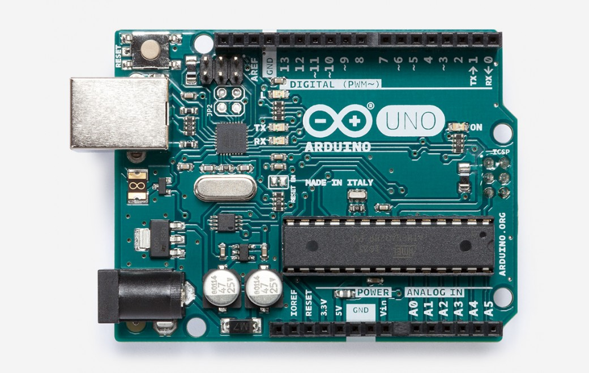
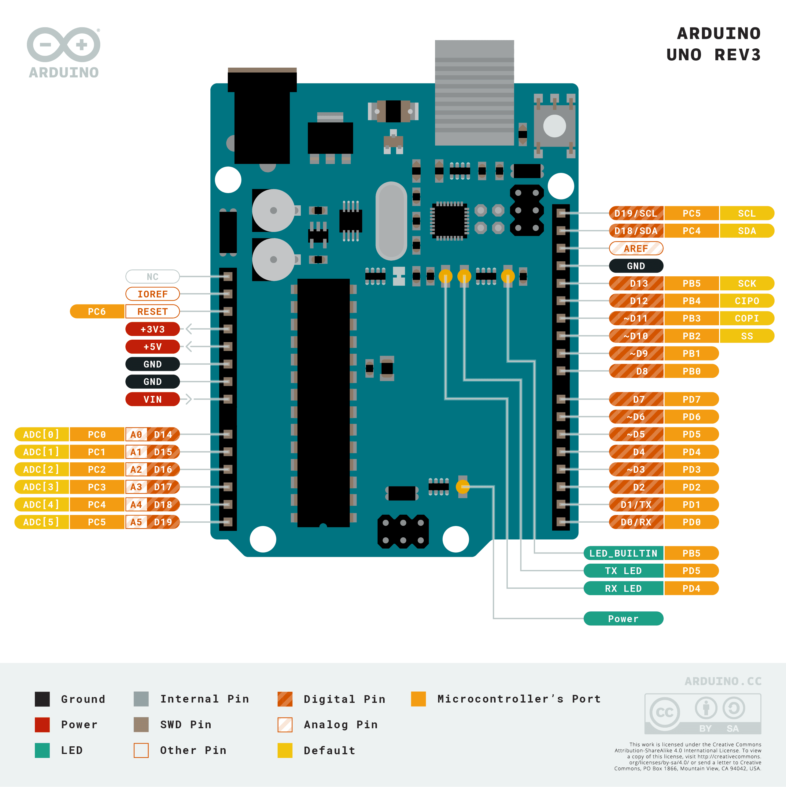

***Note: This page refers to a product that is retired.***

**Arduino UNO** is a microcontroller board based on the ATmega328P ([datasheet](http://ww1.microchip.com/downloads/en/DeviceDoc/Atmel-42735-8-bit-AVR-Microcontroller-ATmega328-328P_Summary.pdf)). It has 14 digital input/output pins (of which 6 can be used as PWM outputs), 6 analog inputs, a 16 MHz ceramic resonator (CSTCE16M0V53-R0), a USB connection, a power jack, an ICSP header and a reset button. It contains everything needed to support the microcontroller; simply connect it to a computer with a USB cable or power it with a AC-to-DC adapter or battery to get started.. You can tinker with your UNO without worring too much about doing something wrong, worst case scenario you can replace the chip for a few dollars and start over again.

"Uno" means one in Italian and was chosen to mark the release of Arduino Software (IDE) 1.0\. The UNO board and version 1.0 of Arduino Software (IDE) were the reference versions of Arduino, now evolved to newer releases. The UNO board is the first in a series of USB Arduino boards, and the reference model for the Arduino platform; for an extensive list of current, past or outdated boards see the Arduino index of boards.

You can find your board's warranty information [here](https://www.arduino.cc/en/Main/warranty).

## Getting Started

You can find in the [Getting Started section](https://www.arduino.cc/en/Guide/HomePage) all the information you need to configure your board, use the Arduino Software (IDE), and start tinker with coding and electronics.

### Need Help?

* On the Software [on the Arduino Forum](https://forum.arduino.cc/index.php?board=63.0)
* On Projects [on the Arduino Forum](https://forum.arduino.cc/index.php?board=3.0)
* On the Product itself through [our Customer Support](https://store.arduino.cc/store-support)

## Documentation

### OSH: Schematics

Arduino UNO is open-source hardware! You can build your own board using the following files:

[EAGLE FILES IN .ZIP](https://content.arduino.cc/assets/UNO-TH_Rev3e-reference.zip) 

[SCHEMATICS IN .PDF](https://content.arduino.cc/assets/UNO-TH_Rev3e_sch.pdf) 

[BOARD SIZE IN .DXF](http://arduino.cc/documents/ArduinoUno.dxf)

### Pinout Diagram

Download the full pinout diagram as PDF [here](https://content.arduino.cc/assets/Pinout-UNOrev3_latest.pdf).

### Programming

The Arduino UNO can be programmed with the ([Arduino Software](https://www.arduino.cc/en/Main/Software) (IDE)). Select "Arduino UNO from the Tools > Board menu (according to the microcontroller on your board). For details, see the [reference](https://www.arduino.cc/en/Reference/HomePage) and [tutorials](https://www.arduino.cc/en/Tutorial/HomePage).

The ATmega328 on the Arduino UNO comes preprogrammed with a [bootloader](https://www.arduino.cc/en/Hacking/Bootloader?from=Tutorial.Bootloader) that allows you to upload new code to it without the use of an external hardware programmer. It communicates using the original STK500 protocol ([reference](http://www.atmel.com/Images/doc2525.pdf), [C header files](http://www.atmel.com/dyn/resources/prod_documents/avr061.zip)).

You can also bypass the bootloader and program the microcontroller through the ICSP (In-Circuit Serial Programming) header using [Arduino ISP](https://www.arduino.cc/en/Main/ArduinoISP) or similar; see [these instructions](https://www.arduino.cc/en/Hacking/Programmer) for details.

The ATmega16U2 (or 8U2 in the rev1 and rev2 boards) firmware source code is available in the Arduino repository. The ATmega16U2/8U2 is loaded with a DFU bootloader, which can be activated by:

* On Rev1 boards: connecting the solder jumper on the back of the board (near the map of Italy) and then rese ing the 8U2.
* On Rev2 or later boards: there is a resistor that pulling the 8U2/16U2 HWB line to ground, making it easier to put into DFU mode.

You can then use [Atmel's FLIP software](http://www.atmel.com/products/microcontrollers/default.aspx) (Windows) or the [DFU programmer](http://dfu-programmer.github.io/) (Mac OS X and Linux) to load a new firmware. Or you can use the ISP header with an external programmer (overwriting the DFU bootloader). See [this user-contributed tutorial](https://forum.arduino.cc/t/tutorial-how-to-change-firmware-on-8u2/113) for more information.

### Warnings

The Arduino UNO has a resettable polyfuse that protects your computer's USB ports from shorts and overcurrent. Although most computers provide their own internal protection, the fuse provides an extra layer of protection. If more than 500 mA is applied to the USB port, the fuse will automatically break the connection until the short or overload is removed.

### Differences with other boards

The UNO differs from all preceding boards in that it does not use the FTDI USB-to-serial driver chip. Instead, it features the Atmega16U2 (Atmega8U2 up to version R2) programmed as a USB-to-serial converter.

### Power

The Arduino UNO board can be powered via the USB connection or with an external power supply. The power source is selected automatically.

External (non-USB) power can come either from an AC-to-DC adapter (wall-wart) or battery. The adapter can be connected by plugging a 2.1mm center-positive plug into the board's power jack. Leads from a battery can be inserted in the GND and Vin pin headers of the POWER connector.

The board can operate on an external supply from 6 to 20 volts. If supplied with less than 7V, however, the 5V pin may supply less than five volts and the board may become unstable. If using more than 12V, the voltage regulator may overheat and damage the board. The recommended range is 7 to 12 volts.

The power pins are as follows:

* Vin. The input voltage to the Arduino board when it's using an external power source (as opposed to 5 volts from the USB connection or other regulated power source). You can supply voltage through this pin, or, if supplying voltage via the power jack, access it through this pin.
* 5V.This pin outputs a regulated 5V from the regulator on the board. The board can be supplied with power either from the DC power jack (7 - 12V), the USB connector (5V), or the VIN pin of the board (7-12V). Supplying voltage via the 5V or 3.3V pins bypasses the regulator, and can damage your board. We don't advise it.
* 3V3. A 3.3 volt supply generated by the on-board regulator. Maximum current draw is 50 mA.
* GND. Ground pins.
* IOREF. This pin on the Arduino board provides the voltage reference with which the microcontroller operates. A properly configured shield can read the IOREF pin voltage and select the appropriate power source or enable voltage translators on the outputs to work with the 5V or 3.3V.

### Memory

The ATmega328 has 32 KB (with 0.5 KB occupied by the bootloader). It also has 2 KB of SRAM and 1 KB of EEPROM (which can be read and written with the [EEPROM library](https://www.arduino.cc/en/Reference/EEPROM)).

### Input and Output

See the mapping between Arduino pins and ATmega328P ports. The mapping for the Atmega8, 168, and 328 is identical.

[PIN MAPPING ATmega328P](https://www.arduino.cc/en/Hacking/PinMapping168)

Each of the 14 digital pins on the UNO can be used as an input or output, using [pinMode()](https://www.arduino.cc/reference/en/language/functions/digital-io/pinmode/),[digitalWrite()](https://www.arduino.cc/en/Reference/DigitalWrite), and [digitalRead()](https://www.arduino.cc/reference/en/language/functions/digital-io/digitalread/) functions. They operate at 5 volts. Each pin can provide or receive 20 mA as recommended operating condition and has an internal pull-up resistor (disconnected by default) of 20-50k ohm. A maximum of 40mA is the value that must not be exceeded on any I/O pin to avoid permanent damage to the microcontroller.

In addition, some pins have specialized functions:

* Serial: 0 (RX) and 1 (TX). Used to receive (RX) and transmit (TX) TTL serial data. These pins are connected to the corresponding pins of the ATmega8U2 USB-to-TTL Serial chip.
* External Interrupts: 2 and 3\. These pins can be configured to trigger an interrupt on a low value, a rising or falling edge, or a change in value. See the attachInterrupt() function for details.
* PWM: 3, 5, 6, 9, 10, and 11\. Provide 8-bit PWM output with the analogWrite() function.
* SPI: 10 (SS), 11 (MOSI), 12 (MISO), 13 (SCK). These pins support SPI communication using the SPI library.
* LED: 13\. There is a built-in LED driven by digital pin 13\. When the pin is HIGH value, the LED is on, when the pin is LOW, it's off.
* TWI: A4 or SDA pin and A5 or SCL pin. Support TWI communication using the Wire library.

The UNO has 6 analog inputs, labeled A0 through A5, each of which provide 10 bits of resolution (i.e. 1024 different values). By default they measure from ground to 5 volts, though is it possible to change the upper end of their range using the AREF pin and the analogReference() function. There are a couple of other pins on the board:

* AREF. Reference voltage for the analog inputs. Used with analogReference().
* Reset. Bring this line LOW to reset the microcontroller. Typically used to add a reset button to shields which block the one on the board.

### Communication

The Arduino UNO has a number of facilities for communicating with a computer, another Arduino board, or other microcontrollers. The ATmega328 provides UART TTL (5V) serial communication, which is available on digital pins 0 (RX) and 1 (TX). An ATmega16U2 on the board channels this serial communication over USB and appears as a virtual com port to software on the computer. The 16U2 firmware uses the standard USB COM drivers, and no external driver is needed. However, [on Windows, a .inf file is required](https://www.arduino.cc/en/Guide/Windows#toc4). The Arduino Software (IDE) includes a serial monitor which allows simple textual data to be sent to and from the board. The RX and TX LEDs on the board will flash when data is being transmitted via the USB-to-serial chip and USB connection to the computer (but not for serial communication on pins 0 and 1).

A [SoftwareSerial library](https://www.arduino.cc/en/Reference/SoftwareSerial) allows serial communication on any of the UNO's digital pins.

The ATmega328 also supports I2C (TWI) and SPI communication. The Arduino Software (IDE) includes a Wire library to simplify use of the I2C bus; see the [documentation](https://www.arduino.cc/en/Reference/Wire) for details. For SPI communication, use the [SPI library](https://www.arduino.cc/en/Reference/SPI).

### Automatic (Software) Reset

Rather than requiring a physical press of the reset button before an upload, the Arduino UNO board is designed in a way that allows it to be reset by software running on a connected computer. One of the hardware flow control lines (DTR) of the ATmega8U2/16U2 is connected to the reset line of the ATmega328 via a 100 nanofarad capacitor. When this line is asserted (taken low), the reset line drops long enough to reset the chip. The Arduino Software (IDE) uses this capability to allow you to upload code by simply pressing the upload button in the interface toolbar. This means that the bootloader can have a shorter timeout, as the lowering of DTR can be well-coordinated with the start of the upload.

This setup has other implications. When the UNO is connected to either a computer running Mac OS X or Linux, it resets each time a connection is made to it from software (via USB). For the following half-second or so, the bootloader is running on the UNO. While it is programmed to ignore malformed data (i.e. anything besides an upload of new code), it will intercept the first few bytes of data sent to the board after a connection is opened. If a sketch running on the board receives one-time configuration or other data when it first starts, make sure that the software with which it communicates waits a second after opening the connection and before sending this data.

The UNO board contains a trace that can be cut to disable the auto-reset. The pads on either side of the trace can be soldered together to re-enable it. It's labeled "RESET-EN". You may also be able to disable the auto-reset by connecting a 110 ohm resistor from 5V to the reset line; see [this forum thread](https://forum.arduino.cc/t/please-add-a-jumper-to-disable-auto-reset/23046) for details.

### Revisions

Revision 3 of the board has the following new features:

* 1.0 pinout: added SDA and SCL pins that are near to the AREF pin and two other new pins placed near to the RESET pin, the IOREF that allow the shields to adapt to the voltage provided from the board. In future, shields will be compatible with both the board that uses the AVR, which operates with 5V and with the Arduino Due that operates with 3.3V. The second one is a not connected pin, that is reserved for future purposes.
* Stronger RESET circuit.
* Atmega 16U2 replace the 8U2.

## Tech Specs

|                             |                                                       |
| --------------------------- | ----------------------------------------------------- |
| Microcontroller             | ATmega328P                                            |
| Operating Voltage           | 5V                                                    |
| Input Voltage (recommended) | 7-12V                                                 |
| Input Voltage (limit)       | 6-20V                                                 |
| Digital I/O Pins            | 14 (of which 6 provide PWM output)                    |
| PWM Digital I/O Pins        | 6                                                     |
| Analog Input Pins           | 6                                                     |
| DC Current per I/O Pin      | 20 mA                                                 |
| DC Current for 3.3V Pin     | 50 mA                                                 |
| Flash Memory                | 32 KB (ATmega328P) of which 0.5 KB used by bootloader |
| SRAM                        | 2 KB (ATmega328P)                                     |
| EEPROM                      | 1 KB (ATmega328P)                                     |
| Clock Speed                 | 16 MHz                                                |
| LED_BUILTIN                 | 13                                                    |
| Length                      | 68.6 mm                                               |
| Width                       | 53.4 mm                                               |
| Weight                      | 25 g                                                  |