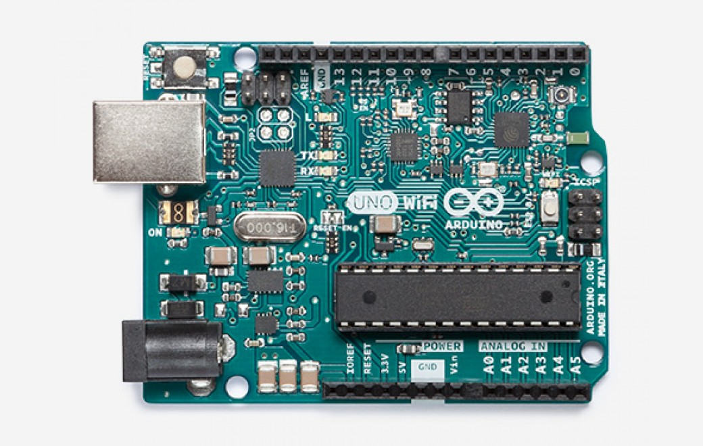
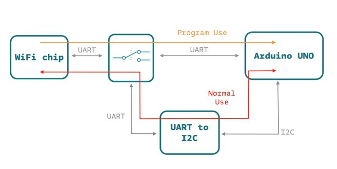
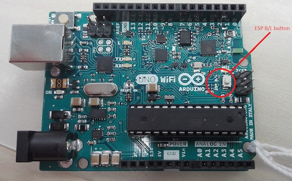
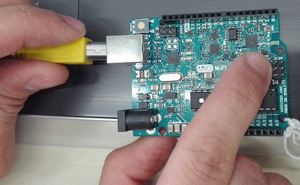
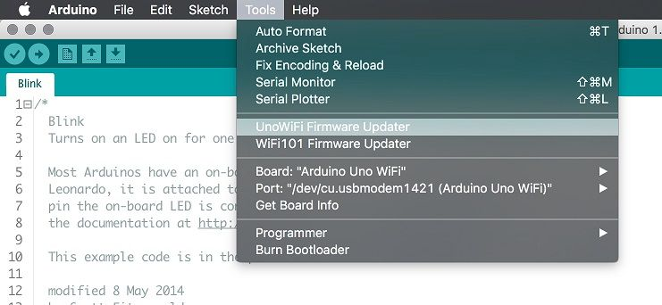
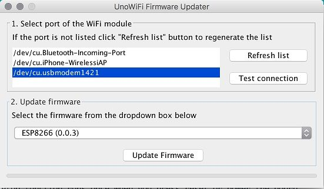
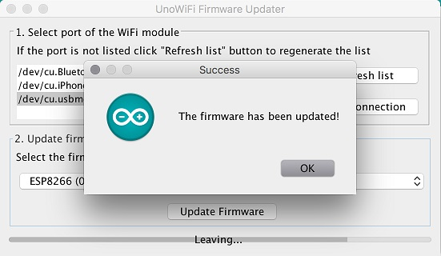

***Note: This page refers to a product that is retired. Check out the [Arduino UNO WiFi Rev2](https://docs.arduino.cc/hardware/uno-wifi-rev2)***



The Arduino UNO WiFi is the same as a Arduino UNO Rev3 but with an integrated Wi-Fi module! The board is based on the ATmega328P with an ESP8266 Wi-Fi Module integrated (datasheet). It has 14 digital input/output pins (of which 6 can be used as PWM outputs), 6 analog inputs, a 16 MHz ceramic resonator, a USB connection, a power jack, an ICSP header, and a reset button. It contains everything needed to support the microcontroller; simply connect it to a computer with a USB cable or power it with an AC-to-DC adapter or battery to get started.  
  
The ESP8266 Wi-Fi Module is a self contained SoC with integrated TCP/IP protocol stack that can give access to your Wi-Fi network. (Or the device can act as an access point.) One useful feature of UNO WiFi is support for OTA (over-the-air) programming, either for transfer of Arduino sketches or Wi-Fi firmware.

## Documentation

### Power

The Arduino UNO WiFi can be powered via the USB connection or with an external power supply. The power source is selected automatically.External (non-USB) power can come either from an AC-to-DC adapter (wall-wart) or battery. The adapter can be connected by plugging a 2.1mm center-positive plug into the board's power jack. Leads from a battery can be inserted in the Gnd and Vin pin headers of the POWER connector.  
  
The board can operate on an external supply of 6 to 20 volts. If supplied with less than 7V, however, the 5V pin may supply less than five volts and the board may be unstable. If using more than 12V, the voltage regulator may overheat and damage the board. The recommended range is 7 to 12 volts.  
  
The power pins are as follows:  
  
* VIN. The input voltage to the Arduino board when it's using an external power source (as opposed to 5 volts from the USB connection or other regulated power source). You can supply voltage through this pin, or, if supplying voltage via the power jack, access it through this pin.
* 5V. This pin outputs a regulated 5V from the regulator on the board. The board can be supplied with power either from the DC power jack (7 - 12V), the USB connector (5V), or the VIN pin of the board (7-12V). Supplying voltage via the 5V or 3.3V pins bypasses the regulator, and can damage your board. We don't advise it.
* 3V3\. A 3.3 volt supply generated by the on-board regulator. Maximum current draw is 1 A (according to the power input source).
* GND. Ground pins.
* IOREF. This pin on the Arduino board provides the voltage reference with which the microcontroller operates. A properly configured shield can read the IOREF pin voltage and select the appropriate power source or enable voltage translators on the outputs for working with the 5V or 3.3V supplies.

### Memory

The ATmega328 has 32 KB Flash (with 0.5 KB used for the bootloader). It also has 2 KB of SRAM and 1 KB of EEPROM (which can be read and written with the EEPROM library).

### Input and Output

Each of the 14 digital pins on the UNO can be used as an input or output, using pinMode(), digitalWrite() and digitalRead() functions. They operate at 5 volts. Each pin can provide or receive a maximum of 40 mA and has an internal pull-up resistor (disconnected by default) of 20-50 kOhms. In addition, some pins have specialised functions:  
  
* Serial: 0 (RX) and 1 (TX). Used to receive (RX) and transmit (TX) TTL serial data. These pins are connected to the corresponding pins of the ATmega8U2 USB-to-TTL Serial chip.
* External Interrupts: 2 and 3\. These pins can be configured to trigger an interrupt on a low value, a rising or falling edge, or a change in value. See the attachInterrupt() function for details.
* PWM: 3, 5, 6, 9, 10 and 11\. Provide 8-bit PWM output with the analogWrite() function.
* SPI: 10 (SS), 11 (MOSI), 12 (MISO), 13 (SCK). These pins support SPI communication using the SPI library.
* LED: 13\. There is a built-in LED connected to digital pin 13\. When the pin is HIGH value, the LED is on, when the pin is LOW, it's off. The UNO has 6 analog inputs, labeled A0 through A5, each of which provide 10 bits of resolution (i.e. 1024 different values). By default they measure from ground to 5 volts, though is it possible to change the upper end of their range using the AREF pin and the analogReference() function. Additionally, some pins have specialized functionality:
* TWI: A4 or SDA pin and A5 or SCL pin. Support TWI communication using the Wire library. NOTE: the A4 or SDA pin and A5 or SCL pin are in use by the IO Expander SC16IS750IBS. There are a couple of other pins on the board:
* AREF. Reference voltage for the analog inputs. Used with analogReference().
* RESET. Bring this line LOW to reset the microcontroller. Typically used to add a reset button to shields which block the one on the board.

### Communication

The Arduino UNO WiFi has a number of facilities for communicating with a computer, another Arduino, or other microcontrollers. The ATmega328 provides UART TTL (5V) serial communication, which is available on digital pins 0 (RX) and 1 (TX). An ATmega16U2 on the board channels this serial communication over USB and appears as a virtual com port to software on the computer. The 16U2 firmware uses the standard USB COM drivers, and no external driver is needed. However, on Windows, a .inf file is required. The Arduino software includes a serial monitor which allows simple textual data to be sent to and from the Arduino board. The RX and TX LEDs on the board will flash when data is being transmitted via the USB-to-serial chip and USB connection to the computer (but not for serial communication on pins 0 and 1).  
  
A SoftwareSerial library allows for serial communication on any of the UNO's digital pins.  
  
The ATmega328 also supports I2C (TWI) and SPI communication. The Arduino software includes a Wire library to simplify use of the I2C bus; For SPI communication, use the SPI library.  
  
On the Arduino UNO WiFi there’s a SC16IS750IBS IO Expander Single UART with I2C-bus/SPI interface that allows the communication between AtMega 16u2, AtMega 328p and the ESP8266EX.  
  
  
  
  
The Arduino UNO WiFi allow you to communicate via Wi-Fi with your sensors or actuators mounted on your board to create easily and quickly your IoT System. You can use your Arduino UNO WiFi as a client of your Wi-Fi network, as a server to connect other client devices or you can create an ad’hoc Wi-Fi connection.  
  
  
The perfect way to communicate to internet via your Arduino UNO WiFi is the Ciao Library and using, for example, the REST connector.  
  
On the Arduino UNO WiFi is pre-uploaded the RestServer sketch that allows you to command immediately your board via browser:  
  
Connect to the Arduino UNO WiFi SSID and go to the link http://192.168.240.1/arduino/digital/13/1 to turn ON the LED L  
  
  
Here other possible commands:  
  
- "/arduino/digital/13" -> digitalRead(13)  
- "/arduino/digital/13/1" -> digitalWrite(13, HIGH)  
- "/arduino/analog/2/123" -> analogWrite(2, 123)  
- "/arduino/analog/2" -> analogRead(2)  
- "/arduino/mode/13/input" -> pinMode(13, INPUT)  
- "/arduino/mode/13/output" -> pinMode(13, OUTPUT)

### Programming

The Arduino UNO WiFi can be programmed as a classic Arduino UNO with the Arduino software ([download](http://www.arduino.cc/download)). Select "Arduino UNO WiFi from the Tools > Board menu (according to the microcontroller on your board.  
  
The new features of the Arduino UNO WiFi allow you to upload your sketch via Wi-Fi (in the same way of Arduino Yun), without any wired connection to your PC and your board.  
  
The ATmega328 on the Arduino UNO WiFi comes pre-burned with a bootloader that allows you to upload new code to it without the use of an external hardware programmer. It communicates using the original STK500 protocol.  
  
You can also bypass the bootloader and program the microcontroller through the ICSP (In-Circuit Serial Programming) header using Arduino ISP or similar.

### Automatic (Software) Reset

Rather than requiring a physical press of the reset button before an upload, the Arduino UNO WiFi is designed in a way that allows it to be reset by software running on a connected computer. One of the hardware flow control lines (DTR) of the ATmega8U2/16U2 is connected to the reset line of the ATmega328 via a 100 nanofarad capacitor. When this line is asserted (taken low), the reset line drops long enough to reset the chip. The Arduino software uses this capability to allow you to upload code by simply pressing the upload button in the Arduino environment. This means that the bootloader can have a shorter timeout, as the lowering of DTR can be well-coordinated with the start of the upload.

This setup has other implications. When the UNO WiFi is connected to either a computer running Mac OS X or Linux, it resets each time a connection is made to it from software (via USB). For the following half-second or so, the bootloader is running on the UNO. While it is programmed to ignore malformed data (i.e. anything besides an upload of new code), it will intercept the first few bytes of data sent to the board after a connection is opened. If a sketch running on the board receives one-time configuration or other data when it first starts, make sure that the software with which it communicates waits a second after opening the connection and before sending this data.  
  
The UNO WiFi contains a trace that can be cut to disable the auto-reset. The pads on either side of the trace can be soldered together to re-enable it. It's labeled "RESET-EN". You may also be able to disable the auto-reset by connecting a 110 ohm resistor from 5V to the reset line.

### USB Overcurrent Protection

The Arduino UNO WiFi has a resettable polyfuse that protects your computer's USB ports from shorts and overcurrent. Although most computers provide their own internal protection, the fuse provides an extra layer of protection. If more than 500 mA is applied to the USB port, the fuse will automatically break the connection until the short or overload is removed.

### Physical Characteristics

The maximum length and width of the UNO WiFi PCB are 2.7 and 2.1 inches respectively, with the USB connector and power jack extending beyond the former dimension. Four screw holes allow the board to be attached to a surface or case. Note that the distance between digital pins 7 and 8 is 160 mil (0.16"), not an even multiple of the 100 mil spacing of the other pins.

## Tech Specs

### General

|                   |              |
| ----------------- | ------------ |
| Digital I/O Pins  | 20           |
| PWM Output        | 6            |
| Power Consumption | 93 mA        |
| PCB Size          | 53 x 68.5 mm |
| Weight            | 0.025 Kg     |
| Product Code      | A000133      |

### Arduino Microcontroller
|                         |                 |
| ----------------------- | --------------- |
| Microcontroller         | ATmega328       |
| Architecture            | Atmel AVR 8-bit |
| Operating Voltage       | 5 V             |
| Flash memory            | 32 KB           |
| SRAM                    | 2 KB            |
| Clock Speed             | 16 MHz          |
| Analog I/O Pins         | 6               |
| EEPROM                  | 1 KB            |
| DC Current per I/O Pins | 40 mA           |

### Wi-Fi Microprocessor

|                   |                              |
| ----------------- | ---------------------------- |
| Processor         | ESP8266                      |
| Architecture      | Tensilica Xtensa LX106       |
| Operating Voltage | 3.3 V                        |
| Flash Memory      | 4 MB                         |
| RAM               | 8 MB instruction, 12 MB data |
| Clock Speed       | 80 MHz                       |
| WiFi              | 802.11 b/g/n 2.4 GHz         |
| Wake up time      | < 2 ms                       |


## Arduino UNO WiFi firmware updater

This tutorial will guide you in the process of updating the firmware of your Arduino UNO WiFi board. 

### Circuit

Connect the board at the USB port of your computer ready with [Arduino Software (IDE) 1.8.0 or later](http://www.arduino.cc/downloads).

### UNO WiFi Firmware updater procedure

To simplify the process, we have prepared a tool - UNO WiFi FirmwareUpdater - available in [Arduino IDE 1.8.0 or later](http://www.arduino.cc/downloads).

Follow these steps to enable this tools into Arduino software:

* Download the tool [here](https://github.com/arduino-libraries/UnoWiFi-FirmwareUpdater-Plugin/releases).
* Create a folder called **tools** into the sketchbook directory (normally in Documents>Arduino).
* Extract it.

Now:

* Launch the Arduino IDE ([**1.8.0** or later](https://www.arduino.cc/en/Main/Software)).
* Connect the board to PC.
* Select the **Arduino UNO WiFi** as board in the Tools>Board menu.
* Select the corresponding serial port in the Tools>Port menu.
* Upload the **ESP Recovery sketch.** It is into the **UNOWiFiDev.Edition** Library. Download it from **[Library Manager](https://www.arduino.cc/en/Guide/Libraries#toc3).**

```arduino
/\*ESP Recovery sketch\*/  
#include <Wire.h>  
#include <UnoWiFiDevEd.h>  
 
#define BAUD 9600  
WifiData ESPSerial;  
 
void setup()  
{  
Serial.begin(BAUD);  
pinMode(13, OUTPUT);  
digitalWrite(13, LOW);  
 
ESPSerial.begin(BAUD);  
}  
 
void loop()  
{  
while (Serial.available()) {  
char inChar = (char)Serial.read();  
ESPSerial.write(inChar);  
}  
 
while (ESPSerial.available()) {  
char inChar = (char)ESPSerial.read();  
Serial.write(inChar);  
}  
 
}
```

* Put the board in **DFU** mode, keeping pressed the **ESP B/L** button and connect the board to PC





* Select the **UnoWiFi Firmware Updater** from the **Tools** menu.



* Click on **Refresh list** if the port is not listed.
* Select the corresponding port.



* Click on **Test connection.**
* Select from windows menu the ESP firmware requested.
* Click on **Update Firmware.**
* Wait the end of process.

**Warning:** The process could last several minutes.

