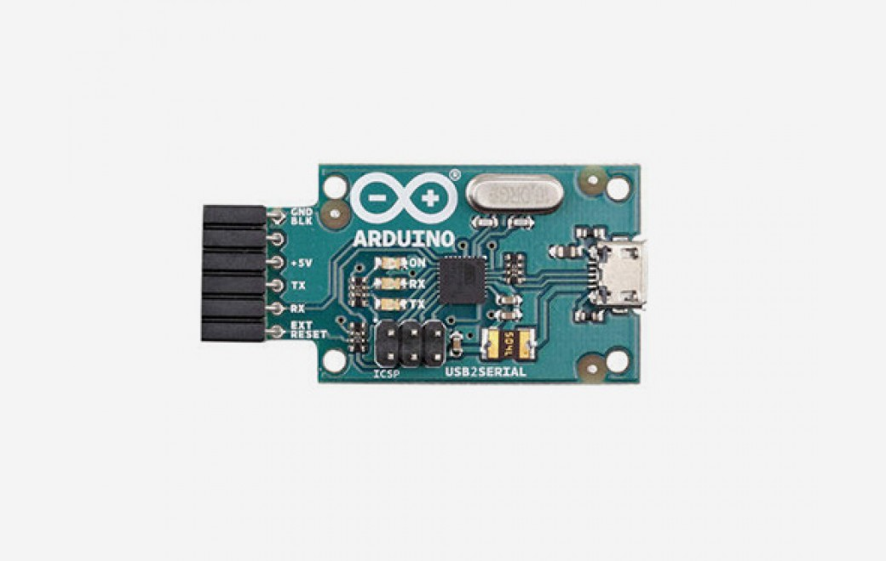

***Note: This page refers to a product that is retired.***

This board converts a USB connection into a 5 volt Serial TX and RX that you can connect straight to the Arduino Mini, Arduino Ethernet or other microcontrollers, allowing them to talk to the computer. It features an Atmega16U2 programmed as a USB-to-serial converter, the same chip found on the [Arduino Uno](https://www.arduino.cc/en/Main/ArduinoBoardUno). The *16U2 firmware* uses the standard USB COM drivers, and no external driver is needed. However, on Windows, a .inf file is required.

The USB Serial Adapter has an onboard mini-USB connector and 5 pins including RX (for receiving data from the computer) and TX (for transmitting data). 5V, Ground and a Reset pin are also exposed.

Status lights include power, RX and TX activity.

The adapter can easily connect to the Arduino Ethernet, Mini, Mini Pro, LilyPad, LilyPad Simple, and Fio.

An onboard polyfuse limits the current to 500mA and protects the host computer from short circuits.

The ATmega16U2 firmware source code is available . The ATmega16U2 is loaded with a DFU bootloader, which can be activated by connecting the solder jumper on the back of the board and then resetting the 16U2\. You can then use [Atmel's FLIP software](http://www.atmel.com/dyn/products/tools_card.asp?tool_id=3886) (Windows) or the [DFU programmer](http://dfu-programmer.sourceforge.net/) (Mac OS X and Linux) to load a new firmware. Or you can use the ISP header with an external programmer (overwriting the DFU bootloader).

You can find [here](https://www.arduino.cc/en/Main/warranty) your board warranty information.

## Getting Started

You can find in the [Getting Started section](https://www.arduino.cc/en/Guide/HomePage) all the information you need to configure your board, use the Arduino So ftware (IDE), and start tinker with coding and electronics.

### Need Help?

* On the Software [on the Arduino Forum](https://forum.arduino.cc/index.php?board=63.0)
* On Projects [on the Arduino Forum](https://forum.arduino.cc/index.php?board=3.0)
* On the Product itself through [our Customer Support](https://support.arduino.cc/hc)

## Documentation

### OSH: Schematics

Arduino USB 2 Serial Micro is open-source hardware! You can build your own board using the following files:

[EAGLE FILES IN .ZIP](https://www.arduino.cc/en/uploads/Main/Arduino-USB2SERIAL-V5.zip) 

[SCHEMATICS IN .PDF](https://www.arduino.cc/en/uploads/Main/Arduino-USB2SERIAL-V5-SCH.pdf) 

[WINDOWS DRIVERS](https://www.arduino.cc/en/uploads/Main/Arduino_USBSerial.zip)

Windows users need a .inf file for this specific product: [Arduino\_USBSerial.zip](https://www.arduino.cc/en/uploads/Main/Arduino_USBSerial.zip)  
For installation follow the same procedure on [how install an UNO board on your computer](http://arduino.cc/en/Guide/Windows#toc4).

### Automatic (Software) Reset

The USB Serial connector is designed in a way that allows it to reset an attached board by software running on a connected computer.The external reset line mirrors the DTR line of the virtual serial device on the computer. It's typically connected to the reset line of the connected board (e.g. an Arduino Ethernet board) through a 100 nF capacitor, allowing the board to reset on upload.

This setup has other implications. When the board is connected to either a computer running Mac OS X or Linux, it resets each time a connection is made to it from software (via USB). While it is programmed to ignore malformed data (i.e. anything besides an upload of new code), it will intercept the first few bytes of data sent to the board after a connection is opened. If a sketch running on the board receives one-time configuration or other data when it first starts, make sure that the software with which it communicates waits a second after opening the connection and before sending this data.

**The pinouts on the connector are compatible with a standard FTDI header ( as well as the Adafruit and Sparkfun USB-Serial adapters).**

### Connecting to the Arduino Mini

See the [guide to the Arduino Mini](https://www.arduino.cc/en/Guide/ArduinoMini) for information on connecting the adapter to the Mini.
