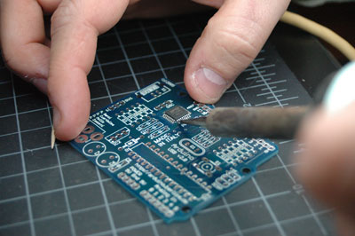
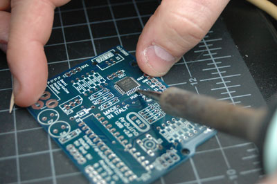
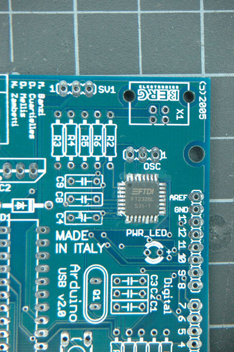
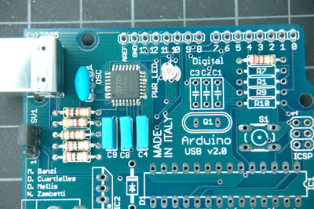
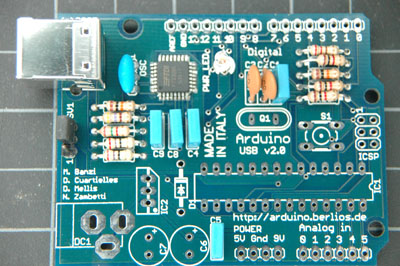
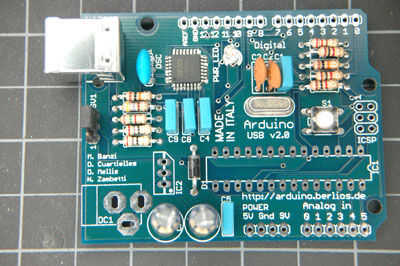
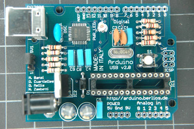
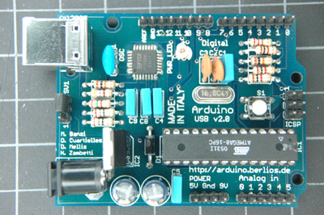
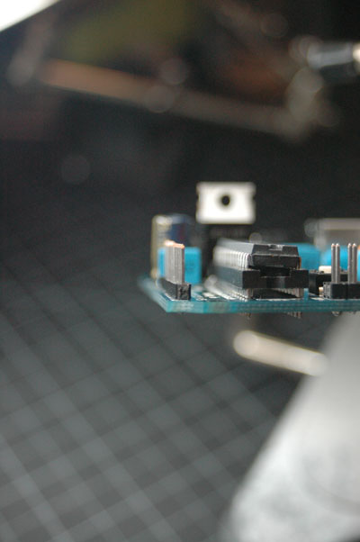

***Note: This page refers to a product that is retired.***

## Assembling the Arduino USB Board v2.0

*by Tom Igoe* 

First, solder the FTDI FT232Bm (or BL) chip to the board. This is the hardest component to solder, since it's a surface-mount chip. The dot on corner of the chip has to line up with the dot on the board where the chip goes. 

You can solder this part to the board without any solder. Just clean the solder pads on the board and the ends of the pins with solder flux. Then position the chip very precisely. Hold it down with a toothpick or other implement that will hold it steady. Tin your iron then wipe off any excess colder, leaving just a thin, shiny coat on the iron. Touch the tip of the iron to a corner pin of the chip. After a second or two, you should see the pin get shinier, as the solder wicks onto it from the pad, and from your iron. You should only need a second or two per pin. Don't hold your iron on each pin too long, or you'll burn the chip and the board.

Tack the chip down by soldering pins on two opposite corners first. Then you won't need to hold it with a toothpick anymore, and can hold the board steady with your other hand. Once you've got the corners done, go around the board and solder each pin down the same way as you did the corners.

Once you've got the USB chip soldered on, breathe a sigh of relief. The rest is easy compared to this. Here's what your board looks like now:

In order to test the USB chip, solder the components that support it to the board next. They are as follows:

* R2, 10Kohms (brown-black-orange-gold)
* R3, 27 ohms (red-purple-black-gold)
* R4, 27 ohms (red-purple-black-gold)
* R5, 1.5Kohms (1K5) (brown-green-red-gold)
* R6, 470 ohms (yellow-purple-brown-gold)
* C4, 100nF (0.1uF) (104)
* C8, 100nF (0.1uF) (104)
* C9, 100nF (0.1uF) (104)
* X1, USB connector
* R8, 220 ohms (red-red-brown-gold)
* PWR\_LED (make sure long end goes to + hole)
* SV1, 3 pin header (make sure they are perpendicular to the board)
* OSC, 6MHz oscillator, 3-pin

After soldering these parts, your board will look like this:

Now you can test to see if the chip works (partially). Install the [FTDI FT232BM USB drivers](http://www.ftdichip.com/FTDrivers.htm) on your computer, and put the shorting block across the two header pins of SV1 closest to the USB connector. This will allow the board to draw power from the USB connection. Plug your board into a USB port of your computer. The LED should light up. When you open Arduino and check the serial port list, you should have a new serial port. On OSX, it's called "USBserial\-" followed by a hexadecimal number.

Once that's done, you're ready to solder the rest of the components.

Now add the rest of the small capacitors and resistors, as follows:

* R1, 10Kohms (brown-black-orange-gold)
* R7, 1Kohm (brown-black-red-gold)
* R9, 1Kohm (brown-black-red-gold)
* R10, 1Kohm (brown-black-red-gold)
* C1, 100nF (0.1uF)
* C2, 22pF
* C3, 22pF
* C5, 100nF (0.1uF)

Now your board will look like this:

Next, acc the big capacitors, the diode, the reset switch, and the microcontroller crystal, as follows:

* C6, 100uF
* C7, 100uF
* D1, 1N4004
* S1, switch
* Q1, 16MHz crystal

Make sure the diode is facing the correct direction. The silver band on the diode should face the top of the board, as in the photo below:

Next, add the voltage regulator, DC power connector, and 28-pin socket for the microcontroller: 

* IC1, 7805 5V voltage regulator
* DC1, DC power connector
* (no label), 28-pin socket

Make sure the notch in the socket faces the right side of the board, as shown in the silkscreen on the board:

Finally, add the headers. For the ISCP header, you should use male headers, so you can connect to an AVRISP programmer in order to bootload the chip. For the other headers, use male headers if you want to be able to attach to any Arduino shields. Otherwise, you can use female headers or screw terminals, whichever meets your needs.

Make sure to keep your headers aligned perpendicular to the board. It'll make fitting shields easier, and fitting the programming cable easier.

That's it! Now you're ready to [bootload the ATMega8](http://arduino.berlios.de/index.php/Main/Bootloader).
