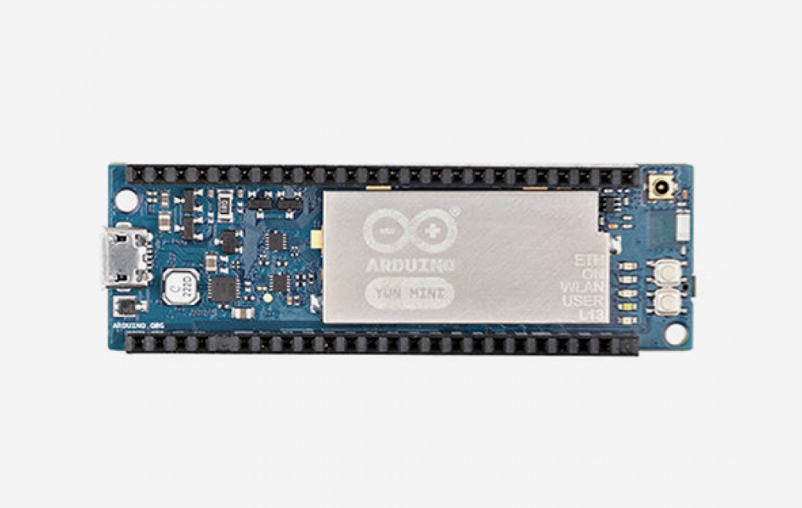

***Note: This page refers to a product that is retired.***

**Arduino Yún Mini** is a breadboard PCB developed with ATmega 32u4 MCU and QCA MIPS 24K SoC CPU operating up to 400 MHz. Qualcomm Atheros CPU supports a Linux distribution based on OpenWRT named Linino. The board has built- in WiFi ( IEEE 802.11b/g/n operations up to 150Mbps 1x1 2.4 GHz ) supports 20 digital input/output pins (of which 7 can be used as PWM outputs and 12 as analog inputs), a 16 MHz crystal oscillator, a micro USB connector, an ICSP header, two reset buttons and one user button. The Arduino Yún Mini is similar to the Leonardo in that the ATmega32u4 has built-in USB communication, eliminating the need for a secondary processor. This allows the Arduino Yún Mini to appear to a connected computer as a mouse and keyboard, in addition to a virtual (CDC) serial / COM port.

## Getting Started

You can find in the [Getting Started section](https://www.arduino.cc/en/Guide/HomePage) all the information you need to configure your board, use the [Arduino Software (IDE)](https://www.arduino.cc/en/Main/Software), and start tinker with coding and electronics..

### Need Help?

* On the Software [on the Arduino Forum](https://forum.arduino.cc/index.php?board=63.0)
* On Projects [on the Arduino Forum](https://forum.arduino.cc/index.php?board=3.0)
* On the Product itself through [our Customer Support](https://support.arduino.cc/hc)

## Documentation

### OSH: Schematics

The Arduino Yún Mini is open-source hardware! You can build your own board using the following files:

[SCHEMATICS IN .PDF](https://content.arduino.cc/assets/Arduino-yun-mini-schematics.pdf) 

[SCHEMATICS DogUSB](https://content.arduino.cc/assets/DOGUSB-Arduino-yun-mini-schematics.pdf) 

[SCHEMATICS DogRJ45](https://content.arduino.cc/assets/DOGRJ45-Arduino-yun-mini-schematics.pdf)

### Power

It is recommended to power the board via the micro-USB connection with 5VDC. If you are powering the board though the Vin pin, you must supply a regulated 5VDC. There is no on-board voltage regulator for higher voltages, which will damage the board. The power pins are as follows:

* VIN. The input voltage to the Arduino board. Unlike other Arduino boards, if you are going to provide power to the board through this pin, you must provide a regulated 5V.
* 5V. The power supply used to power the microcontrollers and other components on the board. This can come either from VIN or be supplied by USB.
* 3V3\. A 3.3 volt supply generated by the on-board regulator. Maximum current draw is 50 mA.
* GND. Ground pins.
* IOREF. The voltage at which the i/o pins of the board are operating (i.e. VCC for the board). This is 5V on the Yún.
* VCC\_GT. A 2.1 volt supply generated by the on-board regulator (designed to dogRJ45)

### Memory

The ATmega32u4 has 32 KB (with 4 KB used for the boot loader). It also has 2.5 KB of SRAM and 1 KB of EEPROM (which can be read and written with the EEPROM library). The memory on the AR9331 is not embedded inside the processor. The RAM and the storage memory are externally connected. The Yún Mini has 64 MB of DDR2 RAM and 16 MB of flash memory. The flash memory is preloaded in factory with a Linux distribution based on OpenWrt called Linino OS. You can change the content of the factory image, such as when you install a program or when you change a configuration file. You can return to the factory configuration by pressing the "WLAN RST" button for 30 seconds.

The Linino OS installation occupies around 6 MB of the 16 MB available of the internal flash memory. You can use dogUSB with a micro SD card or dog eMMC a 4GB Flash if you need more disk space for installing applications.

### Input and Output

Atheros AR9331 pins: Each of these pins can be used by LininoOS side as peripherals of Linux Kernel. In addition, some pins have specialized functions:

* USB: USB , USB- Used to connect USB MIPS with external USB devices. We suggest to use the Add on: dogUSB or dog eMMC.
* GPIO: AR\_GP7, AR\_GP6 These are general purpose input output commanded through the the LininoOS distribution. They operate at 5 volts.
* Ethernet port: RD , RD-, TD , TD- Used to connect the MIPS Ethernet PHY with the dogRJ45 in order to give the user an Ethernet interface.

AVR 32u4 pins: Each of the 20 digital i/o pins on the Yún Mini can be used as an input or output, using the pinMode(), digitalWrite(), and digitalRead() functions. They operate at 5 volts. Each pin can provide or receive a maximum of 40 mA and has an internal pull-up resistor (disconnected by default) of 20-50 kOhms. In addition, some pins have specialized functions:

* Serial: 0->RX and 1Used to receive (RX) and transmit (TX) TTL serial data using the ATmega32U4 hardware serial capability. Note that on the Yún Mini, the Serial class refers to USB (CDC) communication; for TTL serial on pins 0 and 1, use the Serial1 class. The hardware serials of the ATmega32U4 and the AR9331 on the Yún Mini are connected together and are used to communicate between the two processors. As it is common in Linux systems, the console to access the system is exposed on the serial port of the AR9331\. This means that you can access to the programs and tools offered by Linux from your sketch.
* TWI: 2 (SDA) and 3 (SCL). Support TWI communication using the Wire library. External Interrupts: 3 (interrupt 0), 2 (interrupt 1), 0 (interrupt 2), 1 (interrupt 3) and 7 (interrupt 4). These pins can be configured to trigger an interrupt on a low value, a rising or falling edge, or a change in value. See the attachInterrupt() function for details. It is not recommended to use pins 0 and 1 as interrupts because they also are the hardware serial port used to talk with the Linux processor. Pin 7 is connected to the AR9331 processor and it may be used as handshake signal in future. Is recommended to be careful of possible conflicts if you intend to use it as interrupt.
* PWM: 3, 5, 6, 9, 10 and 11.Provide 8-bit PWM output with the analogWrite() function.
* SPI: MISO, SCK, MOSI, RXLED/SS. These pins support SPI communication using the SPI library. Note that the SPI pins are not connected to any of the digital I/O pins as they are on the Uno. The SPI pins are also connected to the AR9331 gpio pins, where it has been implemented in software the SPI interface. This means that the ATMega32u4 and the AR9331 can also communicate using the SPI protocol.
* LED: L13 (pin 13). There is a built-in LED connected to digital pin 13\. When the pin is HIGH value, the LED is on, when the pin is LOW, it's off. There are several other status LEDs on the Yún Mini, indicating power, WLAN connection, ETH connection, and USER functions.
* Analog Inputs: A0 - A5, A6 - A11 (on digital pins 4, 6, 8, 9, 10, and 12). The Yún Mini has 12 analog inputs, labeled A0 through A11, all of which can also be used as digital i/o. Pins A0-A5 appear in the same locations as on the Uno; inputs A6-A11 are on digital i/o pins 4, 6, 8, 9, 10, and 12 respectively. Each analog input provide 10 bits of resolution (i.e. 1024 different values). By default the analog inputs measure from ground to 5 volts, though is it possible to change the upper end of their range using the AREF pin and the analogReference() function.
* AREF. Reference voltage for the analog inputs. Used with analogReference().

There are 3 reset buttons with different functions on the board:

  

* Yún Mini RST. Bring this line LOW to reset the AR9331 microprocessor. Resetting the AR9331 will cause the reboot of the linux system. All the data stored in RAM will be lost and all the programs that are running will be terminated.
* 32U4 RST. Bring this line LOW to reset the ATmega32U4 microcontroller. Typically used to add a reset button to shields which block the one on the board.
* WLAN RST. This button has a double feature. Primarily serves to restore the WiFi to the factory configuration. The factory configuration consist to put the WiFi of the Yún Mini in access point mode (AP) and assign to it the default IP address that is 192.168.240.1, in this condition you can connect with your computer to the a WiFi network that appear with the SSID name "Linino-XXXXXXXXXXXX", where the twelve 'X' are the MAC address of your Yún Mini. Once connected you can reach the web panel of the Yún Mini with a browser at the 192.168.240.1 or "http://linino.local" address. Note that restoring the WiFi configuration will cause the reboot of the linux environment. To restore your WiFi configuration you have to press and hold the WLAN RST button for 5 seconds. When you press the button the WLAN blue LED will start to blink and will keep still blinking when you release the button after 5 seconds indicating that the WiFi restore procedure has been recorded. The second function of the WLAN RST button is to restore the linux image to the default factory image. To restore the linux environment you must press the button for 30 seconds. Note that restoring the factory image make you lose all the files saved and software installed on the on-board flash memory connected to the AR9331.

### Communication

The Yún Mini has a number of facilities for communicating with a computer, another Arduino, or other microcontrollers. The ATmega32U4 provides a dedicated UART TTL (5V) serial communication. The 32U4 also allows for serial (CDC) communication over USB and appears as a virtual com port to software on the computer. The chip also acts as a full speed USB 2.0 device, using standard USB COM drivers. The Arduino software includes a serial monitor which allows simple textual data to be sent to and from the Arduino board. The RX and TX LEDs on the board will flash when data is being transmitted via the USB connection to the computer. Digital pins 0 and 1 are used for serial communication between the 32U4 and the AR9331\. You can use Ciao library to communication between the processors.

Arduino Ciao is an easy-to-use and powerful technology that enables Arduino sketches to communicate intuitively with the "outside World". It aims to simplify interaction between microcontroller and Linino OS, allowing a variety of connections with most common protocols, third-party services and social networks.

Ciao has been designed and developed to be modular and easily configurable. Its goal is to support several connectors capable of interacting with the system resources (filesystem, console, memory) and to communicate with the most common and useful protocols (XMPP, HTTP, WebSocket, COAP, etc..) and applications (Jabber, WeChat, Twitter, Facebook, etc.).

Ciao Library is a lightweight library that can be used inside sketches for MCU to send and receive data, via serial communication, in a simple and intuitive way. A SoftwareSerial library allows for serial communication on any of the Yún mini's digital pins. Pins 0 and 1 should be avoided as they are used by the Bridge library. The ATmega32U4 also supports I2C (TWI) and SPI communication. The Arduino software includes a Wire library to simplify use of the I2C bus;. For SPI communication, use the SPI library. The Yún Mini appears as a generic keyboard and mouse, and can be programmed to control these input devices using the Keyboard and Mouse classes. The onboard Ethernet and WiFi interfaces are exposed directly to the AR9331 processor. To send and receive data through them, use the Bridge library. The Yún Mini also has USB host capabilities through Linino OS. You can connect peripherals like USB flash devices for additional storage, keyboards, or webcams. You may need to download and install additional software for these devices to work.

### Programming

The Arduino Yún Mini can be programmed with the Arduino software ([download](https://www.arduino.cc/en/Main/Software)) or the Linino IO ([www.linino.org](https://www.linino.org/)). Using Arduino IDE Select "Arduino Yún mini from the Tools > Board menu (according to the microcontroller on your board). The ATmega32U4 on the Arduino Yún Mini comes preburned with a bootloader that allows you to upload new code to it without the use of an external hardware programmer. It communicates using the STK500 protocol. You can also bypass the bootloader and program the microcontroller through the SPI signals that are available on the pin headers.

### Automatic (Software) Reset

Rather than requiring a physical press of the reset button before an upload, the Yún Mini is designed in a way that allows it to be reset by software running on a connected computer. The reset is triggered when the Yún Mini's virtual (CDC) serial / COM port is opened at 1200 baud and then closed. When this happens, the processor will reset, breaking the USB connection to the computer (meaning that the virtual serial / COM port will disappear). After the processor resets, the bootloader starts, remaining active for about 8 seconds. The bootloader can also be initiated by pressing the reset button on the Yún Mini. Note that when the board first powers up, it will jump straight to the user sketch, if present, rather than initiating the bootloader. Because of the way the Yún Mini handles reset it's best to let the Arduino software try to initiate the reset before uploading, especially if you are in the habit of pressing the reset button before uploading on other boards. If the software can't reset the board you can always start the bootloader by pressing the reset button on the board.

### Physical Characteristics

The maximum length and width of the Yún Mini PCB are 71.12 mm and 22.86 mm respectively. Weight of the board is 16 g.

### Add on

The Arduino Yun Mini can be complemented by three accessories: the dogRJ45, the dogUSB and the dog eMMC. The first is an Ethernet port that can be added to the Arduino YUN Mini if one needs this type of port for their specific project. The second one, dogUSB, is a USB port featuring also a slot for a mini SD to extend the memory of the board. The last one, which is dogUSB eMMC, is really the latest novelty in terms of accessories: it’s a USB port with an integrated 4 Giga of Flash. The user can add either a single accessory or two, according to their needs.

|          |                                       |
| -------- | ------------------------------------- |
| dogRJ45  | IEEE 802.3 fast ethernet switch       |
|          | 10/100 Mbps fast ethernet port        |
| dogUSB   | USB A type connector with USB 2.0 hub |
|          | Micro SD connector with card reader   |
| dog eMMC | 4 GB Flash                            |
|          | USB port type A                       |

## Tech Specs

## Arduino Microprocessor

|                   |                                               |
| ----------------- | --------------------------------------------- |
| Processor         | Atheros AR9331                                |
| Architecture      | MIPS 24K processor operating at up to 400 MHZ |
| Operating Voltage | 3.3 V typ.380 mA (113~570 mA)                 |
| Flash Memory      | 16 MB                                         |
| RAM               | 64 MB DDR2                                    |
| Clock Speed       | 400 MHz                                       |
| WiFi              | 802.11 b/g/n 2.4 GHz                          |
| Ethernet          | 802.3 10/100 Mbit/s                           |
| USB               | 2.0 Host                                      |

## Arduino Microcontroller

|                         |                                       |
| ----------------------- | ------------------------------------- |
| Microcontroller         | ATmega32u4                            |
| Architecture            | AVR                                   |
| Operating Voltage       | 5V                                    |
| Flash memory            | 32 KB                                 |
| SRAM                    | 2.5Kb                                 |
| Clock Speed             | 16 MHz                                |
| Analog I/O Pins         | 12                                    |
| EEPROM                  | 1 KB                                  |
| DC Current per I/O Pins | 40 mA on I/O Pins; 50 mA on 3.3 V Pin |

## General

|                   |              |
| ----------------- | ------------ |
| Input Voltage     | 5 V          |
| Digital I/O Pins  | 20           |
| PWM Output        | 7            |
| Power Consumption | 170 mA       |
| PCB Size          | 23 x 71.1 mm |
| Weight            | 16g          |
| Product Code      | A000108      |