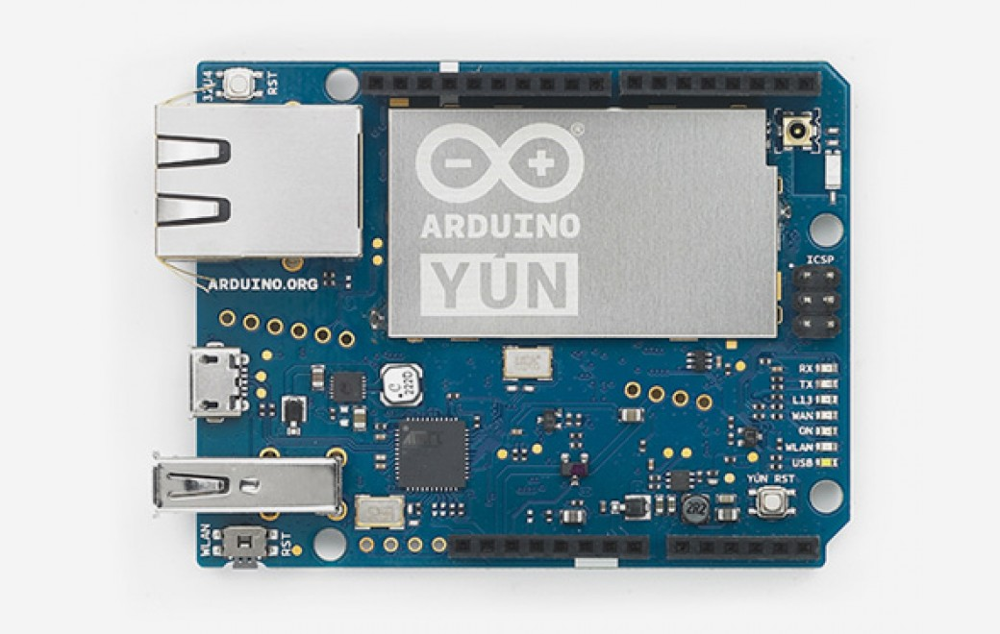

***Note: This page refers to a product that is retired.***

The **Arduino Yún** is a microcontroller board based on the ATmega32u4 and the Atheros AR9331\. The Atheros processor supports a Linux distribution based on OpenWrt named Linino OS. The board has built-in Ethernet and WiFi support, a USB-A port, micro-SD card slot, 20 digital input/output pins (7 of them can be used as PWM outputs and 12 as analog inputs), a 16 MHz crystal oscillator, a micro USB connection, an ICSP header, and 3 reset buttons.

NB : In some countries, it is prohibited to sell WiFi enabled devices without government approval. While waiting for proper certification, some local distributors are disabling WiFi functionality. Check with your dealer before purchasing a Yún if you believe you may live in such a country.

The Yún distinguishes itself from other Arduino boards by its ability to communicate with the Linux distribution onboard, offering a powerful networked computer with the ease of an Arduino. In addition to Linux commands like the cURL, you can write your own shell and Python® scripts for robust interactions. The Yún is similar to the Leonardo with the ATmega32u4, except that it has Linux on board. (has built-in USB communication, eliminating the need for a secondary processor).

NB: Yun Release 5 The new Arduino Yun R5 differs substantially from the previous release in these features:

* The power supply system provides 5V on AREF;
* The layout has been modified, adding two holes for USB signals and two holes for GP6 and GPIO13(LED2).

You can find [here](https://www.arduino.cc/en/Main/warranty) your board warranty information.

## Getting Started

In the Getting Started section, you can find all the information you need to configure your board. Ready to get started? If you bought your Arduino Yún before Oct 2014, please check the [Yún Open WRT OS Getting Started Page](https://www.arduino.cc/en/Guide/ArduinoYun), if you bought it after 2015 check [Arduino Yún Linino OS Getting Started page](https://www.arduino.cc/en/Guide/ArduinoYunLin).

### Need Help?

* On the Software [on the Arduino Forum](https://forum.arduino.cc/index.php?board=93.0)
* On Projects [on the Arduino Forum](https://forum.arduino.cc/index.php?board=3.0)
* On the Product itself through [our Customer Support](https://support.arduino.cc/hc)

Warning: Arduino YÚN is not compatible with 12V PoE module.

## Documentation

### OSH: Schematics

Arduino Yún is open-source hardware! You can build your own board using the following files:

[SCHEMATICS IN DSN](https://www.arduino.cc/en/uploads/Main/YUN-V04(20150114).DSN.zip) 

[SCHEMATICS IN .PDF](https://www.arduino.cc/en/uploads/Main/YUN-V04(20150114).pdf)

### Power

It is recommended to power the board via the micro-USB connection with 5VDC. If you are powering the board though the Vin pin, you must supply a regulated 5VDC. There is no on-board voltage regulator for higher voltages, which will damage the board.

The Yún is also compatible with PoE power supply but in order to use this feature you need to mount a PoE module on the board or buy a preassembled board.

Note: early models of the Yún with a PoE adapter were incorrectly providing the board with 12V. An updated version will soon be provided to distributors that provide the expected 5V. If you believe you have the wrong PoE adapter on your board, please contact [our support](https://www.arduino.cc/en/contact-us/).

The power pins are as follows:

* VIN. The input voltage to the Arduino board. Unlike other Arduino boards, if you are going to provide power to the board through this pin, you must provide a regulated 5V.
* 5V. The power supply used to power the microcontrollers and other components on the board. This can come either from VIN or be supplied by USB.
* 3V3\. A 3.3 volt supply generated by the on-board regulator. Maximum current draw is 50 mA.
* GND. Ground pins.
* IOREF. The voltage at which the i/o pins of the board are operating (i.e. VCC for the board). This is 5V on the Yún.

### Memory

The ATmega32u4 has 32 KB (with 4 KB used for the bootloader). It also has 2.5 KB of SRAM and 1 KB of EEPROM (which can be read and written with the EEPROM library).

The memory on the AR9331 is not embedded inside the processor. The RAM and the storage memory are externally connected. The Yún has 64 MB of DDR2 RAM and 16 MB of flash memory. The flash memory is preloaded in factory with a Linux distribution based on OpenWrt called Linino OS. You can change the content of the factory image, such as when you install a program or when you change a configuration file. You can return to the factory configuration by pressing the "WLAN RST" button for 30 seconds. 

The Linino OS installation occupies around 9 MB of the 16 MB available of the internal flash memory. You can use a micro SD card if you need more disk space for installing applications. 

### Input and Output

It is not possible to access the I/O pins of the Atheros AR9331\. All I/O lines are tied to the 32U4.

Each of the 20 digital i/o pins on the Yún can be used as an input or output, using pinMode(), digitalWrite(), and digitalRead() functions. They operate at 5 volts. Each pin can provide or receive a maximum of 40 mA and has an internal pull-up resistor (disconnected by default) of 20-50 kOhms. In addition, some pins have specialized functions: Serial: 0 (RX) and 1 (TX). Used to receive (RX) and transmit (TX) TTL serial data using the ATmega32U4 hardware serial capability. Note that on the Yún, the Serial class refers to USB (CDC) communication; for TTL serial on pins 0 and 1, use the Serial1 class.

The hardware serials of the ATmega32U4 and the AR9331 on the Yún are connected together and are used to communicate between the two processors. As is common in Linux systems, on the serial port of the AR9331 is exposed the console for access to the system, this means that you can access to the programs and tools offered by Linux from your sketch.

* TWI: 2 (SDA) and 3 (SCL). Support TWI communication using the Wire library.
* External Interrupts: 3 (interrupt 0), 2 (interrupt 1), 0 (interrupt 2), 1 (interrupt 3) and 7 (interrupt 4). These pins can be configured to trigger an interrupt on a low value, a rising or falling edge, or a change in value. See the attachInterrupt() function for details. Is not recommended to use pins 0 and 1 as interrupts because they are the also the hardware serial port used to talk with the Linux processor. Pin 7 is connected to the AR9331 processor and it may be used as handshake signal in future. Is recommended to be careful of possible conflicts if you intend to use it as interrupt.
* PWM: 3, 5, 6, 9, 10, 11, and 13\. Provide 8-bit PWM output with the analogWrite() function.
* SPI: on the ICSP header. These pins support SPI communication using the SPI library. Note that the SPI pins are not connected to any of the digital I/O pins as they are on the Uno, They are only available on the ICSP connector. This means that if you have a shield that uses SPI, but does NOT have a 6-pin ICSP connector that connects to the Yún's 6-pin ICSP header, the shield will not work. The SPI pins are also connected to the AR9331 gpio pins, where it has been implemented in software the SPI interface. This means that the ATMega32u4 and the AR9331 can also communicate using the SPI protocol.
* LED: 13\. There is a built-in LED connected to digital pin 13\. When the pin is HIGH value, the LED is on, when the pin is LOW, it's off. There are several other status LEDs on the Yún, indicating power, WLAN connection, WAN connection and USB.
* Analog Inputs: A0 - A5, A6 - A11 (on digital pins 4, 6, 8, 9, 10, and 12). The Yún has 12 analog inputs, labeled A0 through A11, all of which can also be used as digital i/o. Pins A0-A5 appear in the same locations as on the Uno; inputs A6-A11 are on digital i/o pins 4, 6, 8, 9, 10, and 12 respectively. Each analog input provide 10 bits of resolution (i.e. 1024 different values). By default the analog inputs measure from ground to 5 volts, though is it possible to change the upper end of their range using the AREF pin and the analogReference() function.
* AREF. Reference voltage for the analog inputs. Used with analogReference().

There are 3 reset buttons with different functions on the board: 

* Yún RST. Bring this line LOW to reset the AR9331 microprocessor. Resetting the AR9331 will cause the reboot of the linux system. All the data stored in RAM will be lost and all the programs that are running will be terminated.
* 32U4 RST. Bring this line LOW to reset the ATmega32U4 microcontroller. Typically used to add a reset button to shields which block the one on the board.
* WLAN RST. This button has a double feature. Primarily serves to restore the WiFi to the factory configuration. The factory configuration consist to put the WiFi of the Yún in access point mode (AP) and assign to it the default IP address that is 192.168.240.1, in this condition you can connect with your computer to the a WiFi network that appear with the SSID name "Arduino Yun-XXXXXXXXXXXX", where the twelve 'X' are the MAC address of your Yún. Once connected you can reach the web panel of the Yún with a browser at the 192.168.240.1 or "[http://arduino.local](http://arduino.local/ "Arduino local")" address. Note that restoring the WiFi configuration will cause the reboot of the linux environment. To restore your WiFi configuration you have to press and hold the WLAN RST button for 5 seconds. When you press the button the WLAN blue LED will start to blink and will keep still blinking when you release the button after 5 seconds indicating that the WiFi restore procedure has been recorded. The second function of the WLAN RST button is to restore the linux image to the default factory image. To restore the linux environment you must press the button for 30 seconds. Note that restoring the factory image make you lose all the files saved and software installed on the on-board flash memory connected to the AR9331.

### Communication

The Yún has a number of facilities for communicating with a computer, another Arduino, or other microcontrollers. The ATmega32U4 provides a dedicated UART TTL (5V) serial communication. The 32U4 also allows for serial (CDC) communication over USB and appears as a virtual com port to software on the computer. The chip also acts as a full speed USB 2.0 device, using standard USB COM drivers. The Arduino software includes a serial monitor which allows simple textual data to be sent to and from the Arduino board. The RX and TX LEDs on the board will flash when data is being transmitted via the USB connection to the computer.  

Digital pins 0 and 1 are used for serial communication between the 32U4 and the AR9331\.   

You can use Ciao library to communication between the processors.  

A SoftwareSerial library allows for serial communication on any of the Yún's digital pins. Pins 0 and 1 should be avoided as they are used by the Bridge library. The ATmega32U4 also supports I2C (TWI) and SPI communication. The Arduino software includes a Wire library to simplify use of the I2C bus;. For SPI communication, use the SPI library.

The Yún appears as a generic keyboard and mouse, and can be programmed to control these input devices using the Keyboard and Mouse classes.

The onboard Ethernet and WiFi interfaces are exposed directly to the AR9331 processor. To send and receive data through them, use the Bridge library. 

The Yún also has USB host capabilities through Linino OS. You can connect peripherals like USB flash devices for additional storage, keyboards, or webcams. You may need to download and install additional software for these devices to work. 

### Programming

The Yún can be programmed with the Arduino software ([download](https://www.arduino.cc/en/Main/Software "Download Arduino Yun software")). Select "Arduino Yún from the Tools > Board menu (according to the microcontroller on your board). 

The ATmega32U4 on the Arduino Yún comes preburned with a bootloader that allows you to upload new code to it without the use of an external hardware programmer. It communicates using the AVR109 protocol.

You can also bypass the bootloader and program the microcontroller through the ICSP (In-Circuit Serial Programming) header using Arduino ISP or similar;

### Automatic (Software) Reset

Rather than requiring a physical press of the reset button before an upload, the Yún is designed in a way that allows it to be reset by software running on a connected computer. The reset is triggered when the Yún's virtual (CDC) serial / COM port is opened at 1200 baud and then closed. When this happens, the processor will reset, breaking the USB connection to the computer (meaning that the virtual serial / COM port will disappear). After the processor resets, the bootloader starts, remaining active for about 8 seconds.

The bootloader can also be initiated by pressing the reset button on the Yún. Note that when the board first powers up, it will jump straight to the user sketch, if present, rather than initiating the bootloader. Because of the way the Yún handles reset it's best to let the Arduino software try to initiate the reset before uploading, especially if you are in the habit of pressing the reset button before uploading on other boards. If the software can't reset the board you can always start the bootloader by pressing the reset button on the board.

### USB Overcurrent Protection

The Yún has a resettable polyfuse that protects your computer's USB ports from shorts and overcurrent. Although most computers provide their own internal protection, the fuse provides an extra layer of protection. If more than 500 mA is applied to the USB port, the fuse will automatically break the connection until the short or overload is removed.

### Physical Characteristics

The maximum length and width of the Yún PCB are 2.7 and 2.1 inches respectively, with the USB connector extending beyond the former dimension. Four screw holes allow the board to be attached to a surface or case. Note that the distance between digital pins 7 and 8 is 160 mil (0.16"), not an even multiple of the 100 mil spacing of the other pins. Weight of the board is 32 g.

### Pinout

## Previous Versions

Do you own a past an old version of this product? If you bought your Arduino Yún before Oct 2014, please check the [Yún Open WRT OS Getting Started Page](https://www.arduino.cc/en/Guide/ArduinoYun). If you bought it in 2015 check[ Arduino Yún Linino OS Getting Started page](https://www.arduino.cc/en/Guide/ArduinoYunLin).

## Tech Specs

### AVR Arduino microcontroller

|                        |                                          |
| ---------------------- | ---------------------------------------- |
| Microcontroller        | ATmega32U4                               |
| Operating Voltage      | 5V                                       |
| Input Voltage          | 5 V                                      |
| Digital I/O Pins       | 20                                       |
| PWM Output             | 7                                        |
| Analog I/O Pins        | 12                                       |
| DC Current per I/O Pin | 40 mA on I/O Pins; 50 mA on 3,3 Pin      |
| Flash Memory           | 32 KB (of which 4 KB used by bootloader) |
| SRAM                   | 2.5 KB                                   |
| EEPROM                 | 1 KB                                     |
| Clock Speed            | 16 MHz                                   |

### Arduino Microprocessor

|                   |                     |
| ----------------- | ------------------- |
| Processor         | Atheros AR9331      |
| Architecture      | MIPS                |
| Operating Voltage | 3.3V                |
| Ethernet          | 802.3 10/100Mbit/s  |
| WiFi              | 802.11b/g/n 2.4 GHz |
| USB Type          | 2.0 Host            |
| Card Reader       | Micro-SD            |
| RAM               | 64 MB DDR2          |
| Flash Memory      | 16 MB               |
| SRAM              | 2.5 KB              |
| EEPROM            | 1 KB                |
| Clock Speed       | 400 MHz             |