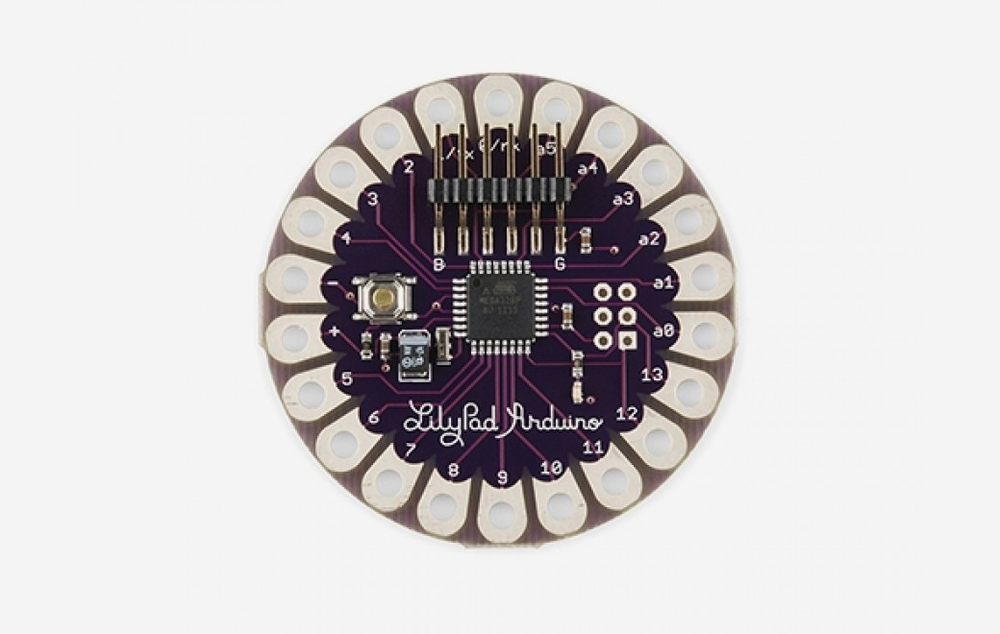

***Note: This page refers to a product that is retired.***

The **LilyPad Arduino Main Board** is based on the ATmega168V (the low-power version of the ATmega168) or the ATmega328V. The LilyPad Arduino was designed and developed by Leah Buechley and SparkFun Electronics.

You can find your board warranty information [here](https://www.arduino.cc/en/Main/warranty).

### Getting Started

In the [Getting Started section](https://www.arduino.cc/en/Guide/ArduinoLilyPad), you can find all the information you need to configure your board, use the [Arduino Software (IDE)](https://www.arduino.cc/en/Main/Software), and start to tinker with coding and electronics. SparkFun Electronics has a [range of accessories](http://www.sparkfun.com/commerce/categories.php?c=135) for use with the LilyPad Arduino.

### Need Help?

* On Projects [on the Arduino Forum](https://forum.arduino.cc/index.php?board=3.0)
* On the Product itself through [our Customer Support](https://support.arduino.cc/hc)

## Tech Specs

|                        |                                                        |
| ---------------------- | ------------------------------------------------------ |
| Microcontroller        | [ATmega168](http://www.atmel.com/Images/Atmel-2545-8-bit-AVR-Microcontroller-ATmega48-88-168_Datasheet.pdf) or [ATmega328V](http://www.atmel.com/dyn/resources/prod_documents/doc8025.pdf) |
| Operating Voltage      | 2.7-5.5 V |
| Input Voltage          | 2.7-5.5 V|
| Digital I/O Pins       | 14|
| PWM Channels           | 6 |
| Analog Input Channels  | 6|
| DC Current per I/O Pin | 40 mA|
| Flash Memory           | 16 KB (of which 2 KB used by bootloader)|
| SRAM                   | 1 KB |
| EEPROM                 | 512 bytes |
| Clock Speed            | 8 MHz|

**Warning:** *Don't power the LilyPad Arduino with more than 5.5 volts, or plug the power in backwards, you'll kill it.*

