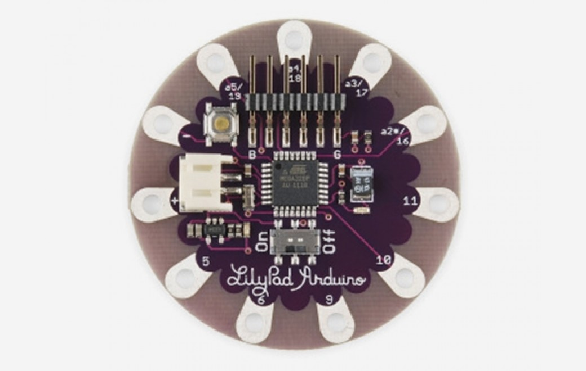

***Note: This page refers to a product that is retired.***

Unlike the [LilyPad Arduino Main Board](https://www.arduino.cc/en/Main/ArduinoBoardLilyPad), the **LilyPad Simple** has only 9 pins for input/output. Additionally, it has a JST connector and a built in charging circuit for Lithium Polymer batteries. The board is based on the [ATmega328](http://www.atmel.com/assets/Atmel-8271-8-bit-AVR-Microcontroller-ATmega48A-48PA-88A-88PA-168A-168PA-328-328P_datasheet_Complete.pdf).  
  
The LilyPad Arduino Simple was designed and developed by Leah Buechley and SparkFun Electronics.

You can find your board warranty information [here](https://www.arduino.cc/en/Main/warranty).

### Getting Started

In the [Getting Started section](https://www.arduino.cc/en/Guide/ArduinoLilyPad), you can find all the information you need to configure your board, use the [Arduino Software (IDE)](https://www.arduino.cc/en/Main/Software), and start to tinker with coding and electronics. SparkFun Electronics has a [range of accessories](http://www.sparkfun.com/commerce/categories.php?c=135) for use with the LilyPad Arduinos.

### Need Help?

* On the board on the [LilyPad Arduino Simple Page](http://lilypadarduino.org/?p=149)
* On Projects [on the Arduino Forum](https://forum.arduino.cc/index.php?board=3.0)
* On the Product itself through [our Customer Support](https://support.arduino.cc/hc)

### Documentation

### OSH: Schematics

Lilypad Simple is open-source hardware! You can build your own board using the following files:

[EAGLE FILES IN .ZIP](http://dlnmh9ip6v2uc.cloudfront.net/datasheets/Dev/LilyPad/LilyPad-Simple-v25.zip) 
[SCHEMATICS IN .PDF](http://dlnmh9ip6v2uc.cloudfront.net/datasheets/Dev/LilyPad/LilyPad-Simple-v25.pdf)

### Power

The LilyPad Arduino Simple can be powered via an external power supply or an FTDI compatible adapter like the [USBSerial Light Adapter](https://www.arduino.cc/en/Main/USBSerial).  
  
The board can be turned on and off with the on-board switch. When the board is unplugged from an FTDI adapter and powered via a battery, the switch turns the board on and off; with the switch in the ON position, the microcontroller receives power and the board runs and with the switch in the OFF position, the microcontroller doesn't receive power. When the board is powered via an FTDI adapter, the board remains on all of the time; with the switch in the ON position, the microcontroller receives power from the battery (or the FTDI board via the battery charging circuit if no battery is attached) and with the switch in the OFF position, the microcontroller receives power from the FTDI adapter.

An external power supply should provide between 2.7 and 5.5 volts. The Lilypad Simple is designed with battery use in mind; 3.7 volt Lithium Polymer batteries can be plugged directly into the on-board JST connector. Again, *don't power the LilyPad Arduino Simple with more than 5.5 volts, or plug the power in backwards: you'll kill it*.

The board contains a MCP73831 LiPo battery charging chip. If the board is connected to both a FTDI connection and a battery, the FTDI power will charge the battery. This is true regardless of the position of the switch. The LED adjacent to the switch lights up while the battery is being charged. The charging will stop automatically when the battery is fully charged.

Because of the battery charging circuit, it is not possible to power components like a Bluetooth® modem via the FTDI connector.

### Programming

The LilyPad Simple can be programmed with the Arduino [Arduino Software](https://www.arduino.cc/en/Main/Software) (IDE). Select "LilyPad Arduino" from the **Tools > Board** menu. For details, see the [LilyPad Arduino Getting Started Guide](https://www.arduino.cc/en/Guide/ArduinoLilyPad).

The ATmega328P on the LilyPad Arduino comes preburned with [bootloader](https://www.arduino.cc/en/Hacking/Bootloader?from=Tutorial.Bootloader) that allows you to upload new code to it with the Arduino software.

The LilyPad Simple does not have an onboard USBSerial adapter or USB connector. To program the board, you will need to use a FTDI compatible adapter like the [USBSerial Light Adapter](https://docs.arduino.cc/retired/boards/arduino-usb-2-serial-micro).

### Inputs and Outputs

The LilyPad Simple has fewer inputs and outputs than the [LilyPad Arduino Main Board](https://www.arduino.cc/en/Main/ArduinoBoardLilyPad). There are a total of 9 I/O pins on the Simple board, one exposed pin for +3.3VDC, and one pin for ground.

Each of the 9 digital I/O pins on the LilyPad Arduino Simple can be used as an input or output, using [pinMode()](https://www.arduino.cc/reference/en/language/functions/digital-io/pinmode/), [digitalWrite()](https://www.arduino.cc/en/Reference/DigitalWrite), and [digitalRead()](https://www.arduino.cc/reference/en/language/functions/digital-io/digitalread/) functions. They operate at 5V volts. Each pin can provide or receive a maximum of 40 mA and has an internal pull-up resistor (disconnected by default) of 20 kOhms. In addition, some pins have specialized functions:

* **PWM: 5, 6, 9, 10, 11** Provide 8-bit PWM output with the [analogWrite()](https://www.arduino.cc/en/Reference/AnalogWrite) function.
* **Analog Inputs: A2-A5**. The LilyPad Simple Arduino has 4 analog inputs, labeled A2 through A5, all of which can also be used as digital I/O. Each analog input provide 10 bits of resolution (i.e. 1024 different values). By default the analog inputs measure from ground to 5 volts, though is it possible to change the upper end of their range using the [analogReference()](https://www.arduino.cc/reference/en/language/functions/analog-io/analogreference/)function.

### Automatic (Software) Reset and Bootloader Initiation

Rather than requiring a physical press of the reset button before an upload, the LilyPad Simple Arduino is designed in a way that allows it to be reset by software running on a connected computer. The bootloader can also be initiated by pressing the reset button on the LilyPad Arduino Simple.

Because of the way the LilyPad Arduino Simple handles reset it's best to let the Arduino software try to initiate the reset before uploading. If the software can't reset the board you can always start the bootloader by pressing the reset button.

### Physical Characteristics

The LilyPad Arduino Simple is a circle, approximately 50mm (2") in diameter. The board itself is 0.8mm (1/32") thick (approximately 3mm (1/8") where electronics are attached).

### Washability

We recommend washing projects in cold water by hand with a mild detergent. Drip dry. Do not dry clean or dry in a dryer. Remove the battery before washing the board!

### Tech Specs

|                        |                                                                                                                    |
| ---------------------- | ------------------------------------------------------------------------------------------------------------------ |
| Microcontroller        | [ATmega328P](http://ww1.microchip.com/downloads/en/DeviceDoc/ATmega48A-PA-88A-PA-168A-PA-328-P-DS-DS40002061A.pdf) |
| Operating Voltage      | 2.7-5.5 V                                                                                                          |
| Input Voltage          | 2.7-5.5 V                                                                                                          |
| Digital I/O Pins       | 9                                                                                                                  |
| PWM Channels           | 5                                                                                                                  |
| Analog Input Channels  | 4                                                                                                                  |
| DC Current per I/O Pin | 40 mA                                                                                                              |
| Flash Memory           | 32 KB (of which 2 KB used by bootloader)                                                                           |
| SRAM                   | 2 KB                                                                                                               |
| EEPROM                 | 1 KB                                                                                                               |
| Clock Speed            | 8 MHz                                                                                                              |
  
Warning: *Don't power the LilyPad Arduino with more than 5.5 volts, or plug the power in backwards, you'll kill it.*