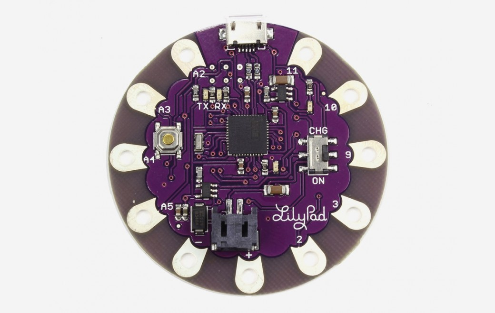

***Note: This page refers to a product that is retired.***

The **LilyPad Arduino USB** is a microcontroller board based on the [ATmega32u4](http://www.atmel.com/Images/Atmel-7766-8-bit-AVR-ATmega16U4-32U4_Datasheet.pdf). It has 9 digital input/output pins (of which 4 can be used as PWM outputs and 4 as analog inputs), an 8 MHz resonator, a micro USB connection, a JST connector for a 3.7V LiPo battery, and a reset button. It contains everything needed to support the microcontroller; simply connect it to a computer with a USB cable or power it with a battery to get started.

The LilyPad Arduino USB differs from previous LilyPad boards in that the ATmega32u4 has built-in USB communication, eliminating the need for a separate USB-to-serial adapter. This allows the LilyPad Arduino USB to appear to a connected computer as a mouse and keyboard, in addition to a virtual (CDC) serial / COM port. It also has other implications for the behavior of the board; these are detailed on the [Getting Started](https://www.arduino.cc/en/Guide/ArduinoLilyPadUSB) page.

You can find your board warranty information [here](https://www.arduino.cc/en/Main/warranty).

## Getting Started

In the [Getting Started section](https://www.arduino.cc/en/Guide/ArduinoLilyPadUSB), you can find all the information you need to configure your board, use the [Arduino Software (IDE)](https://www.arduino.cc/en/Main/Software), and start to tinker with coding and electronics.

### Need Help?

* On Projects [on the Arduino Forum](https://forum.arduino.cc/index.php?board=3.0)
* On the Product itself through [our Customer Support](https://support.arduino.cc/hc)

## Documentation

### OSH: Schematics

The Lilypad Arduino USB is open-source hardware! You can build your own board using the following files:

[EAGLE FILES IN .ZIP](https://www.arduino.cc/en/uploads/Main/arduino-lilypad-usb-reference-design.zip) 

[SCHEMATICS IN .PDF](https://www.arduino.cc/en/uploads/Main/arduino-lilypad-usb-schematic.pdf)

### Power

The LilyPad Arduino USB can be powered via the micro USB connection or with a 3.7V LiPo battery (connected to the JST connector on the board). Either power source is regulated down to the operating voltage (3.3V) by the on-board MIC5219.

The board can be turned on and off with the on-board switch. With the switch in the ON position, the microcontroller receives power and the board runs. With the switch in the "CHG" position, the microcontroller doesn't receive power. (This is true whether the board is powered via USB or a battery.)

The board contains a MCP73831 LiPo battery charging chip. If the board is connected to both USB and a battery, the USB power will charge the battery. This is true regardless of the position of the switch. The LED above the word "CHG" lights up while the battery is being charged. The charging will stop automatically when the battery is fully charged.  
  
The power pins are as follows:

* **\+** The regulated 3.3V power supply used to power the microcontroller and other components on the board. This can come either from the USB connection or a battery, both via the on-board regulator. This pin is only powered when the on-board switch is in the ON position.
* **\-** Ground pin.

### Memory

The ATmega32u4 has 32 KB (with 4 KB used for the bootloader). It also has 2.5 KB of SRAM and 1 KB of EEPROM (which can be read and written with the [EEPROM library](https://www.arduino.cc/en/Reference/EEPROM)).

### Input and Output

Each of the 9 digital i/o pins on the LilyPad Arduino USB can be used as an input or output, using[pinMode()](https://www.arduino.cc/reference/en/language/functions/digital-io/pinmode/), [digitalWrite()](https://www.arduino.cc/en/Reference/DigitalWrite), and [digitalRead()](https://www.arduino.cc/reference/en/language/functions/digital-io/digitalread/) functions. They operate at 3.3V volts. Each pin can provide or receive a maximum of 40 mA and has an internal pull-up resistor (disconnected by default) of 20-50 kOhms.

In addition, some pins have specialized functions:

* **TWI**: 2 (SDA) and 3 (SCL). Support a simple TWI communication using the [Wire library](https://www.arduino.cc/en/Reference/Wire).
* **External Interrupts**: 2 and 3\. These pins can be configured to trigger an interrupt on a low value, a rising or falling edge, or a change in value. See the [attachInterrupt()](https://www.arduino.cc/reference/en/language/functions/external-interrupts/attachinterrupt/) function for details.
* **PWM**: 3, 9, 10, 11, and 13\. Provide 8-bit PWM output with the [analogWrite()](https://www.arduino.cc/en/Reference/AnalogWrite) function.
* **LED**: 13\. There is a built-in LED connected to digital pin 13\. When the pin is HIGH value, the LED is on, when the pin is LOW, it's off.
* **Analog Inputs:** A2-A5\. The LilyPad Arduino USB has 4 analog inputs, labeled A0 through A11, all of which can also be used as digital i/o. Each analog input provide 10 bits of resolution (i.e. 1024 different values). By default the analog inputs measure from ground to 5 volts, though is it possible to change the upper end of their range using the [analogReference()](https://www.arduino.cc/reference/en/language/functions/analog-io/analogreference/) function.

See also the mapping between Arduino pins and ATmega32u4 ports.

[PIN MAPPING ATmega32U4](https://www.arduino.cc/en/Hacking/PinMapping32u4)

### Communication

The LilyPad Arduino USB has a number of facilities for communicating with a computer, another Arduino, or other microcontrollers. The 32U4 also allows for serial (CDC) communication over USB and appears as a virtual com port to software on the computer. The chip also acts as a full speed USB 2.0 device, using standard USB COM drivers. On Windows, a [.inf file is required](https://www.arduino.cc/en/Guide/Windows#toc4)\>. The Arduino software includes a serial monitor which allows simple textual data to be sent to and from the Arduino board. The RX and TX LEDs on the board will flash when data is being transmitted via the USB connection to the computer.

A [SoftwareSerial library](https://www.arduino.cc/en/Reference/SoftwareSerial) allows serial communication on any of the LilyPad's digital pins.

The LilyPad Arduino USB also supports I2C (TWI). The Arduino software includes a [Wire Library](https://www.arduino.cc/en/Reference/Wire) to simplify use of the I2C bus.

The LilyPad Arduino USB appears as a generic keyboard and mouse, and can be programmed to control these input devices using the [Keyboard](https://www.arduino.cc/reference/en/language/functions/usb/keyboard/) and [Mouse](https://www.arduino.cc/reference/en/language/functions/usb/mouse/) classes.

### Programming

The LilyPad Arduino USB can be programmed with the Arduino [Arduino Software](https://www.arduino.cc/en/Main/Software) (IDE). Select "LilyPad Arduino USB" from the **Tools > Board** menu (according to the microcontroller on your board). For details, see the [reference](https://www.arduino.cc/en/Reference/HomePage) and [tutorials](https://www.arduino.cc/en/Tutorial/HomePage).

The ATmega32U4 on the LilyPad Arduino USB comes preburned with [bootloader](https://www.arduino.cc/en/Hacking/Bootloader?from=Tutorial.Bootloader) that allows you to upload new code to it without the use of an external hardware programmer. It communicates using the AVR109 protocol.

You can also bypass the bootloader and program the microcontroller through the ICSP (In-Circuit Serial Programming) header. While the holes are too small to insert pins into, you can insert male header pins into the ISP connector on your programmer and press them against the ICSP header on the board (from above).

### Automatic (Software) Reset and Bootloader Initialisation

Rather than requiring a physical press of the reset button before an upload, the LilyPad Arduino USB is designed in a way that allows it to be reset by software running on a connected computer. The reset is triggered when the LilyPad's virtual (CDC) serial / COM port is opened at 1200 baud and then closed. When this happens, the processor will reset, breaking the USB connection to the computer (meaning that the virtual serial / COM port will disappear). After the processor resets, the bootloader starts, remaining active for about 8 seconds. The bootloader can also be initiated by pressing the reset button on the LilyPad Arduino USB twice in quick in succession.

### Physical Characteristics

The LilyPad Arduino USB is a circle, approximately 50mm (2") in diameter. The Micro USB connector extends slightly beyond this diameter. The board itself is .8mm (1/32") thick (approximately 6.5mm (1/4") including components, the tallest of which is the JST battery connector).

## Tech Specs

|                        |                                                     |
| ---------------------- | --------------------------------------------------- |
| Microcontroller        | ATmega32u4                                          |
| Operating Voltage      | 3.3V                                                |
| Input Voltage          | 3.8V-5V                                             |
| Digital I/O Pins       | 9                                                   |
| PWM Channels           | 4                                                   |
| Analog Input Channels  | 4                                                   |
| DC Current per I/O Pin | 40 mA                                               |
| Flash Memory           | 32 KB (ATmega32u4) of which 4 KB used by bootloader |
| SRAM                   | 2.5 KB (ATmega32u4)                                 |
| EEPROM                 | 1 KB (ATmega32u4)                                   |
| Clock Speed            | 8 MHz                                               |