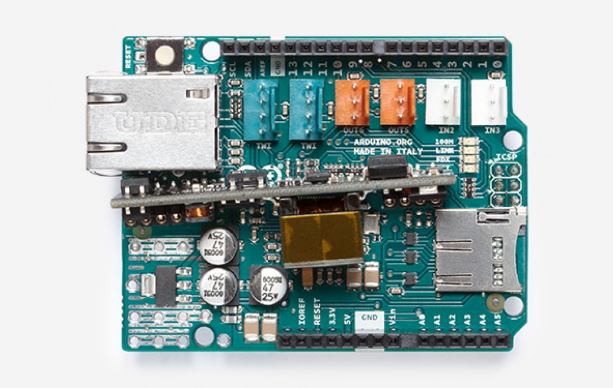

***Note: This page refers to a product that is retired.***

The **Arduino Ethernet Shield 2 with PoE** connects your Arduino to the internet in mere minutes. Just plug this shield into your Arduino Board, connect it to your network with an RJ45 cable (not included) and follow a few simple steps to start controlling your world through the internet. As always with Arduino, every element of the platform – hardware, software and documentation – is freely available and open-source. This means you can learn exactly how it's made and use its design as the starting point for your own circuits. Hundreds of thousands of Arduino Boards are already fueling people’s creativity all over the world, everyday. Join us now, Arduino is you!   

\*Requires an Arduino Board (not included)

* Operating voltage 5V (supplied from the Arduino Board)
* Ethernet Controller: W5500 with internal 32K buffer
* Connection speed: 10/100Mb
* Connection with Arduino on SPI port

The Shield has a Power over Ethernet (PoE) module designed to extract power from a conventional Ethernet cable.

You can find your board warranty information [here](https://www.arduino.cc/en/Main/warranty).

## Getting Started

In the [Getting Started section](https://www.arduino.cc/en/Guide/ArduinoEthernetShield), you can find all the information you need to configure your board, use the [Arduino Software (IDE)](https://www.arduino.cc/en/Main/Software), and start to tinker with coding and electronics.

### Need Help?

* Learn more on the Ethernet Shield 2 [in the Ethernet2 Library reference](https://www.arduino.cc/en/Reference/Ethernet)
* Get assistance with your projects [in the Arduino Forum](https://forum.arduino.cc/index.php?board=3.0)
* Contact us through [our Customer Support](https://support.arduino.cc/hc)

## Documentation

### OSH: Schematics

Arduino Ethernet Shield is open-source hardware! You can build your own board using the following files:

[EAGLE FILES IN .ZIP](https://content.arduino.cc/assets/EthernetShield2V2.0.zip) 

[SCHEMATICS IN .PDF](https://content.arduino.cc/assets/EthernetShield2V2.0_sch.pdf)

Do you own a past version of this product? Check the [Arduino Ethernet Shield V1](https://www.arduino.cc/en/Main/ArduinoEthernetShieldV1) product page.

### The shield

The Arduino Ethernet Shield 2 allows an Arduino Board to connect to the internet. It is based on the ([Wiznet W5500 Ethernet chip](http://wizwiki.net/wiki/lib/exe/fetch.php?media=products:w5500:w5500_ds_v106e_141230.pdf)). The Wiznet W5500 provides a network (IP) stack capable of both TCP and UDP. It supports up to eight simultaneous socket connections. Use the Ethernet library to write sketches that connect to the Internet using the Shield. The Ethernet Shield 2 connects to an Arduino Board using long wire-wrap headers extending through the Shield. This keeps the pin layout intact and allows another Shield to be stacked on top of it.

The most recent revision of the board exposes the 1.0 pinout on rev 3 of the Arduino UNO Board.

The Ethernet Shield 2 has a standard RJ-45 connection, with an integrated line transformer and Power over Ethernet enabled.

There is an onboard micro-SD card slot, which can be used to store files for serving over the network. It is compatible with the Arduino Uno and Mega (using the Ethernet library). The onboard micro-SD card reader is accessible through the SD Library. When working with this library, SS is on Pin 4\. The original revision of the Shield contained a full-size SD card slot; this is not supported.

The Shield also includes a reset controller, to ensure that the W5500 Ethernet module is properly reset on power-up. Previous revisions of the Shield were not compatible with the Mega and needed to be manually reset after power-up. The current Shield has a Power over Ethernet (PoE) module designed to extract power from a conventional twisted pair Category 5 Ethernet cable.   
PoE module features as follows:

* IEEE802.3af compliant
* Input voltage range 36V to 57V
* Overload and short-circuit protection
* 12V Output
* High efficiency DC/DC converter: typ 85% @ 80% load
* 1500V isolation (input to output)

*NB: the Power over Ethernet module is proprietary hardware not made by Arduino, it is a third party accessory. For more information, see the* *[datasheet](https://www.arduino.cc/en/uploads/Main/PoE-datasheet.pdf)*

The Shield does not come with a built in PoE module, it is a separate component that must be added on. Arduino communicates with both the W5500 and SD card using the SPI bus (through the ICSP header). This is on digital pins 10, 11, 12, and 13 on the Uno and pins 50, 51, and 52 on the Mega. On both boards, pin 10 is used to select the W5500 and pin 4 for the SD card. These pins cannot be used for general I/O. On the Mega, the hardware SS pin, 53, is not used to select either the W5500 or the SD card, but it must be kept as an output or the SPI interface won't work.

Note that because the W5500 and SD card share the SPI bus, only one at a time can be active. If you are using both peripherals in your program, this should be taken care of by the corresponding libraries. If you're not using one of the peripherals in your program, however, you'll need to explicitly deselect it. To do this with the SD card, set pin 4 as an output and write a high to it. For the W5500, set digital pin 10 as a high output.

* The Shield provides a standard RJ45 Ethernet jack.
* The reset button on the Shield resets both the W5500 and the Arduino Board.
* The Shield contains a number of information LEDs:
* ON: indicates that the Board and Shield are powered
* LINK: indicates the presence of a network link and flashes when the Shield transmits or receives data
* FDX: indicates that the network connection is full duplex
* 100M: indicates the presence of a 100 Mb/s network connection (as opposed to 10 Mb/s)
* ACT: flashes when RX or TX activity is present

  
This shield also hosts Tinkerkit compatible connectors as follows:

* 2 TinkerKit connectors for two Analog Inputs (in white), connected to A2 and A3.
* 2 TinkerKit connectors for two Aanlog Outputs (in orange in the middle), connected to PWM outputs on pins D5 and D6.
* 2 TinkerKit connectors for the TWI interface (in white with 4 pins), one for input and the other one for output.