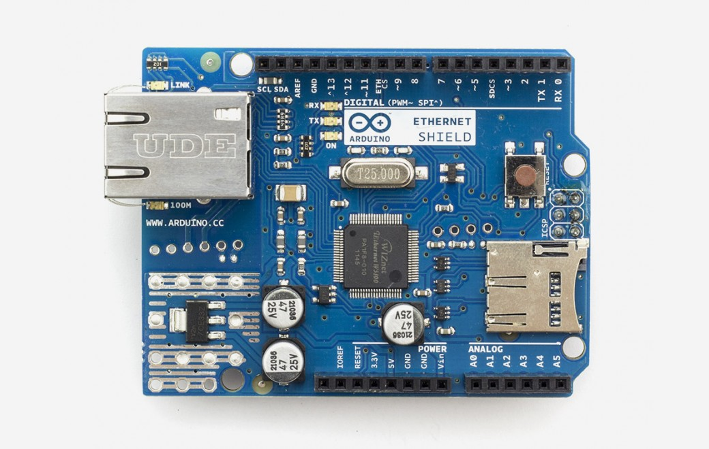

***Note: This page refers to a product that is retired.***

The Arduino Ethernet Shield V1 connects your Arduino to the internet in mere minutes. Just plug this module onto your Arduino board, connect it to your network with an RJ45 cable (not included) and follow a few simple instructions to start controlling your world through the internet.

The Arduino Ethernet Shield V1 allows an Arduino board to connect to the internet. It is based on the [Wiznet W5100](http://www.wiznet.co.kr/Sub_Modules/en/product/Product_Detail.asp?cate1=5&cate2=7&cate3=26&pid=1011)ethernet chip ([datasheet](http://www.wiznet.co.kr/UpLoad_Files/ReferenceFiles/W5100_Datasheet_v1.2.2.pdf)). The Wiznet W5100 provides a network (IP) stack capable of both TCP and UDP. It supports up to four simultaneous socket connections. Use the [Ethernet library](https://www.arduino.cc/en/Reference/Ethernet) to write sketches which connect to the internet using the shield. The ethernet shield connects to an Arduino board using long wire-wrap headers which extend through the shield. This keeps the pin layout intact and allows another shield to be stacked on top.

## Documentation

### OSH: Schematics

Arduino Ethernet Shield is open-source hardware! You can build your own board using the following files:

[EAGLE FILES IN .ZIP](https://www.arduino.cc/en/uploads/Main/arduino-ethernet-shield-06-reference-design.zip) 

[SCHEMATICS IN .PDF](https://www.arduino.cc/en/uploads/Main/arduino-ethernet-shield-06-schematic.pdf)

The most recent revision of the board exposes the 1.0 pinout on rev 3 of the Arduino UNO board.

The Ethernet Shield V1 has a standard RJ-45 connection, with an integrated line transformer and Power over Ethernet enabled.

There is an onboard micro-SD card slot, which can be used to store files for serving over the network. It is compatible with all the Arduino/Genuino boards. The on-board micro SD card reader is accessible through the SD Library. When working with this library, SS is on Pin 4\. The original revision of the shield contained a full-size SD card slot; this is not supported.

The shield also includes a reset controller, to ensure that the W5100 Ethernet module is properly reset on power-up. Previous revisions of the shield were not compatible with the Mega and need to be manually reset after power-up.

The current shield has a Power over Ethernet (PoE) module designed to extract power from a conventional twisted pair Category 5 Ethernet cable:

* IEEE802.3af compliant
* Low output ripple and noise (100mVpp)
* Input voltage range 36V to 57V
* Overload and short-circuit protection
* 9V Output
* High efficiency DC/DC converter: typ 75% @ 50% load
* 1500V isolation (input to output)

*NB: the Power over Ethernet module is proprietary hardware not made by Arduino, it is a third party accessory. For more information, see the* *[datasheet](https://www.arduino.cc/en/uploads/Main/PoE-datasheet.pdf)*

The shield does not come with the PoE module built in, it is a separate component that must be added on.

Arduino communicates with both the W5100 and SD card using the SPI bus (through the ICSP header). This is on digital pins 10, 11, 12, and 13 on the Uno and pins 50, 51, and 52 on the Mega. On both boards, pin 10 is used to select the W5100 and pin 4 for the SD card. These pins cannot be used for general I/O. On the Mega, the hardware SS pin, 53, is not used to select either the W5100 or the SD card, but it must be kept as an output or the SPI interface won't work.

Note that because the W5100 and SD card share the SPI bus, only one can be active at a time. If you are using both peripherals in your program, this should be taken care of by the corresponding libraries. If you're not using one of the peripherals in your program, however, you'll need to explicitly deselect it. To do this with the SD card, set pin 4 as an output and write a high to it. For the W5100, set digital pin 10 as a high output.

The shield provides a standard RJ45 ethernet jack.

The reset button on the shield resets both the W5100 and the Arduino board.

The shield contains a number of informational LEDs:

* PWR: indicates that the board and shield are powered
* LINK: indicates the presence of a network link and flashes when the shield transmits or receives data
* FULLD: indicates that the network connection is full duplex
* 100M: indicates the presence of a 100 Mb/s network connection (as opposed to 10 Mb/s)
* RX: flashes when the shield receives data
* TX: flashes when the shield sends data
* COLL: flashes when network collisions are detected

The solder jumper marked "INT" can be connected to allow the Arduino board to receive interrupt-driven notification of events from the W5100, but this is not supported by the Ethernet library. The jumper connects the INT pin of the W5100 to digital pin 2 of the Arduino.
