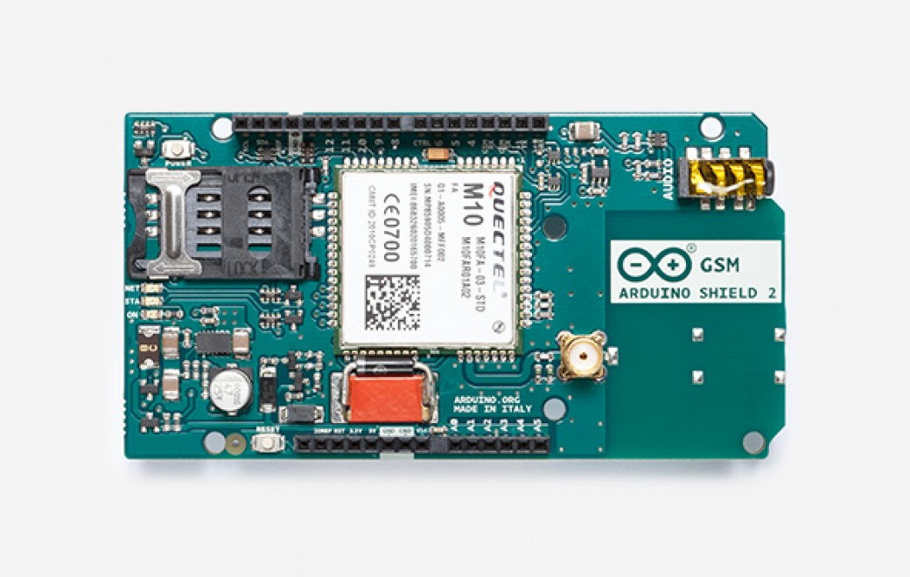

***Note: This page refers to a product that is retired.***

The **Arduino GSM Shield 2** allows an Arduino board to connect to the internet, make/receive voice calls and send/receive SMS messages. The shield uses a radio modem [M10 by Quectel](https://www.arduino.cc/en/uploads/Main/Quectel_M10_datasheet.pdf). It is possible to communicate with the board using [AT commands](https://www.arduino.cc/en/uploads/Main/Quectel_M10_AT_commands.pdf). The [GSM library](https://www.arduino.cc/en/Reference/GSM) has a large number of methods for communication with the shield.

The shield uses digital pins 2 and 3 for software serial communication with the M10\. Pin 2 is connected to the M10’s TX pin and pin 3 to its RX pin. [See these notes](https://docs.arduino.cc/retired/getting-started-guides/ArduinoGSMShield) for working with an Arduino Mega, Mega ADK, or Leonardo. The modem's PWRKEY pin is connected to Arduino pin 7.

The M10 is a Quad-band GSM/GPRS modem that works at frequencies GSM850MHz, GSM900MHz, DCS1800MHz and PCS1900MHz. It supports TCP/UDP and HTTP protocols through a GPRS connection. GPRS data downlink and uplink transfer speed maximum is 85.6 kbps.

To interface with the cellular network, the board requires a SIM card provided by a network operator. See the [getting started page](https://docs.arduino.cc/retired/getting-started-guides/ArduinoGSMShield#toc4) for additional information on SIM usage.

The most recent revision of the board uses the 1.0 pinout on rev 3 of the Arduino Uno board.

To use this board you should note that:

* Requires an Arduino board (not included)
* Operating voltage 5V (supplied from the Arduino Board)
* Connection with Arduino Uno on pins 2, 3 (Software Serial) and 7 (reset). See [these notes](https://www.arduino.cc/en/Guide/GSMShieldLeonardoMega) for working with a Mega, Mega ADK, or Leonardo.
* This version has a connector for an external antenna

You can find your board warranty information [here](https://www.arduino.cc/en/Main/warranty).

## Getting Started

In the [Getting Started section](https://www.arduino.cc/en/Guide/ArduinoGSMShieldV2), you can find all the information you need to configure your board, use the [Arduino Software (IDE)](https://www.arduino.cc/en/Main/Software), and start to tinker with coding and electronics.

### Need Help?

* On the GSM Shield [on the GSM Library](https://docs.arduino.cc/retired/archived-libraries/GSM)
* On Projects [on the Arduino Forum](https://forum.arduino.cc/index.php?board=3.0)
* On the Product itself through [our Customer Support](https://support.arduino.cc/hc)

## Documentation

### OSH: Schematics

Arduino GSM Shield 2 is open-source hardware! You can build your own board using the following files:

[EAGLE FILES IN .ZIP](https://content.arduino.cc/assets/GSMShield3V1.0.zip)

{/* [SCHEMATICS IN .PDF]() */}

### SIM to use with this shield

The GSM shield 2 is compatible with Data only and Voice and Data SIM. GPRS and SMS are supported by 2G Data only SIM, while voice calls, supported by the hardware, require a Voice and Data SIM, the same you may use in a GSM mobile phone. The Data transfer is based on GPRS technology and therefore it is not compatible with 3G or UMTS only network providers. GPRS is a 2G technology.

### Power

It is recommended that the board be powered with an external power supply that can provide between 700mA and 1000mA. Powering an Arduino and the GSM shield 2 from a USB connection is not recommended, as USB cannot provide the required current for when the modem is in heavy use.

### On board indicators

The shield contains a number of status LEDs:

* **On**: shows the Shield gets power.
* **Status**: turns on to when the modem is powered and data is being transferred to/from the GSM/GPRS network.
* **Net**: blinks when the modem is communicating with the radio network.

### On board interfaces

The shield comes with a on-board audio jack as well, and it can be used for both microphone and line inputs. It is also possible to make voice calls. You don’t need to add a speaker and microphone.

There are two small buttons on the shield. The button labeled "Reset" is tied to the Arduino reset pin. When pressed, it will restart the sketch. The button labeled "Power" is connected to the modem and will power the modem on and off. For early versions of the shield, it was necessary to press the power button to turn on the modem. Newer versions of the board will turn the modem on automatically.

If you have an early version of the shield, and it does not turn on automatically, you can solder a jumper to the CTRL/D7 pad on the reverse side of the board, and it will turn on when an attached Arduino receives power.

Several of the modem pins are exposed on the underside of the board. These provide access to the modem for features like speaker output and microphone input. See the datasheet for complete information.

## Previous Versions

Do you own a past an old version of this product? Check [Arduino GSM Shield V1](/retired/shields/arduino-gsm-shield) product page.