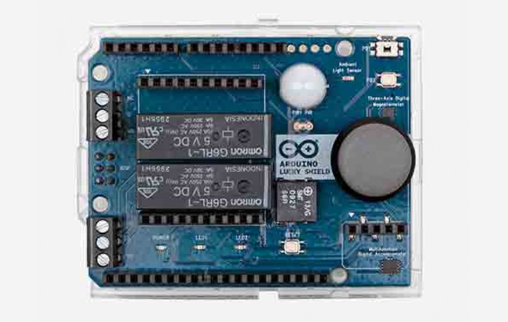

***Note: This page refers to a product that is retired.***

Arduino Lucky Shield is an easy way to use your Arduino boards, that grants you access to barometric pressure, relative altitude, luminosity, temperature, motion and presence. You can also turn it into a simple controller and OLED (organic light-emitting diode) display system. It is the perfect shield for IoT.

## Documentation

### OSH: Schematics

The Arduino Lucky Shield is open-source hardware! You can build your own board using the following files:

[EAGLE FILES IN .ZIP](https://content.arduino.cc/assets/Arduino-Lucky-Shield-Rev2-web.zip) 

[SCHEMATICS IN .PDF](https://content.arduino.cc/assets/Arduino_Lucky_Shield_V2_Schematic.zip) 

### Power

The shield doesn't need external power. It will be provided by the Arduino base board, through the 5V and 3.3V pins of the base. The shield is compatible with all Arduino board 5V and 3.3V standards. 

### Physical Characteristics

The maximum length and width of the Lucky Shield PCB are 2.7 by 2.1 inches,respectively (68.6 x 53.4 mm). Four screw holes allow the Shield to be attached to a surface or case. Note that the distance between digital pins 7 and 8 is 160 mil (0.16"), not an even multiple of the 100 mil spacing of the other pins.

## Tech Specs

|                                  |                                             |
| -------------------------------- | ------------------------------------------- |
| Relays               | OMRON G6RL-1 (5V DC)|
| PIR Sensor           | MOSDESIGN M7616 |
| Ambient Light Sensor | EVERLIGHT ALS-PT19-315C/L177/TR8Peak sensitivity wavelength 630nm, Operating temperature -40 ~ +85°C |
| Humidity Sensor      | BOSCH SENSORTEC BME 280 |
| Temperature Sensor   | BOSCH SENSORTEC BME 280 Operating temperature -40 ~ +85°C |
| Pressure sensor      | BOSCH SENSORTEC BME 280Operating pressure range 300 ~ 1100 hPa |
| 3-axis magnetometer  | NXP® MAG3110E-compass, Full-scale range ±1000 T, Output data rates (ODR) up to 80 Hz|
| 3 Axis accelerometer | NXP® MMA8491QG-sensor, Ultra-fast data output time, ~700 μs ±8g full-scale range 3-axis, 45° tilt outputs |
| Buzzer               | PUI AUDIO SMT-0927-S-6-R|
| Joystick             | 5-directional tact switch|