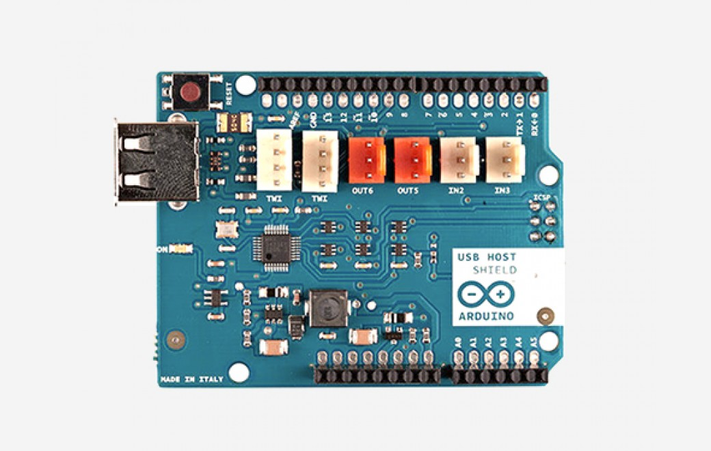

***Note: This page refers to a product that is retired.***

The **Arduino USB Host Shield** allows you to connect a USB device to your Arduino board. The Arduino USB Host Shield is based on the MAX3421E ([datasheet](http://www.maximintegrated.com/datasheet/index.mvp/id/3639)), which is a USB peripheral/host controller containing the digital logic and analog circuitry necessary to implement a full-speed USB peripheral or a full-/low-speed host compliant to USB specification rev 2.0\. The shield is TinkerKit compatible, which means you can quickly create projects by plugging TinkerKit modules onto the board.

The following device classes are supported by the shield:

* HID devices: keyboards, mice, joysticks, etc.
* Game controllers: Sony PS3, Nintendo Wii, Xbox360.
* USB to serial converters: FTDI, PL-2303, ACM, as well as certain cell phones and GPS receivers.
* ADK-capable Android phones and tables.
* Digital cameras: Canon EOS, Powershot, Nikon DSLRs and P&S, as well as generic PTP.
* Mass storage devices: USB sticks, memory card readers, external hard drives, etc.
* Bluetooth® dongles.

For information on using the board with the Android OS, you may refer to the documentation about Mega2560 ADK that contains information about Arduino ADK:

[Arduino's ADK documentation](https://www.arduino.cc/en/Guide/ArduinoADK). 

Arduino communicates with the MAX3421E using the SPI bus (through the ICSP header). This is on digital pins 10, 11, 12, and 13 on the Uno and pins 10, 50, 51, and 52 on the Mega. On both boards, pin 10 is used to select the MAX3421E. Pins 7, 8 and 9 are used for GPX, INT and RES pins.

You can find [here](https://www.arduino.cc/en/Main/warranty) your board warranty information.

## Getting Started

In the [Getting Started section](https://www.arduino.cc/en/Guide/HomePage) you can find all the information you need to configure your board. Use the Arduino Software (IDE) to start tinkering with coding and electronics.

### Need Help?

* On the Software [on the Arduino Forum](https://forum.arduino.cc/index.php?topic=443558.0)
* On Projects [on the Arduino Forum](https://forum.arduino.cc/index.php?board=3.0)
* On the Product itself through [our Customer Support](https://store.arduino.cc/store-support)

## Documentation

### OSH: Schematics

Arduino USB Host Shield is open-source hardware! You can build your own board using the following files:

[EAGLE FILES IN .ZIP](https://www.arduino.cc/en/uploads/Main/USBHostShield-Rev2.zip) 

[SCHEMATICS IN .PDF](https://www.arduino.cc/en/uploads/Main/USBHostShield-Rev2.pdf)

### Arduino Library

The Arduino USB Host Shield can be used with the "USB Host Library for Arduino" hosted by Oleg Mazurov and Alexei Glushchenko from [circuits@home](https://circuitsathome.com/), Kristian Lauszus and Andrew Kroll on [GitHub](https://github.com/felis/USB_Host_Shield_2.0) ([download](https://github.com/felis/USB_Host_Shield_2.0/archive/master.zip)).

### Tutorials

With an Arduino HSB Host Shield you can even [control an RC car using an XBOX wireless game controller](https://create.arduino.cc/projecthub/Arduino_Scuola/joystick-controlled-rc-car-076b7f). Many tutorials are available online, here you can find some tutorials developed by [circuits@home](https://chome.nerpa.tech/).

* [Bluetooth® HID devices](https://chome.nerpa.tech/mcu/arduino/bluetooth-hid-devices-now-supported-by-the-usb-host-library/)
* [PS4 controller](https://chome.nerpa.tech/mcu/arduino/ps4-controller-support-for-the-usb-host-library/)
* [Adding a display to a digital scale using Arduino and USB Host shield](https://chome.nerpa.tech/mcu/adding-a-display-to-a-digital-scale-using-arduino-and-usb-host-shield/)
* [Mass Storage](https://chome.nerpa.tech/mcu/mass-storage-support-for-usb-host-library-2-0-released/comment-page-1/)

### Power

The Arduino USB Host Shield has no power jack and is powered only when attached to an Arduino board.

### Input & Output

This shield has a Type-A USB receptacle where you can attach your USB device. The shield features several TinkerKit input/output and communication interfaces. Connecting TinkerKit modules can simplify the creation of a project or a prototype. The on-board connectors are :

* 2 TinkerKit Inputs: IN2 and IN3 (in white), these connectors are routed to the Arduino A2 and A3 analog input pins.
* 2 TinkerKit Outputs: OUT5 and OUT6 (in orange), these connectors are routed to the Arduino PWM outputs on pins 5 and 6.
* 2 TinkerKit TWI: these connectors (4-pin in white) are routed on the Arduino TWI interface. Both connect to the same TWI interface to allow you to create a chain of TWI devices.

### Physical Characteristics

The maximum length and width of the Motor Shield PCB are 2.7 and 2.1 inches respectively. Four screw holes allow the board to be attached to a surface or case. Note that the distance between digital pins 7 and 8 is 160 mil (0.16"), not an even multiple of the 100 mil spacing of the other pins.

## Tech Specs

|                   |                                                                                               |
| ----------------- | --------------------------------------------------------------------------------------------- |
| Operating Voltage | 5V                                                                                            |
| USB Controller    | MAX3421E                                                                                      |
| Max Current       | 500 mA when Arduino is powered by a suitable power supply connected to the Arduino power jack |
| Max Current       | 400 mA when Arduino is powered by its USB port                                                |
