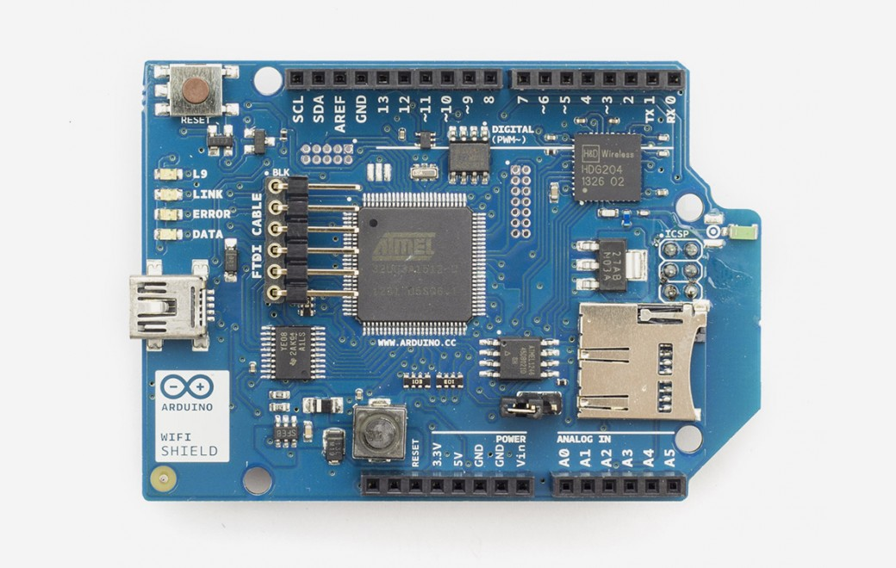
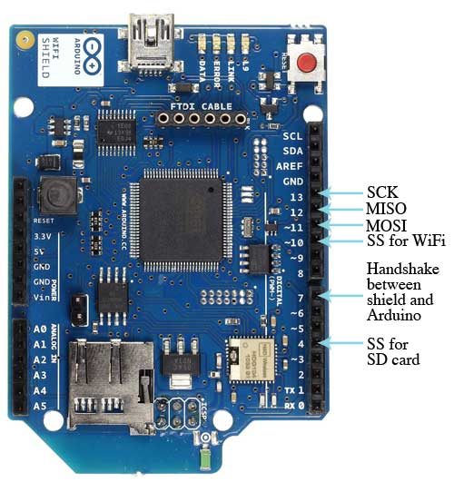
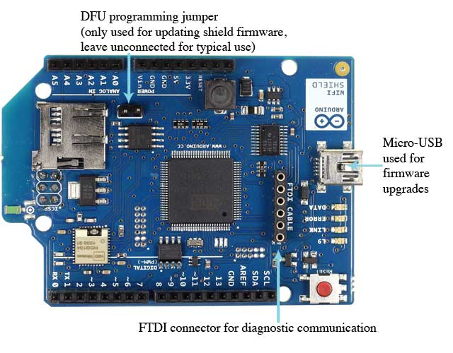
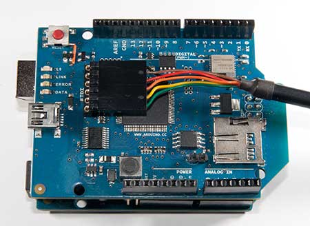
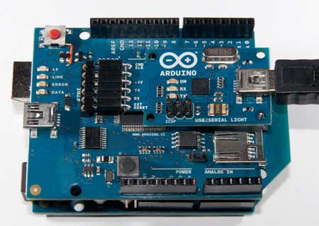

***Note: This page refers to a product that is retired.***



The **Arduino WiFi Shield** connects your Arduino to the internet wirelessly. Connect it to your wireless network by following a few simple instructions to start controlling your world through the internet. As always with Arduino, every element of the platform – hardware, software and documentation – is freely available and open-source. This means you can learn exactly how it's made and use its design as the starting point for your own circuits.

* Requires an Arduino board (not included)
* Operating voltage 5V (supplied from the Arduino Board)
* Arduino Due compatible
* Connection via: 802.11b/g networks
* Encryption types: WEP and WPA2 Personal
* Connection with Arduino on SPI port
* on-board micro SD slot
* ICSP headers
* FTDI connection for serial debugging of WiFi shield
* Mini-USB for updating WiFi shield firmware

## Getting Started

You can find in the [Getting Started section](https://www.arduino.cc/en/Guide/ArduinoWiFiShield) all the information you need to configure your board, use the Arduino So ftware (IDE), and start tinker with coding and electronics.

### Need Help?

* On the Software [on the Arduino Forum](https://forum.arduino.cc/index.php?board=63.0)
* On Projects [on the Arduino Forum](https://forum.arduino.cc/index.php?board=3.0)
* On the Product itself through [our Customer Support](https://support.arduino.cc/hc)

## Documentation

### OSH: Schematics

Arduino WiFi Shield is open-source hardware! You can build your own board using the following files:

[EAGLE FILES IN .ZIP](http://download.arduino.org/products/WIFISHIELD/arduino-wifi-shield-reference-design.zip) 

[SCHEMATICS IN .PDF](http://download.arduino.org/products/WIFISHIELD/arduino-wifi-shield-schematic.pdf)

The Arduino WiFi Shield allows an Arduino board to connect to the internet using the 802.11 wireless specification (WiFi). It is based on the [HDG204](http://pub.ucpros.com/download/1451_hdg204_datasheet_pa4.pdf?osCsid=mcrh728ovgeg6ub4ka6mccrso5s) Wireless LAN 802.11b/g System in-Package. An AT32UC3 provides a network (IP) stack capable of both TCP and UDP. Use the [WiFI library](https://www.arduino.cc/en/Reference/WiFi) to write sketches which connect to the internet using the shield. The WiFI shield connects to an Arduino board using long wire-wrap headers which extend through the shield. This keeps the pin layout intact and allows another shield to be stacked on top.

The WiFi Shield can connect to wireless networks which operate according to the 802.11b and 802.11g specifications.

There is an onboard micro-SD card slot, which can be used to store files for serving over the network. It is compatible with the Arduino Uno and Mega. The onboard microSD card reader is accessible through the SD Library. When working with this library, SS is on Pin 4.

Arduino communicates with both the Wifi shield's processor and SD card using the SPI bus (through the ICSP header). This is on digital pins 11, 12, and 13 on the Uno and pins 50, 51, and 52 on the Mega. On both boards, pin 10 is used to select the HDG204 and pin 4 for the SD card. These pins cannot be used for general I/O. On the Mega, the hardware SS pin, 53, is not used to select either the HDG204 or the SD card, but it must be kept as an output or the SPI interface won't work.

Digital pin 7 is used as a handshake pin between the WiFi shield and the Arduino, and should not be used.



Note that because the HDG204 and SD card share the SPI bus, only one can be active at a time. If you are using both peripherals in your program, this should be taken care of by the corresponding libraries. If you're not using one of the peripherals in your program, however, you'll need to explicitly deselect it. To do this with the SD card, set pin 4 as an output and write a high to it. For the HDG204, set digital pin 10 as a high output.

The shield can connect to encrypted networks that use either WPA2 Personal or WEP encryption. It can also connect to open networks. A network must broadcast its SSID for the shield to be able to connect.

### Attention

The previous version of this shield uses a HDG104 instead of the actual HDG204.

### On board interfaces

The reset button on the shield resets both the HDG204 and the Arduino board.



There is an onboard Mini-USB connector. This is not for programming an attached Arduino, it is for updating the AT32UC3 using the Atmel DFU protocol. The programming jumper adjacent to the power bus and analog inputs should be left unconnected for typical use. It is only used for DFU programming mode.

A FTDI connection enables serial communication with the 32U for debugging purposes. A list of[available commands can be found here](https://www.arduino.cc/en/Hacking/WiFiShield32USerial).

### On board indicators

The shield contains a number of informational LEDs:

* L9 (yellow): this is tied to digital pin 9
* LINK (green): indicates a connection to a network
* ERROR (red): indicates when there is a communication error
* DATA (blue): indicates data being transmitted/received

### Updating firmware on the shield

Please follow the guide below to update the firmware on your shield.

See also: [getting started with the WiFi shield](https://www.arduino.cc/en/Guide/ArduinoWiFiShield) and [WiFi library reference](https://www.arduino.cc/en/Reference/WiFi)

---

## WiFi Shield 32U serial commands

The Arduino WiFi Shield has an FTDI compatible connector that enables you to get diagnostic information from the onboard ATmega 32U.

You can connect to the 32U with a FTDI cable:



You can also use a USB2Serial board:



To send messages to the board, use a program like Coolterm to connect to the FTDI port. The board communicates at 57600bps. When sending messages, terminate with a carriage return (CR).

Supported commands and their parameters:

* **scan**
* **connect** `<ssid>`
* **setkey** `<key\_idx (0-3)>` `<key in hex>` ("**setkey** none" will delete all WEP keys)
* **status**
* **debug** `<section>` `<level>`  
   * *section*: init, cm, spi, tcp , util, warn  
   * *level* : 0 (off), 1 (on), 2 (verbose)
* **ttcp** \-t/-r \[-options\] host  
   * \-l length of bufs written to network (default 1024)  
   * \-n number of bufs written to network (default 1024)  
   * \-p port number to send to (default 2000)  
   * \-u udp  
   * \-v verbose
* **wpass** `<ssid>` `<passphrase>` (set passphrase associated to ssid)
* **dpass** `<ssid>` (delete passphrase associated to ssid)

If you send a string or character that is not recognized, you'll get a list of supported commands.

---

## Upgrading the WiFi Shield firmware

The WiFi shield provides wireless connectivity per the IEEE 802.11 b/g standard through the HDG204 (or HDG104) module. The TCP/IP stack and the APIs for WiFi library are managed by the AT32UC3A1512 (or AT32UC3A1256) called AT32UC3 for short microcontroller on the shield. Your Arduino connects to the shield using SPI through the WiFi library.

Both the AT32UC3 and the HDG204/HDG104 modules have firmware upgradable through the mini USB connector. 

This tutorial shows you how to upgrade:

* the HDG204/HDG104 WiFi module firmware, for when the manufacturer provides a new firmware binary for their device.
* the AT32UC3 when there is a new version of the firmware available from Arduino. Alternately, if you are an expert C programmer you can customise the official source code to make a derivative firmware for yourself. Check the [WiFi library repository](https://github.com/arduino/ArduinoCore-avr/tree/master/firmwares) for the source code.

**When upgrading the firmware, the WiFi shield should not be connected to the Arduino board.** 

Upgrading the firmware on the devices is a two step process:

* The HDG204/HDG104 firmware is named "wifi\_dnld.elf". The H&D module doesn't have static memory so you'll upload its firmware to AT32UC3 controller, then the AT32UC3 will transfer the firmware into the HDG204 module's dedicated flash memory.
* Once the firmware for the HDG204/HDG104 is uploaded, you're ready to the upload the WiFi shield firmware for the AT32UC3. The "wifiHD.elf" is the file that contains the the application for the controller.

### Download a DFU Programmer

You'll need additional software to update the code on the 32UC3.

**Windows**: Download Atmel's flip programmer from [here](http://%e2%80%8bwww.microchip.com/developmenttools/productdetails.aspx?partno=flip) 

**Mac**: Install MacPorts following the instructions on this [page](http://www.macports.org/install.php#pkg). Once MacPorts is installed, in a Terminal window, type: `sudo port install dfu-programmer` 

To update macPorts:

`sudo port selfupdate` 

To update dfu-programmer and other ports to the most recent version:

`sudo port upgrade outdated` 

Make sure you're using dfu-programer version 0.5.4 or later

*NB: If you've never used sudo before, it will ask for your password. Use the password you login to your Mac with. sudo allows you to run commands as the administrator of the computer* 

**Linux**: from a command line type 

`sudo apt-get install dfu-programme` 

or 

`sudo aptitude install dfu-programmer` 

depending on your distribution.

### Download updated firmware for the 32UC3A1256/AT32UC3A1256

The latest version is [here](https://github.com/arduino/ArduinoCore-avr/tree/master/firmwares). Choose WiFi shield firmware. 

The firmware is also located with the Arduino software in the /hardware/avr/arduino/firmwares/wifishield folder. On OSX, right-click or command-click on the Arduino application and select "show package contents" to find this folder. 

### Windows procedure

On Windows, you need to install the [AVR 32 Drivers](//www.arduino.cc/en/uploads/Hacking/AVR32%5FUSB%5FDriver.zip) . On Windows use the [Flip](http://www.atmel.com/tools/FLIP.aspx) software provided by Atmel to program the device using the DFU mode (Device Firmware Update). Flip supplies a utility called batchisp that you'll use to make the upgrade. Once you've installed Flip, open a command prompt (CMD) and reach the following path contained inside the Flip installation directory, usually: `cd C:\Program Files (x86)\Atmel\Flip 3.4.5\bin` but it depends where the Atmel software is installed. Now you are able to download the firmware on the shield. 

#### Note

Flip needs needs a 32-bit JRE. A 64-bit JRE do not work.

Connect the J3 jumper to put the shield in the programming mode, then plug it to the computer through the mini USB socket. On the command prompt type:

```arduino
batchisp.exe \-device AT32UC3A1512 \-hardware usb \-operation erase f memory flash blankcheck loadbuffer /Arduino/hardware/avr/arduino/firmwares/wifishield/binary/wifi\_dnld.elf program verify start reset 0
```

[\[Get Code\]](//www.arduino.cc/en/Hacking/WiFiShieldFirmwareUpgrading?action=sourceblock&num=1)

or

```arduino
batchisp.exe \-device AT32UC3A1256 \-hardware usb \-operation erase f memory flash blankcheck loadbuffer /Arduino/hardware/avr/arduino/firmwares/wifishield/binary/wifi\_dnld.elf program verify start reset 0
```

[\[Get Code\]](//www.arduino.cc/en/Hacking/WiFiShieldFirmwareUpgrading?action=sourceblock&num=2)

Depending on the chip you have.

To download the HDG204/HDG104 WiFi module firmware inside the dataflash.

```arduino
batchisp.exe \-device AT32UC3A1512 \-hardware usb \-operation erase f memory flash blankcheck loadbuffer /Arduino/hardware/avr/arduino/firmwares/wifishield/binary/wifiHD.elf program verify start reset 0
```

[\[Get Code\]](//www.arduino.cc/en/Hacking/WiFiShieldFirmwareUpgrading?action=sourceblock&num=3)

or

```arduino
batchisp.exe \-device AT32UC3A1256 \-hardware usb \-operation erase f memory flash blankcheck loadbuffer /Arduino/hardware/avr/arduino/firmwares/wifishield/binary/wifiHD.elf program verify start reset 0
```

[\[Get Code\]](//www.arduino.cc/en/Hacking/WiFiShieldFirmwareUpgrading?action=sourceblock&num=4)

Depending on the chip you have.

To download the WiFi shield firmware on the AT32UC3A1512/AT32UC3A1256.

Once the upgrade is done you can remove the J3 jumper and restart the shield. Now it's ready to be used. Look at the **Optional** section at the bottom of this page for details on checking if the firmware upgrade was a success.

### Linux and Mac procedure

On Linux and Mac we wrote a script that automates the process. The script is a command line utility, so in order to use it you need to open a terminal on your system.

You can find the script inside your IDE at the following path: `~/arduino1.x.x/hardware/avr/arduino/firmwares/wifishield/scripts` 

The WiFi shield upgrading script also make use of the [dfu-programmer](http://dfu-programmer.sourceforge.net/) that you need to install on your system previously (make sure that the version is 0.5.4 or later). 

Connect a jumper on the J3 connector, that put the shield in the programming mode. Then connect the USB cable to the shield USB mini socket.

Open a Terminal window and move to the path were you saved the script and type as following to get the help:

* Mac: `./ArduinoWifiShield_upgrade.sh -h`
* Linux: `sudo ./ArduinoWifiShield_upgrade.sh -h`

On Linux you need to run the script as root in order to access correctly to the USB DFU peripherals.

With the `-a` parameter you'll pass to the script the current Arduino installation path, for example: `/home/user/Coding` 

With the `-f` parameter you'll make the choice of which firmware install: 

* `shield` to upgrade only the shield firmware
* `all` to upgrade both the firmwares

**Optional**: to test if the WiFi shield has been updated, you can connect an USB to Serial adapter to the FTDI socket and access to the serial debug terminal if the startup message contains the updated date. Look at the apposite page to learn more about the serial debug option.