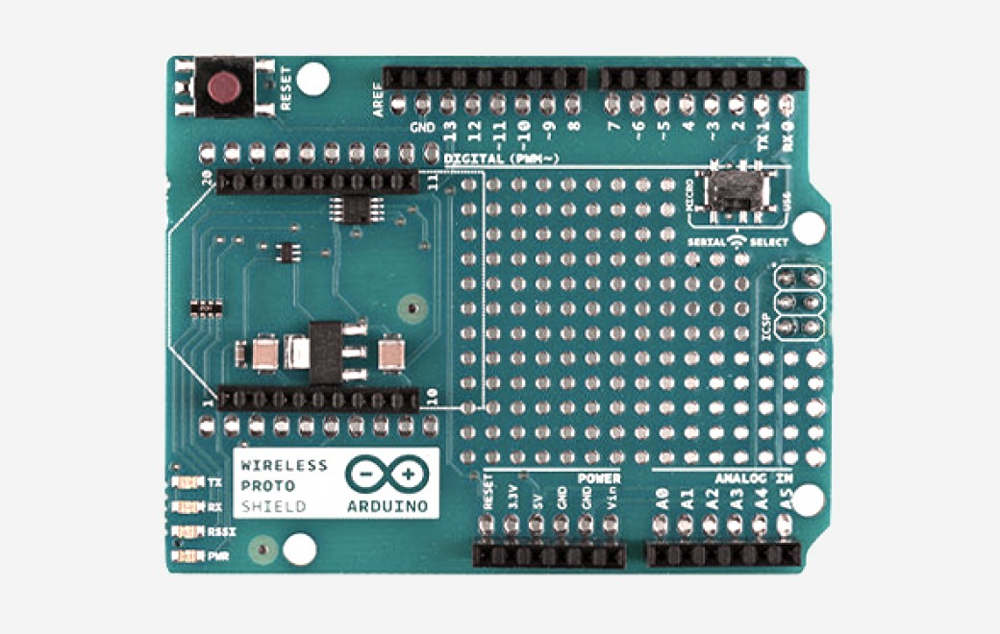
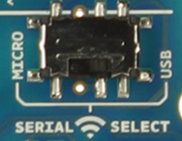
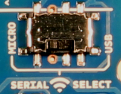

***Note: This page refers to a product that is retired.***

The **Arduino Wireless Proto Shield** allows an Arduino board to communicate wirelessly using a wireless module. It is based on the [Xbee modules from Digi](http://www.digi.com/products/wireless-wired-embedded-solutions/zigbee-rf-modules/zigbee-mesh-module/xbee-zb-module), but can use any module with the same footprint. The module can communicate up to 100 feet indoors or 300 feet outdoors (with line-of-sight). It can be used as a serial/usb replacement or you can put it into a command mode and configure it for a variety of broadcast and mesh networking options. The shields breaks out each of the Xbee's pins to a through-hole solder pad.

**This shield doesn't have the SD socket.**

An on-board switch allows the wireless module to communicate with the USB-to-serial converter or with the microcontroller.

## Getting Started

You can find in the [Getting Started section](https://www.arduino.cc/en/Guide/HomePage) all the information you need to configure your board, use the Arduino So ftware (IDE), and start tinker with coding and electronics.

### Need Help?

* On the Software [on the Arduino Forum](https://forum.arduino.cc/index.php?board=63.0)
* On Projects [on the Arduino Forum](https://forum.arduino.cc/index.php?board=3.0)
* On the Product itself through [our Customer Support](https://support.arduino.cc/hc)

## Documentation

### OSH: Schematics

Arduino Wireless Proto Shield is open-source hardware! You can build your own board using the following files:

[EAGLE FILES IN .ZIP](https://www.arduino.cc/en/uploads/Main/arduino-wireless-proto-shield-reference-design.zip) 

[SCHEMATICS IN .PDF](https://www.arduino.cc/en/uploads/Main/arduino-wireless-proto-shield-schematc.pdf)

### Switch Settings

The Wireless Proto shield has an on-board switch labelled Serial Select. It determines how the Xbee's serial communication connects to the serial communication between the microcontroller (ATmega8 or ATmega168) and USB-to-serial chip on the Arduino board.

When in the Micro position, the DOUT pin of the wireless module is connected to the RX pin of the microcontroller; and DIN is connected to TX. The wireless module will then communicate with the microcontroller. Note that the RX and TX pins of the microcontroller are still connected to the TX and RX pins (respectively) of the USB-to-serial converter. Data sent from the microcontroller will be transmitted to the computer via USB as well as being sent wirelessly by the wireless module. The microcontroller will not be programmable via USB in this mode.

With the switch in the USB position, the DOUT pin the wireless module is connected to the RX pin of the USB-to-serial converter, and DIN on the wireless module is connected to the TX pin of the USB-to-serial converter. This means that the module can communicate directly with the computer. The microcontroller on the board will be bypassed. To use the shield in this mode, you must program the microcontroller with an empty sketch (shown below), or remove it from the board.

Empty sketch:

void **setup**() { }  
void **loop**() { }

[\[Get Code\]](https://www.arduino.cc/en/Main/ArduinoWirelessShield?action=sourceblock&num=1)

### Networking

The Wireless Proto shield can be used with different modules with the same footprint as the XBeemodules. The instructions below are for the **XBee 802.15.4 modules** (sometimes called "Series 1" to distinguish them from the Series 2 modules, although "Series 1" doesn't appear in the official name or product description) and also for the **XBee ZNet 2.5** or **XBee ZB** modules, both known as "Series 2" modules. All the modules, basically have the same type of configuration parameters, but differ by the function that they implement and the topologies of networks that they can create. Can communicate with each other only modules of the same family.

### Addressing

There are multiple parameters that need to be configured correctly for two modules to talk to each other (although with the default settings, all modules should be able to talk to each other). They need to be on the same network, as set by the **ID** parameter (see "Configuration" below for more details on the parameters). The modules need to be on the same channel, as set by the CHparameter. Finally, a module's destination address (**DH** and **DL** parameters) determine which modules on its network and channel will receive the data it transmits. This can happen in a few ways:

* If a module's DH is 0 and its DL is less than 0xFFFF (i.e. 16 bits), data transmitted by that module will be received by any module whose 16-bit address MY parameter equals DL.
* If DH is 0 and DL equals 0xFFFF, the module's transmissions will be received by all modules.
* If DH is non-zero or DL is greater than 0xFFFF, the transmission will only be received by the module whose serial number equals the transmitting module's destination address (i.e. whose SH equals the transmitting module's DH and whose SL equals its DL).

Again, this address matching will only happen between modules on the same network and channel. If two modules are on different networks or channels, they can't communicate regardless of their addresses.

For the "Series 2" modules you must chose which firmware put on the module to give it Coordinator, Router or End Device functionality. Series 2 use only serial low (SL) and serial high (SH) for addressing.

### Configuration

Here are some of the more useful parameters for configuring your Xbee module. For step-by-step instructions on reading and writing them using AT commands, see the:

* [guide to the Wireless shield with the 802.15.4 modules](https://www.arduino.cc/en/Guide/ArduinoWirelessShield).
* [guide to the Wireless shield with the ZNet 2.5 modules](https://www.arduino.cc/en/Guide/ArduinoWirelessShieldS2).

Make sure to prepend AT to the parameter name when sending a command to the module (e.g. to read the ID parameter, you should send the command ATID).

| *Command* | *Description* | *ValidValues* | *Default Value*|
| --------- | ------------- | ------------- | -------------- |
| `ID` | The network ID of the XBee module.| 0 - 0xFFFF  | 3332 |
| `CH`         | The channel of the XBee module.| 0x0B - 0x1A | 0X0C |
| `MY`         | The 16-bit address of the module. 0 - 0xFFFF | 0 | |
| `DH` and `DL` | The destination address for wireless communication (`DH` is the high 32 bits, `DL` the low 32). | 0 - 0xFFFFFFFF (for both `DH` and `DL`)| 0 (for both `DH` and `DL`) |
| `BD` | The baud rate used for serial communication with the Arduino board or computer. | 0 (1200 bps),  1 (2400 bps), 2 (4800 bps), 3 (9600 bps), 4 (19200 bps), 5 (38400 bps), 6 (57600 bps), 7 (115200 bps) | 3 (9600 baud)|
| `SH` and `SL` | The serial number of the XBee module (`SH` gives the high 32 bits, `SL` the low 32 bits). Read-only. | 0 - 0xFFFFFFFF (for both `SH` and `SL`)| different for each module |

**Note:** although the valid and default values in the table above are written with a prefix of "0x" (to indicate that they are hexadecimal numbers), the module will not include the "0x" when reporting the value of a parameter, and you should omit it when setting values.

