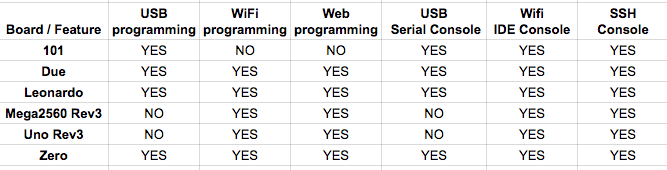
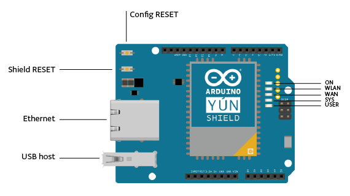

***Note: This page refers to a product that is retired.***

The **Arduino Yún Shield** extends your Arduino & Genuino board with the power of a Linux based system that enables advanced network connections and applications.  

Connection to your WiFi or wired network is simple thanks to the Yún Web Panel and the dedicated[ ''YunFirstConfig'' sketch](https://www.arduino.cc/en/Tutorial/YunFirstConfig). The Web panel allows you to manage your shield preferences and upload your sketch (in .hex format) on the attached Arduino or Genuino board. The Yún Shield uses the [ Bridge library](https://www.arduino.cc/en/Reference/YunBridgeLibrary) and so extends your board capabilities using the Linux processor, in the same way as the Yún board.

As always, every element of the platform – hardware, software and documentation – is freely available and open-source. This means that you can learn exactly how it's made and use its design as the starting point for your own projects.

## Getting Started

You can find in the [Getting Started section](https://www.arduino.cc/en/Guide/ArduinoYunShield) all the information you need to configure your board, use the [Arduino Software (IDE)](https://www.arduino.cc/en/Main/Software), and start tinker with coding and electronics.

### Need Help?

* On the Software [on the Arduino Forum](https://forum.arduino.cc/index.php?board=63.0)
* On Projects [on the Arduino Forum](https://forum.arduino.cc/index.php?board=110.0)
* On the Product itself through [our Customer Support](https://support.arduino.cc/hc)

## Documentation

### OSH: Schematics

Yún Shield is open-source hardware! You can build your own board using the following files:

[EAGLE FILES IN .ZIP](https://content.arduino.cc/assets/YunShield_Rev1.0.zip) 

[SCHEMATICS IN .PDF](https://content.arduino.cc/assets/YunShield_Rev1.0_sch.pdf)

### Compatibility

The Yún Shield allows an Arduino or Genuino board to connect to the internet using the on-board WiFi or Ethernet connection. Furthermore thanks to the [Bridge library](https://www.arduino.cc/en/Reference/YunBridgeLibrary) it is possible to extend the basic functionalities of the connected board using the computational power of the Linux processor on the shield. Using the Yún Web Panel it is also possible to configure all the shield-related features and remotely upload sketches on the board connected to the shield. Please refer to the matrix below to find the board compatibility and their functionality.

### On-board Indicators

The shield contains a number of signalling LEDs:

* ON (green): indicates that the shield is properly powered
* WLAN (blue): indicates a connection to a network
* WAN (red): indicates connection to ethernet
* SYS (white): indicates system activity
* USER (red): indicates that the Bridge connection is active

## Tech Specs

**Linux Microprocessor**

|                   |                                                                                   |
| ----------------- | --------------------------------------------------------------------------------- |
| Processor         | [Atheros AR9331](https://www.openhacks.com/uploadsproductos/ar9331_datasheet.pdf) |
| Architecture      | MIPS @400MHz                                                                      |
| Operating Voltage | 3.3V                                                                              |
| Ethernet          | IEEE 802.3 10/100Mbit/s                                                           |
| WiFi              | IEEE 802.11b/g/n                                                                  |
| USB Type-A        | 2.0 Host                                                                          |
| RAM               | 64 MB DDR2                                                                        |
| Flash Memory      | 16 MB                                                                             |
| Board interfacing | SPI and HW Serial                                                                 |